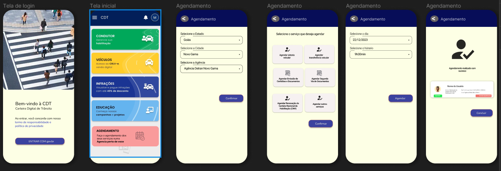

# Protótipo de Alta Fidelidade - Realizar Agendamento de Serviços

## Introdução

Um protótipo de alta fidelidade é uma representação visual e interativa de um produto ou sistema que se assemelha muito ao produto final em termos de design, interatividade e funcionalidade. Esses protótipos são geralmente criados usando ferramentas de design gráfico e prototipagem, e podem incluir detalhes como cores, tipografia, imagens e interações mais complexas.

A principal finalidade de um protótipo de alta fidelidade é fornecer uma visão mais precisa de como o produto final se parecerá e funcionará. Eles são valiosos em fases avançadas do processo de design, quando muitos detalhes já foram definidos e a equipe está buscando validar e refinar a experiência do usuário.

## Metodologia

Neste documento, apresentamos e validamos o protótipo de alta fidelidade referente ao [Requisito Funcional 29 - RF29](https://requisitos-de-software.github.io/2023.2-Carteira_Digital_de_Transito/elicita%C3%A7%C3%A3o/requisitos_elicitados/)  que faz referência ao aplicativo que deve ser possível realizar o agendamento de serviços de manutenção e inspeção veicular. O protótipo foi desenvolvido utilizando a ferramenta Figma, e pode ser visto na figura 1.

## Protótipo de Alta Fidelidade

Na Figura 1, é possível ver imagens do protótipo de alta fidelidade feito com intuito de demonstrar a funcionalidade de agendamento.

**Figura 1** - Protótipo de Alta Fidelidade - Agendamento

Fonte: [Mayara Alves](https://github.com/Mayara-tech) 

Na Figura 2, apresentamos o protótipo de alta fidelidade diretamente no Figma, onde reflete não apenas funcionalidade, mas também estilo, resultado de iterações com feedbacks, explorando suas características e destacando como melhora a experiência do usuário.

<b>Figura 2</b>: Figma do Protótipo de Alta Fidelidade

<iframe style="border: 1px solid rgba(0, 0, 0, 0.1);" width="800" height="450" src="https://www.figma.com/embed?embed_host=share&url=https%3A%2F%2Fwww.figma.com%2Ffile%2FO7bSLvnevQwsyFcM2g3VYf%2Fcarteira_digital_transito%3Ftype%3Ddesign%26node-id%3D0%253A1%26mode%3Ddesign%26t%3DPyIeE1XIjhxocTnK-1" allowfullscreen></iframe>

<b>Fonte:</b> <a href="https://github.com/Mayara-tech">Mayara Alves</a>, 2023

## Aspectos Práticos

Para a avaliação do protótipo de papel foi conduzida uma entrevista pela integrante do grupo [Mayara Alves](https://github.com/Mayara-tech) e contou com a participação do entrevistado, Igor Luna. Não houve outras pessoas envolvidas no processo, e a avaliação não gerou quaisquer custo ao projeto, logo que foi conduzida em casa e de carater volutário, e o equipamento utilizado foi apenas um notebook, mostrando o protótipo de alta fidelidade.

## Aspectos Éticos

Foram seguidos os príncipios éticos de pesquisas científicas envolvendo pessoas, e o nosso [termo de consentimento livre e esclarecido](https://github.com/Requisitos-de-Software/2023.2-Carteira_Digital_de_Transito/blob/main/docs/elicita%C3%A7%C3%A3o/Termo%20de%20Consentimento.pdf) foi devidamente lido e aceito pelo participante, para garantir que o participante estivesse completamente informado sobre os procedimentos, objetivos, riscos, benefícios e objetivos da pesquisa antes de concordar em participar. 

## Cronograma executado

O cronograma executado para avaliação do protótipo pode ser observado na tabela 1, neste também esta presente o link para entrevista de avaliação do prototipo de alta fidelidade.

**Tabela 1** - Cronograma executado - Protótipo de alta fidelidade

| Data | Descrição | entrevistadora |  Entrevistado | Horário | Entrevista
| --- | ---------------------| ---------------------- |---------------------| ---------------------- | ---------------------------- |
| 04/12/2023 | Entrevista de Avaliação do protótipo de alta fidelidade | [Mayara Alves](https://github.com/Mayara-tech) | Igor Luna Almeida | 09h10/09h18  | [link](jkdbs)

Fonte: [Mayara Alves](https://github.com/Mayara-tech) 

## Resultados Obtidos

De acordo com a fluidez com que o usuário realizava as tarefas, foi possível observar que o usuário conseguiu sem dificuldades para realizar um agendamento de um serviço no aplicativo, não foram identificados problemas na interação do usuário com a interface. Durante o processo foi observado que não há a necessidade de ajustes no protótipo.

Desta forma temos os seguintes resultados obtidos a partir da avaliação do protótipo de alta fidelidade:

1. Foram identificadas sugestões de melhoria para o protótipo proposto?
     - Não foram identificadas sugestões de melhoria.
2. Foi possível identificar problemas de usabilidade preliminares?
    - Não foi possível identificar problemas de usabilidade.

## Histórico de Versões

| Versão | Data       | Descrição            |                       Autor                        |                     Revisor                      |
| :----: | ---------- | -------------------- | :------------------------------------------------: | :----------------------------------------------: |
| `1.0`  | 03/12/2023 |  Criação do documento |  [Mayara Alves](https://github.com/Mayara-tech)    |  |
