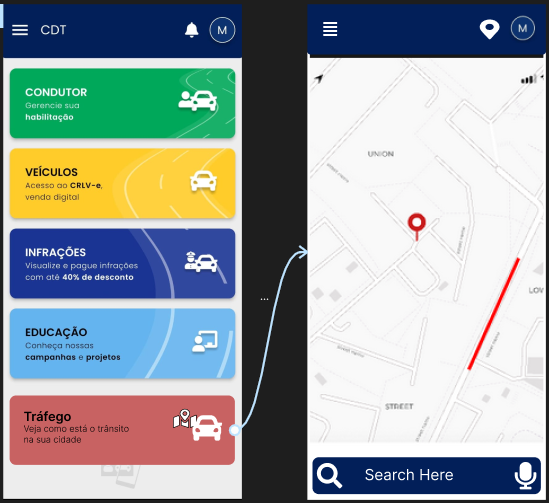

# Protótipo de Alta Fidelidade - Informações Sobre Tráfego

## Introdução

Um protótipo de alta fidelidade é uma representação visual e interativa de um produto ou sistema que se assemelha muito ao produto final em termos de design, interatividade e funcionalidade. Esses protótipos são geralmente criados usando ferramentas de design gráfico e prototipagem, e podem incluir detalhes como cores, tipografia, imagens e interações mais complexas.

A principal finalidade de um protótipo de alta fidelidade é fornecer uma visão mais precisa de como o produto final se parecerá e funcionará. Eles são valiosos em fases avançadas do processo de design, quando muitos detalhes já foram definidos e a equipe está buscando validar e refinar a experiência do usuário.

## Metodologia

Neste documento, apresentamos e validamos o protótipo de alta fidelidade referente ao [Requisito Funcional 26 - RF26](https://requisitos-de-software.github.io/2023.2-Carteira_Digital_de_Transito/elicita%C3%A7%C3%A3o/requisitos_elicitados/) que cita que o usuário deve conseguir visualizar informações em tempo real sobre as condições de trânsito. O protótipo foi desenvolvido utilizando a ferramenta Figma, e pode ser visto na figura 1.

## Protótipo de Alta Fidelidade

Na Figura 1, é possível ver imagens do protótipo de alta fidelidade feito com intuito de demonstrar a funcionalidade de agendamento.

**Figura 1** - Protótipo de Alta Fidelidade - Informações de Trânsito

Fonte: [Breno Queiroz](https://github.com/brenob6) 

Na Figura 2, apresentamos o protótipo de alta fidelidade diretamente no Figma, onde reflete não apenas funcionalidade, mas também estilo, resultado de iterações com feedbacks, explorando suas características e destacando como melhora a experiência do usuário.

<b>Figura 2</b>: Figma do Protótipo de Alta Fidelidade

<iframe style="border: 1px solid rgba(0, 0, 0, 0.1);" width="800" height="450" src="https://www.figma.com/proto/tFNsq8qzFrBuxZxBA1d5K9/Untitled?type=design&node-id=101-24&t=PU817OUW9kw4rU8d-1&scaling=scale-down&page-id=0%3A1&starting-point-node-id=101%3A22&mode=design" allowfullscreen></iframe>

<b>Fonte:</b> <a href="https://github.com/brenob6">Breno Queiroz</a>, 2023

## Bibliografia 

> FIGMA, Figma - Software de design colaborativo. Figma. [https://www.figma.com/](https://www.figma.com/file/O7bSLvnevQwsyFcM2g3VYf/carteira_digital_transito?type=design&mode=design&t=35FppirBalAoXBPN-0). Acesso em : 03/12/2023
>
> BARBOSA, Simone; DINIZ, Bruno. Interação Humano-Computador. Editora Elsevier, Rio de Janeiro, 2010.

## 📑 Histórico de Versões

| Versão | Data       | Descrição            |                       Autor                        |                     Revisor                      |
| :----: | ---------- | -------------------- | :------------------------------------------------: | :----------------------------------------------: |
| `1.0`  | 06/12/2023 |  Criação do documento |  [Breno Queiroz](https://github.com/brenob6)    | [Luis Miranda](https://github.com/LuisMiranda10) |
