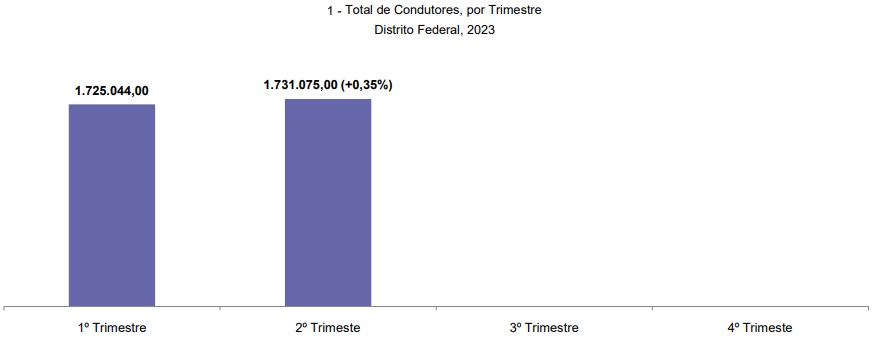
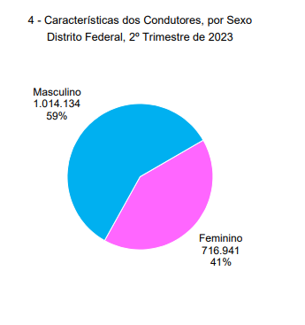
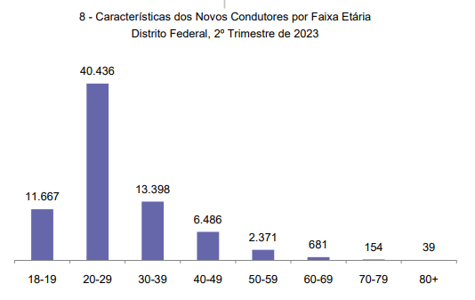
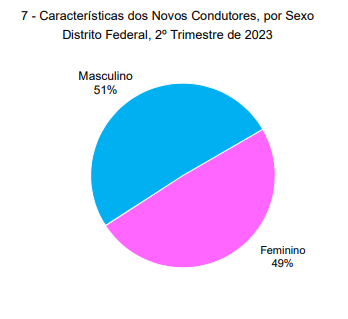

# Análise de documentos 

## Introdução

A análise de documentos desempenha um papel crucial na definição do perfil do usuário. Ela é uma abordagem fundamental que visa examinar documentos, registros e fontes de informações relevantes para entender mais profundamente as necessidades, características e comportamentos dos usuários. Ao analisar documentos, como registros de interações anteriores, histórico de uso, feedbacks ou outras fontes de dados escritos, é possível obter insights valiosos que ajudam a criar um perfil mais preciso e abrangente do usuário.

## Metodologia 

Entre os dias 18 e 20 de outubro de 2023, realizou-se uma análise documental com o propósito de adquirir uma compreensão mais aprofundada do perfil dos usuários da Carteira Digital de Trânsito. Dado que a Carteira Digital de Trânsito é uma aplicação voltada principalmente para condutores, a análise concentrou-se na caracterização do perfil dos condutores residentes no Distrito Federal, utilizando dados disponibilizados pelo Departamento de Trânsito do Distrito Federal (Detran-DF)^1^ sobre perfil de condutores do DF.

## Resultado da análise de documentos 

De acordo com o levantamento do detran-DF, podemos observar nas figuras de 1 a 5 as informações referentes ao perfil do condutor do DF. 

### Total de Condutores, por Trimestre no Distrito Federal em 2023
Podemos observar na figura 1, o crescimento no número de condutores de veiculos no Distrito federal desde o ultimo semestre de 2023.

**Figura 1** - Total de condutores

    

    

Fonte: GDF/SSP/DETRAN/DG/DIRTEC.

### Características dos Condutores por Faixa Etária, 2º Trimestre de 2023 
Podemos observar na figura 2, que as principais faixa etárias caracteristica do condutor do distrito federal são 40 a 49 anos  e de 30 a 39 anos.

**Figura 2** - Faixa etária dos condutores

Fonte: GDF/SSP/DETRAN/DG/DIRTEC.

### Características dos Condutores por sexo, 2º Trimestre de 2023 
Podemos observar na figura 3, que 59% dos condutores do DF são do sexo masculino, enquanto os outros 41% são feminino.

**Figura 3** - Sexo dos condutores

Fonte: GDF/SSP/DETRAN/DG/DIRTEC.

### Características dos novos condutores por faixa etária, 2º Trimestre de 2023 
Podemos observar na figura 4, que a principal faixa etária entre os novos condutores do DF é 20 a 29 anos.

**Figura 4** - Faixa etária dos novos condutores

Fonte: GDF/SSP/DETRAN/DG/DIRTEC.

### Características dos novos condutores por sexo, 2º Trimestre de 2023 
Podemos observar na figura 5, que 51% dos condutores do DF são do sexo masculino, enquanto os outros 49% são feminino.

**Figura 5** - Faixa etária dos novos condutores

    

Fonte: GDF/SSP/DETRAN/DG/DIRTEC.

## Referências bibliograficas 
> 1. Departamento de Trânsito do Distrito Federal (Detran-DF). Condutores habilitados do Distrito Federal, 2023. Disponível em: [https://www.detran.df.gov.br/wp-content/uploads/2018/06/Condutores-do-Distrito-Federal-2%C2%B0-trimestre-2023.pdf](https://www.detran.df.gov.br/wp-content/uploads/2018/06/Condutores-do-Distrito-Federal-2%C2%B0-trimestre-2023.pdf). Acesso em 19/10/2023

## Bibliografia
> BARBOSA, S. D. J.; SILVA, B. S. Interação Humano-Computador. Rio de Janeiro: Elsevier, 2011.

> HENRIQUE, Matheus. FERREIRA, Rafael. Perfil do Usuário. Repositório da disciplina de Requisitos de Software da Universidade de Brasília, 1/2023. Disponível em: [https://requisitos-de-software.github.io/2023.1-BilheteriaDigital/elicitacao/perfil_de_usuario/](https://requisitos-de-software.github.io/2023.1-BilheteriaDigital/elicitacao/perfil_de_usuario/). Acesso em: 29 setembro de 2023.

## 📑 Histórico de versões:

 Versão  |    Data    |                        Descrição                        |                                             Autor(es)                                             |                  Revisor(es)                   
 :-----: | :--------: | :-----------------------------------------------------: | :-----------------------------------------------------------------------------------------------: | :--------------------------------------------: 
`1.0`  | 20/10/2023 |            Criação da página de analise de documentos          | [Mayara Alves](https://github.com/Mayara-tech) | [Breno Queiroz](https://github.com/brenob6)
`1.1`  | 06/12/2023 |            Correção do artefato         | [Mayara Alves](https://github.com/Mayara-tech) | [Breno Queiroz](https://github.com/brenob6)
