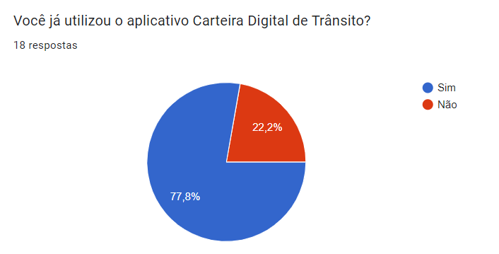

# Perfil de usuário 

## Introdução 
Com o propósito de aprofundar a compreensão dos utilizadores do aplicativo, torna-se imperativo a elaboração de um perfil genérico, conhecido como perfil de usuário. 
O perfil de usuário é, fundamentalmente, uma representação detalhada das características, preferências, comportamentos e necessidades dos indivíduos que utilizam um determinado sistema, aplicativo ou serviço.
Essa representação não apenas ajuda a identificar quem são os usuários, mas também fornece insights valiosos sobre como eles interagem com a tecnologia e quais são seus objetivos ao utilizarem.

A utilização de questionários como parte do processo de criação de perfis de usuário oferece uma série de vantagens notáveis. Eles permitem a coleta de informações de maneira 
estruturada e quantificável, o que facilita a análise e a interpretação dos dados obtidos. Além disso, questionários podem ser administrados a um grande número de respondentes
de forma eficiente, tornando possível a criação de perfis de usuário representativos de uma base diversificada de usuários potenciais. 

## Metodologia 
Pensando nisso a equipe realizou um questionário com intuito de conhecer o perfil de usuário do aplicativo Carteira Digital de Trânsito. O questionário engloba um total 8 perguntas sobre aspectos gerais do 
usuário do aplicativo e foi divulgado em grupos da comunidade atráves do aplicativo whatsapp e telegram entre o período de 24 a 27 de setembro de 2023. 

## Resultado do questionário 
O resultado no questionário teve o total de 18 respostas todas de acordo com o [termo de consertimento]. O resultado das respostas são apresentados nas figuras de 1 a 8.

### Questão 1 - Você já utilizou o aplicativo Carteira Digital de Trânsito?
De acordo com o gráfico apresentado na figura 1 em relação a utilização do aplicativo, 14 participantes (77,8%) são usuários do aplicativo.

**Figura 1** - Questão 1.

Fonte: [Mayara Alves](https://github.com/Mayara-tech).

