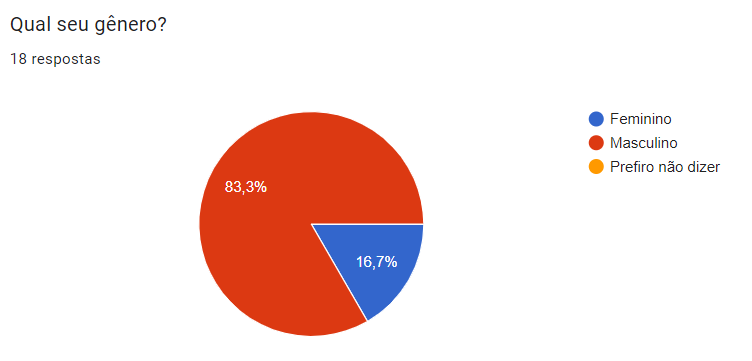
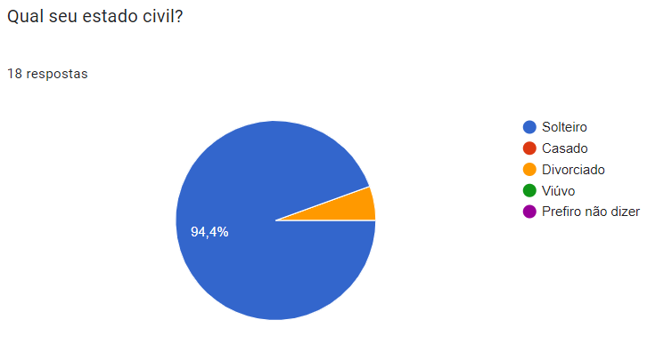
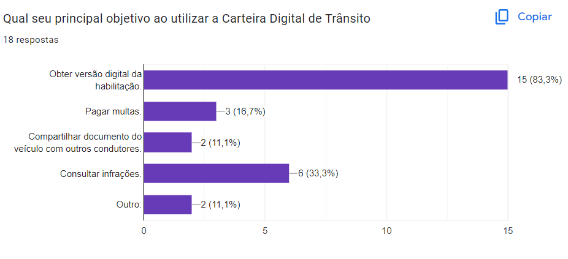
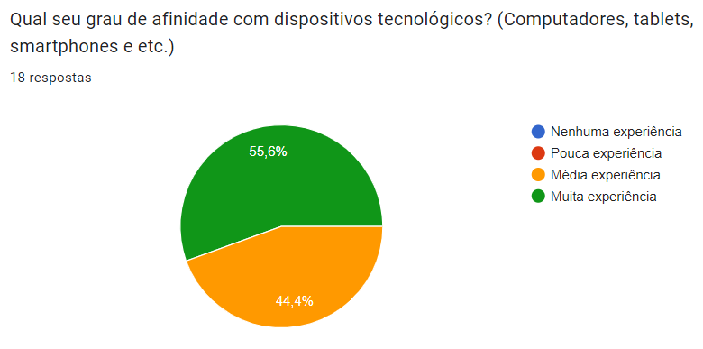

# Perfil de usuário 

## Introdução 
Com o propósito de aprofundar a compreensão dos utilizadores do aplicativo, torna-se imperativo a elaboração de um perfil genérico, conhecido como perfil de usuário. 
O perfil de usuário é, fundamentalmente, uma representação detalhada das características, preferências, comportamentos e necessidades dos indivíduos que utilizam um determinado sistema, aplicativo ou serviço.
Essa representação não apenas ajuda a identificar quem são os usuários, mas também fornece insights valiosos sobre como eles interagem com a tecnologia e quais são seus objetivos ao utilizarem.

A utilização de questionários como parte do processo de criação de perfis de usuário oferece uma série de vantagens notáveis. Eles permitem a coleta de informações de maneira 
estruturada e quantificável, o que facilita a análise e a interpretação dos dados obtidos. Além disso, questionários podem ser administrados a um grande número de respondentes
de forma eficiente, tornando possível a criação de perfis de usuário representativos de uma base diversificada de usuários potenciais. 

## Metodologia 
Pensando nisso a equipe realizou um questionário com intuito de conhecer o perfil de usuário do aplicativo Carteira Digital de Trânsito. O questionário engloba um total 8 perguntas sobre aspectos gerais do 
usuário do aplicativo e foi divulgado em grupos da comunidade atráves do aplicativo whatsapp e telegram entre o período de 24 a 27 de setembro de 2023. 

## Resultado do questionário 
O resultado no questionário teve o total de 18 respostas todas de acordo com o [termo de consertimento]. O resultado das respostas são apresentados nas figuras de 1 a 8.

### Questão 1 - Você já utilizou o aplicativo Carteira Digital de Trânsito?
De acordo com o gráfico apresentado na figura 1 em relação a utilização do aplicativo, 14 participantes (77,8%) são usuários do aplicativo.

**Figura 1** - Questão 1.

Fonte: [Mayara Alves](https://github.com/Mayara-tech).

### Questão 2 - Qual seu gênero?
De acordo com a figura 2, o gênero dos participantes em sua maioria é masculino representando 83,3% das respostas sendo que o gênero feminino presenta os outros 16,7%.

**Figura 2** - Questão 2.

Fonte: [Mayara Alves](https://github.com/Mayara-tech).

### Questão 3 - Qual seu estado civil?
De acordo com a figura 3, o estado civil dos participantes em sua maioria é solteiro representando 94,4% das respostas, onde divorciado representa os outros 5,6%.

**Figura 3** - Questão 3.

Fonte: [Mayara Alves](https://github.com/Mayara-tech).

### Questão 4 - Com qual frequência você utiliza o aplicativo da Carteira Digital de Trânsito?
De acordo com a figura 4 sobre a frequência que o participante utiliza o aplicativo 64,7% selecionaram a opção esporadicamente e os outros 35,3% semanalmente e diariamente.

**Figura 4** - Questão 4.

Fonte: [Mayara Alves](https://github.com/Mayara-tech).

### Questão 5 - Qual seu principal objetivo ao utilizar a Carteira Digital de Trânsito?
De acordo com a figura 5 sobre a utilização do aplicativo 83,3% dos participantes selecionaram que utilizam o aplicativo para obter a versão digital da habilitação e os outros 16,7% as demais funcionalidades do aplicativo 

**Figura 5** - Questão 5.

Fonte: [Mayara Alves](https://github.com/Mayara-tech).

### Questão 6 - Qual a sua faixa etária ?
De acordo com a figura 6 em relação a faixa etária dos participantes, a maioria representando 61,1% dos participantes estão na faixa etária de 18 a 24 anos.

**Figura 6** - Questão 6.

Fonte: [Mayara Alves](https://github.com/Mayara-tech).

### Questão 7 - Qual seu grau de escolaridade?
De acordo com a figura 7 em relação ao grau de escolaridade dos participantes, com 55,6% o Ensino Superior Incompleto, depois o Ensino Superior Completo com 16,7%, e com 27,7% os demais níveis de escolaridade

**Figura 7** - Questão 7.

Fonte: [Mayara Alves](https://github.com/Mayara-tech).

### Questão 8 - Qual seu grau de afinidade com dispositivos tecnológicos? (Computadores, tablets, smartphones e etc.)?
De acordo com a figura 8 em relação ao grau de afinidade com os dispositivos eletrônicos, o gráfico apresentou que os participantes possuem muita experiência em manusear dispositivos eletrônicos com 55,6% e os outros 44,4% com média experiencia. 

**Figura 8** - Questão 8.

Fonte: [Mayara Alves](https://github.com/Mayara-tech).

