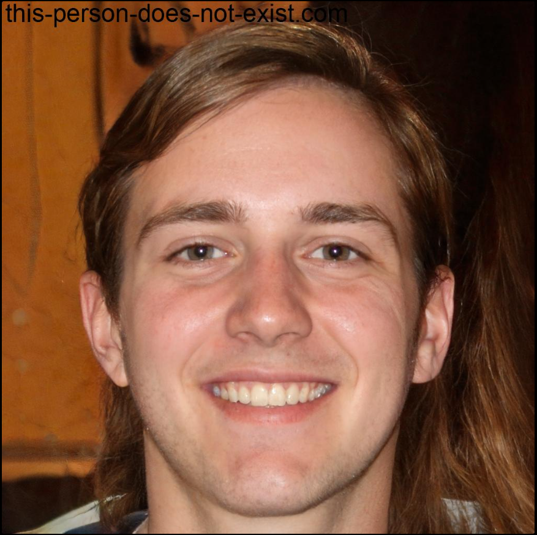
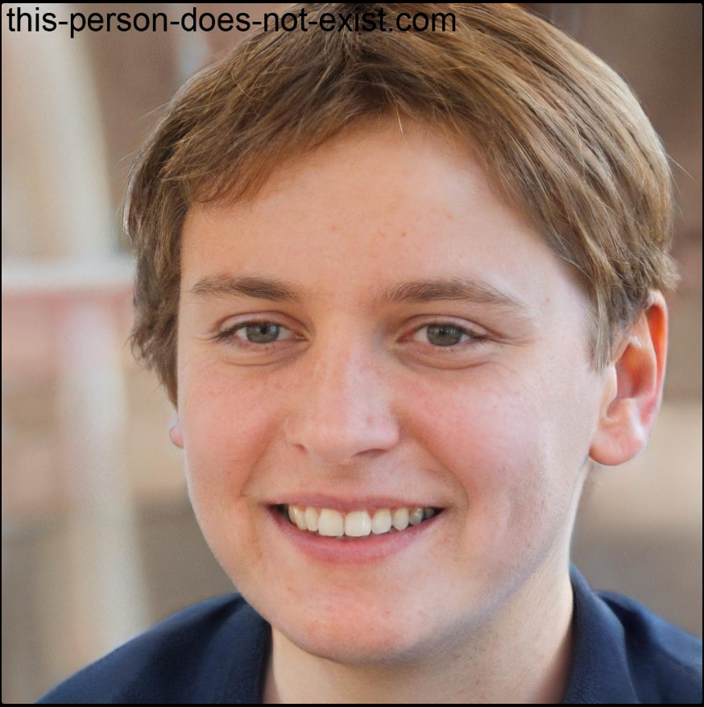
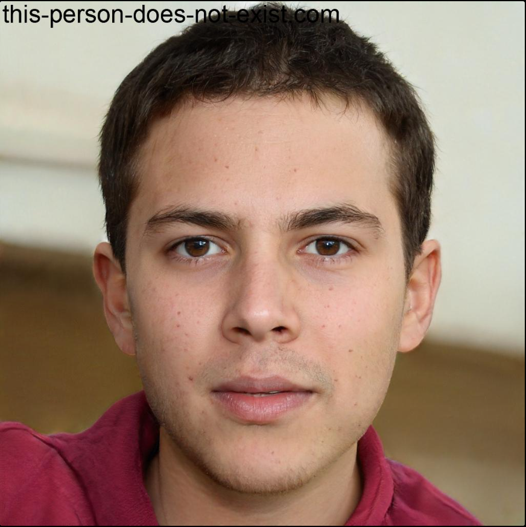

# Personas

## Introdução

As personas são personagens fictícias criadas para representar os usuários da aplicação no intuito de melhorar o entendimento das funcionalidades que o sistema deve apresentar. Elas devem possuir características que sumarizam bem os usuários “típicos”, mas que sejam específicas para torná-las ferramentas de design e comunicação eficientes.<a id="TEC1" href="#QT1">^1^</a>

## Metodologia

As personas criadas possuem as características apresentadas na seção de <a href="/elicitacao/perfil_de_usuario/">perfil de usuário</a>. Foram criadas cinco personas, assim como vistas nas figuras de 1 a 5, sendo 2 primárias, 2 secundárias e uma antipersona. Foi escolhida essa quantidade, pois permite que as diversas características distintas possam ter ao menos um representante sem que o foco no usuário principal do sistema seja perdido. Após o detalhamento das personas foi utilizada a ferramenta <a href="https://this-person-does-not-exist.com/pt"><i>This Person Doesn't Exist</i></a> para gerar uma imagem falsa que representaria a persona.

## Elenco

As tabelas de 1 a 5 apresentam o elenco de personas.

<b>Tabela 1</b> - Persona Primária Maria Silva.

| 
Figura 1- Persona Primária Maria Silva.
<figure markdown>{:style="height:500px;width:500px"}<figcaption>Fonte: Elaborada por [Altino Arthur](https://github.com/arthurrochamoreira) (2023).<a id="TEC2" href="#QT2">^2^</a></figcaption></figure> |
| ----------------------------------------------------------------------------------------------------------------------------------------------------------------------------------------------------------------------------------------------------------------------------------------------------------------------------------------------------------------------------------------- |
| **Nome**: Maria Silva.                                                                                                                                                                                                                                                                                                                                                        |
| **Status**: Persona Secundária.                                                                                                                                                                                                                                                                                                                                                         |
| **Gênero**: Feminino                                                                                                                                                                                                                                                                                                                                                                   |
| **Idade**: 22 anos                                                                                                                                                                                                                                                                                                                                                                  |
| **Profissão**: Entregadora Delivery.                                                                                                                                                                                                                                                                                                                       |
| **Escolaridade**: Ensino Superior Incompleto em Biologia.                                                                                                                                                                                                                                                                                                                            |
| **Habilidades e Experiências**: Conhecimento em sustentabilidade, tecnologias verdes e navegação em aplicativos móveis.                                                                                                                                                                                            |
| **Relacionamento**: Solteira                                                                                                                                                                                                                                                                              |
| **Objetivo**:  Maria quer garantir entregas eficientes enquanto mantém uma baixa pegada de carbono, promovendo práticas sustentáveis.                                     |
| **Expectativa**: Espera que o aplicativo Carteira Digital de Trânsito ofereça uma gestão eficaz dos documentos para agilizar a resolução de eventuais circunstâncias que necessitem do uso da carteira digital.                                     |
| **Requisitos**: Acesso fácil aos documentos de trânsito, notificações sobre infrações e uma interface amigável ao usuário.                                                                                                                                                                                                           |
| **Tarefas**: Acorda cedo, prepara sua moto elétrica, faz entregas durante o dia, participa de reuniões de grupos ambientais e passa tempo com a família à noite.                                                                                                                                                                                                                              |

Fonte: [Rafael Ferreira](https://github.com/RafaelCLG0).

**Tabela 2** - Persona Secundária José da Silva.

| 
Figura 2 - Persona Secundária Steve Vobes.
<figure markdown>{: style="height:500px;width:500px"}<figcaption>Fonte: Elaborada por [Altino Arthur](https://github.com/arthurrochamoreira) (2023).<a id="TEC2" href="#QT2">^2^</a></figcaption></figure> |
| ---------------------------------------------------------------------------------------------------------------------------------------------------------------------------------------------------------------------------------------------------------------------------------------------------------------------------------------------------------------------------------- |
| **Nome**: Steve Vobes.                                                                                                                                                                                                                                                                                                                                                           |
| **Status**: Persona Secundária.                                                                                                                                                                                                                                                                                                                                                    |
| **Gênero**: Masculino.                                                                                                                                                                                                                                                                                                                                                             |
| **Idade**: 21 anos.                                                                                                                                                                                                                                                                                                                                                                |
| **Profissão**: Estudante de Ciência da Computação na UnB.                                                                                                                                                                                                                                                                                                                 |
| **Escolaridade**: Ensino Superior em andamento.                                                                                                                                                                                                                                                                                                         |
| **Habilidades e Experiências**: Programação, design de UI/UX e conhecimento sobre startups e inovação tecnológica.                                                                                                                                                                       |
| **Relacionamento**: Colegas de classe, professores e comunidade de startups local.                                                                                                                                                                                                                                                                                               |
| **Objetivo**: Steve tem uma rotina agitada entre aulas, projetos e eventos de networking. Ele utiliza a Carteira Digital de Trânsito para ter seus documentos de trânsito sempre à mão de forma digital, evitando a necessidade de carregar documentos físicos e facilitando sua mobilidade entre o campus, eventos e reuniões de equipe. possível.                                                                                                                                                   |
| **Expectativa**: Ele espera que o aplicativo Carteira Digital de Trânsito facilite a gestão de documentos de trânsito, permitindo que ele foque em seus projetos e estudos.                                                                                                                                    |
| **Requisitos**: Interface intuitiva, acesso rápido aos documentos e segurança robusta dos dados.                                                                                                                                                                                    |
| **Tarefas**: Assistir a aulas, trabalhar em projetos pessoais e acadêmicos, participar de hackathons e eventos de networking, estudar e socializar com amigos.                                                                    |

Fonte: [Matheus Henrique](https://github.com/mathonaut).

**Tabela 3** - Persona Primária jair Motonaro.

| 
Figura 3- Persona Secundária Jair Motonaro<figure markdown>{: style="height:500px;width:500px"}<figcaption>Fonte: Elaborada por [Altino Arthur](https://github.com/arthurrochamoreira) (2023).<a id="TEC2" href="#QT2">^2^</a></figcaption></figure> |
| ----------------------------------------------------------------------------------------------------------------------------------------------------------------------------------------------------------------------------------------------------------------------------------------------------------------------------------------------------------------- |
| **Nome**: Jair Motonaro.                                                                                                                                                                                                                                                                                                                                              |
| **Status**: Persona Secundária.                                                                                                                                                                                                                                                                                                                                     |
| **Gênero**: Masculino                                                                                                                                                                                                                                                                                                                                             |
| **Idade**: 23 anos.                                                                                                                                                                                                                                                                                                                                               |
| **Profissão**: Motorista de Uber                                                                                                                                                                                                                                                                     |
| **Escolaridade**: Ensino Superior em Engenharia Civil                                                                                                                                                                                                                                                                             |
| **Habilidades e Experiências**: Conhecimento sólido em leis de trânsito, regulamentações locais e manutenção básica de veículos.                                                                                                                                                             |
| **Relacionamento**: Sua maior rede de relacionamento é com seus amigos da faculdade, pois se mudou de Estado para poder estudar na UnB.                                                                                                                                                                                                                           |
| **Objetivo**: Jair quer garantir que está em conformidade com todas as leis de trânsito e regulamentos locais enquanto está na estrada, tanto para proteger a si mesmo quanto seus passageiros. |
| **Expectativa**: Ele espera que o aplicativo Carteira Digital de Trânsito facilite o acesso e a gestão de seus documentos de trânsito de uma maneira segura e eficiente.                                                                                                                                                                          |
| **Requisitos**: Como tem facilidade com tecnologia, Lara acha que o app deve fornecer uma compra segura e que os eventos apareçam de acordo com seus gostos, para que a navegação seja mais fácil.                                                                                                                                                                |
| **Tarefas**: Acorda cedo, verifica o aplicativo para quaisquer atualizações ou notificações, começa seu dia de trabalho como motorista particular, volta para casa para passar tempo com a família e se manter atualizado sobre as notícias de interesse nacionais.                                                                                                        |

Fonte: [Geovanna Maciel](https://github.com/manuziny).

**Tabela 4** - Persona Secundária Pedro Matos.

| 
Figura 4- Persona Primária Carlos Digital
<figure markdown>{: style="height:500px;width:500px"}<figcaption>Fonte: Elaborada por [Altino Arthur](https://github.com/arthurrochamoreira) (2023).<a id="TEC2" href="#QT2">^2^</a></figcaption></figure> |
| --------------------------------------------------------------------------------------------------------------------------------------------------------------------------------------------------------------------------------------------------------------------------------------------------------------------------------------------------------------------------------- |
| **Nome**: Carlos Digital.                                                                                                                                                                                                                                                                                                                                                             |
| **Status**: Persona Primária.                                                                                                                                                                                                                                                                                                                                                   |
| **Gênero**: Masculino.                                                                                                                                                                                                                                                                                                                                                            |
| **Idade**:  24 anos.                                                                                                                                                                                                                                                                                                                                                               |
| **Profissão**: Analista de Sistemas.                                                                                                                                                                                                                                                                                                                |
| **Escolaridade**: Ensino Superior Completo em Ciência da Computação.                                                                                                                                                                                                                                                                                                                                   |
| **Habilidades e Experiências**:  Habilidades avançadas em tecnologia, uso de aplicativos móveis e gestão de dados digitais.
| **Relacionamento**: Colegas de trabalho, grupo de amigos aficionados por tecnologia e familiares.                                                                                                                                             |
| **Objetivo**: Carlos é muito focado na eficiência e na digitalização de sua vida. Ele optou pela Carteira Digital de Trânsito para manter todos os seus documentos de trânsito em um lugar seguro e acessível, facilitando o acesso rápido sempre que necessário, seja para verificações de rotina ou situações inesperadas na estrada.                   |
| **Expectativa**:  Ele espera que o aplicativo Carteira Digital de Trânsito ofereça uma interface intuitiva, acesso rápido aos documentos e um alto nível de segurança para proteger suas informações pessoais.                                                                                                                                                                                                                                      |
| **Requisitos**:  Interface de usuário clara e intuitiva, acesso rápido e fácil aos documentos digitais (CNH e CRLV), funções de gestão de infrações de trânsito, e opções de segurança robustas.                                                                                                                                                           |
| **Tarefas**: Acorda cedo, vai para o trabalho, almoça com colegas, trabalha no desenvolvimento e aprimoramento de sistemas, volta para casa, janta, estuda novas tecnologias ou trabalha em projetos pessoais, e utiliza as redes sociais antes de dormir.                                                                                                                       |

Fonte: [Altino Arthur](https://github.com/arthurrochamoreira).

**Tabela 5** - Antipersona Pedro Gamer

| 
Figura 5 - Antipersona Pedro Gamer
<figure markdown>{: style="height:500px;width:500px"}<figcaption>Fonte: Elaborada por [Altino Arthur](https://github.com/arthurrochamoreira) (2023).<a id="TEC2" href="#QT2">^2^</a></figcaption></figure> |
| -------------------------------------------------------------------------------------------------------------------------------------------------------------------------------------------------------------------------------------------------------------------------------------------------------------------------------------------------------------------------------------------- |
| **Nome**: Pedro Gamer                                                                                                                                                                                                                                                                                                                                                                  |
| **Status**: Antipersona.                                                                                                                                                                                                                                                                                                                                                                     |
| **Gênero**: Masculino.                                                                                                                                                                                                                                                                                                                                                                       |
| **Idade**: 18 anos.                                                                                                                                                                                                                                                                                                                                                                          |
| **Profissão**: Estudante e streamer de jogos em tempo parcial.                                                                                                                                                                                                                                                                                                    |
| **Escolaridade**: Ensino Médio.                                                                                                                                                                                                                                                                                                         |
| **Habilidades e Experiências**: Habilidades avançadas em jogos online, streaming e comunicação em mídias sociais.                                                                           |
| **Relacionamento**: Seguidores online, amigos gamers e colegas de classe.                                                                                                                                                         |
| **Objetivo**:  Pedro ainda não possui uma carteira de motorista e não tem nenhum veículo registrado em seu nome, então ele não vê nenhum benefício em usar a Carteira Digital de Trânsito neste momento.                                                            |
| **Expectativa**: Ele não tem expectativas ou interesse em relação ao aplicativo Carteira Digital de Trânsito, pois não possui uma carteira de motorista ou um veículo.                                                                                                                                                                                                                                                                 |
| **Requisitos**: Não aplicável, pois Pedro não possui requisitos para a Carteira Digital de Trânsito.                                                                                                                                                                                                                                                                      |
| **Tarefas**: Acorda tarde, joga online com amigos, faz streaming de suas sessões de jogo, assiste a aulas online, estuda para provas e interage com seus seguidores nas redes sociais antes de dormir.              |

Fonte: [Altino Arthur](https://github.com/arthurrochamoreira).

## Referências Bibliográficas

> <a id="QT1" href="#anchor_1">1.</a> BARBOSA, S. D. J.; SILVA, B. S. Interação Humano-Computador. Rio de Janeiro: Elsevier, 2011.

> <a id="QT2" href="#anchor_2">2.</a> Imagem gerada através da aplicação This Person Doesn't Exist. Disponível em: [https://this-person-does-not-exist.com/](https://this-person-does-not-exist.com/pt). Acesso em: 29 de abr. de 2023. 

## Bibliografia

> BARROS, Philipe de Sousa. Perfil do Usuário. Repositório da disciplina de Requisitos de Software da Universidade de Brasília, 2022. Disponível em: [https://requisitos-de-software.github.io/2022.2-Grasshopper/elicitacao/perfil-do-usuario/](https://requisitos-de-software.github.io/2022.2-Grasshopper/elicitacao/perfil-do-usuario/). Acesso em: 25 abr. 2023.

> FERREIRA, A. L. H. et al. Perfil do Usuário. Repositório da disciplina de Requisitos de Software da Universidade de Brasília, 2022. Disponível em: [https://requisitos-de-software.github.io/2022.2-MEI/Elicitacao/perfil/](https://requisitos-de-software.github.io/2022.2-MEI/Elicitacao/perfil/). Acesso em: 25 abr. 2023.

> MACHADO, M. et al. Personas. Repositório da disciplina de Requisitos de Software da Universidade de Brasília, 2022. Disponível em: [https://requisitos-de-software.github.io/2022.2-Lichess/elicitacao/personas/](https://requisitos-de-software.github.io/2022.2-Lichess/elicitacao/personas/). Acesso em: 25 abr. 2023.

## Histórico de Versões

| Versão | Data       | Descrição                                 | Autor(es)                                                                                           | Revisor(es)                                      |
| ------ | ---------- | ----------------------------------------- | --------------------------------------------------------------------------------------------------- | ------------------------------------------------ |
| `1.0`  | 27/04/2023 | Criação da página.                        | [Matheus Henrique](https://github.com/mathonaut) e [Rafael Ferreira](https://github.com/RafaelCLG0) | [Geovanna Maciel](https://github.com/manuziny)   |
| `1.1`  | 27/04/2023 | Adicição da persona Roberta do Santos.    | [Rafael Ferreira](https://github.com/RafaelCLG0)                                                    | [Matheus Henrique](https://github.com/mathonaut) |
| `1.2`  | 28/04/2023 | Adicição da persona José da Silva.        | [Matheus Henrique](https://github.com/mathonaut)                                                    | [Rafael Ferreira](https://github.com/RafaelCLG0) |
| `1.3`  | 28/04/2023 | Adição da introdução e ajustes no estilo. | [Matheus Henrique](https://github.com/mathonaut) e [Rafael Ferreira](https://github.com/RafaelCLG0) | [Geovanna Maciel](https://github.com/manuziny)   |
| `1.4`  | 29/04/2023 | Adição da Lara, Pedro e Jair              | [Geovanna Maciel](https://github.com/manuziny)                                                      | [Matheus Henrique](https://github.com/mathonaut) |
| `1.5`  | 30/04/2023 | Ajustes nos textos                        | [Matheus Henrique](https://github.com/mathonaut)                                                    | [Geovanna Maciel](https://github.com/manuziny)   |
| `1.6`  | 01/07/2023 | Retrabalho da verificação                     | [Rafael Ferreira](https://github.com/RafaelCLG0)                                                    | [Douglas Alves](https://github.com/dougAlvs)   |

