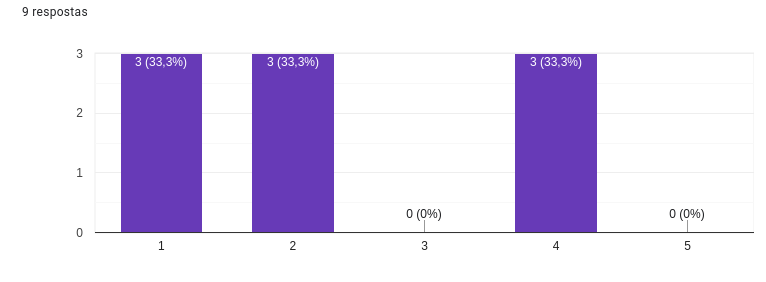
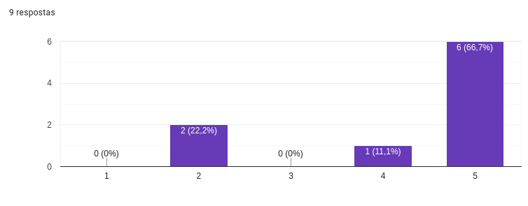
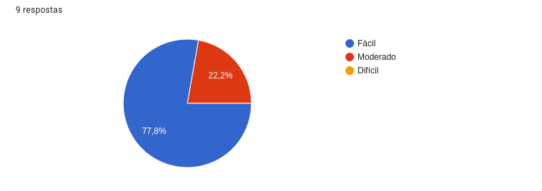

# Questionário

## Introdução

Questionários são instrumentos valiosos de pesquisa que possibilitam a coleta de dados quantitativos e qualitativos de maneira eficaz. São ferramentas flexíveis que permitem explorar as opiniões, comportamentos e preferências de um determinado público-alvo. O design e a implementação de um questionário requerem um entendimento claro dos objetivos que se pretende alcançar, assegurando que as perguntas formuladas sejam capazes de gerar insights significativos para a pesquisa em questão.

Neste contexto, o questionário específico em análise foi desenvolvido para avaliar a satisfação dos usuários com o aplicativo governamental Carteira Digital de Trânsito. O foco principal está em entender a frequência e a forma como o aplicativo é utilizado, identificar as funcionalidades mais populares, assim como as que poderiam ser potencialmente acrescentadas para melhorar a experiência do usuário. Adicionalmente, a pesquisa visa avaliar a facilidade de uso do aplicativo, uma métrica crucial para a aceitação e adoção de tecnologias digitais pelo público geral.

Além disso, os questionários são particularmente úteis para obter informações diretas e mensuráveis sobre atitudes, opiniões e comportamentos dos usuários. Esta metodologia possibilita uma análise sistemática e comparativa dos dados, permitindo que os pesquisadores identifiquem padrões e tendências significativas nas respostas dos participantes. A familiaridade e a facilidade de uso dos questionários online também foram consideradas, pois eles permitem que os usuários participem da pesquisa em um momento conveniente para eles, aumentando assim a probabilidade de engajamento e a qualidade das respostas obtidas. A natureza estruturada do questionário facilita a padronização das perguntas e respostas, o que é crucial para a validade e confiabilidade dos resultados da pesquisa.

Ao utilizar um questionário, foi possível abordar uma série de tópicos relevantes de forma concisa, incluindo a frequência de uso do aplicativo, funcionalidades utilizadas, e satisfação geral com a experiência do usuário. Isso proporcionou insights valiosos sobre como o aplicativo está sendo usado e como pode ser melhorado para atender às necessidades dos usuários de maneira mais eficaz.Consequentemente, a escolha deste método de pesquisa está alinhada com os objetivos estabelecidos, garantindo que as informações coletadas sejam tanto abrangentes quanto pertinentes para informar as decisões futuras de desenvolvimento e aprimoramento do aplicativo.

## Objetivos

O objetivo do questionário foi de mensurar o grau de satisfação dos usuários com o aplicativo,
quais são as funcionalidade mais utilizadas no mesmo, identificar possíveis funcionalidades que
os usuários gostariam que fossem implementadas e a facilidade de uso do aplicativo pelos usuários.

## Metodologia do Questionário

### Distribuição e Contexto do Questionário

A disseminação do questionário foi realizada de maneira direcionada e intencional, utilizando plataformas de mensagens instantâneas onde se encontram os potenciais respondentes. Os canais escolhidos foram grupos específicos no WhatsApp e Telegram pertencentes à comunidade da Universidade de Brasília.

### Público Alvo

- **Seleção de Grupos Universitários:** A utilização de grupos universitários foi deliberada, visando um público que, por sua natureza acadêmica, possivelmente apresenta uma maior propensão ao uso de tecnologias e aplicativos.
- **Familiaridade com o Aplicativo:** Considerando que os universitários representam uma demografia que tende a estar mais envolvida com dispositivos móveis e aplicativos, a probabilidade de que os participantes sejam usuários ativos do aplicativo em questão é alta.

### Relevância da Amostra

- **Representatividade dos Dados:** A concentração de usuários ativos em grupos universitários pode proporcionar uma amostra com opiniões e experiências significativas, oferecendo uma visão mais fidedigna sobre a usabilidade e funcionalidade do aplicativo.
- **Cautela na Generalização:** Embora essa metodologia favoreça a obtenção de dados detalhados sobre o uso do aplicativo, é importante notar que a amostra pode não ser completamente representativa de todos os perfis de usuários, sendo um recorte específico de uma população maior.

### Coleta de Dados

A coleta de dados foi realizada durante um período pré-determinado, com a distribuição do questionário ocorrendo de maneira eletrônica, permitindo assim uma coleta de informações rápida e eficiente.

- **Período de Resposta:** O intervalo de tempo em que o questionário esteve disponível para resposta foi cuidadosamente selecionado para maximizar a participação sem comprometer a qualidade dos dados coletados.

### Perguntas Realizadas

A tabela 1 contém tudas as perguntas realizadas no questionário.

 

**Tabela 1:** questões do questionário

|Pergunta|Respostas|
|:--|:-:|
|Você já utilizou o aplicativo governamental Carteira  de Trânsito Digital? | 12
|Por que você não faz uso do aplicativo Carteira Digital de Trânsito?       | 3
|Com que frequência você utiliza o aplicativa Carteira Digital de Trânsito? | 9
|Você acha que o aplicativo da Carteira Digital de Trânsito facilita o acesso a documentos e serviços relacionados ao trânsito? | 9
|Quais são as funcionalidades que você normalmente utiliza no aplicativo Carteira Digital de Trânsito? | 9
|Com que frequência você utiliza essas funcionalidades com sucesso?         | 9
|Como você avaliaria a facilidade de uso do aplicativo? (Fácil, Moderado, Difícil) | 9
|Qual sua idade?    | 12
|Você possui carteira de habilitação de trânsito?   | 12
|Quantos veículos você costumar dirigir durante a semana?   | 9
|Você é dono dos veículos que dirige?   | 9
|Você já foi multado após cometer uma infração? Com que frequência? | 9

**Fonte:** Breno

## Resultados Coletados

As figuras de 1 a 4 monstram os resultados das perguntas mais relevantes da pesquisa.

 

### Questão 01

Com que frequência você utiliza o aplicativo Carteira Digital de Trânsito?

**Figura 1:** gráfico questão 1

**Fonte:** Breno

 

### Questão 02

Quais são as funcionalidades que você normalmente utiliza no aplicativo Carteira
Digital de Trânsito

**Figura 2:** gráfico questão 2

**Fonte:** Breno

 

### Questão 03

Com que frequência você utiliza essas funcionalidades com sucesso?

**Figura 3:** gráfico questão 3

**Fonte:** Breno

 

### Questão 04

Como você avaliaria a facilidade de uso do aplicativo?

**Figura 4:** gráfico questão 4

**Fonte:** Breno

## Implicações e Aplicação dos Resultados

### Aplicação dos Dados

Os resultados do questionário oferecem insights valiosos sobre o comportamento e as preferências dos usuários do aplicativo Carteira Digital de Trânsito. Estes dados serão utilizados para:

- **Melhoria Contínua:** Direcionar as atualizações do aplicativo, focando nas funcionalidades mais utilizadas e nos pontos de insatisfação dos usuários.
- **Desenvolvimento de Funcionalidades:** Identificar as necessidades não atendidas dos usuários, que podem ser convertidas em novas funcionalidades ou serviços.

### Decisões Estratégicas

A análise das respostas do questionário informará decisões estratégicas importantes, tais como:

- **Priorização de Recursos:** Alocar recursos para as áreas do aplicativo que requerem mais atenção, seja em termos de usabilidade ou de conteúdo.
- **Interface do Usuário:** Implementar mudanças na interface do usuário baseadas nas preferências e dificuldades expressas pelos respondentes.

### Engajamento do Usuário

Compreender melhor o engajamento do usuário é crucial para o sucesso do aplicativo. Os resultados do questionário ajudarão a:

- **Medir Satisfação:** Estabelecer métricas de satisfação do usuário e acompanhar a evolução ao longo do tempo.
- **Campanhas de Conscientização:** Criar campanhas de marketing e educacionais mais eficazes para informar os usuários sobre as funcionalidades e benefícios do aplicativo.

## Conclusão

Devido ao pequeno tempo de circulamento do questionário não obtivemos muitas respostas.

Com a pequena amostra de dados que obtivemos, inferimos que o aplicativo possui uma boa usabilidade,
as funções mais utilizadas são: obter versão digital da habilitação e consultar infrações.
A proporsão de usuários que não vê utilidade no aplicativo é semelhante a proporsão de usuários que não possuem
carteira de habilitação.

## Bibliografia

> VAZQUES, Carlos Eduardo, SIMÕES, Guilherme Siqueira, **Engenharia de Requisitos**, Editora: Brasport Livros e Multimídia Ltda 

## 📑 Histórico de versões:

| Versão |    Data    |    Descrição                | Autor(es)     |    Revisor(es) |                  
|:-----: | :--------: | :-------------:             | :--------:    | :-------------:| 
| `1.0`    | 30/09/23   | Criação do documento        | Breno         | [Limirio Guimarães](https://github.com/LimirioGuimaraes)      |
| `1.1`    | 30/09/23   | Criação do documento        | Breno         | [Limirio Guimarães](https://github.com/LimirioGuimaraes)      |
| `1.2`    | 21/11/23   |Correção Verificação Grupo 01: Melhoria na Introdução | [Altino Arthur](https://github.com/arthurrochamoreira) | [Luis Eduardo](https://github.com/LuisMiranda10) |
| `1.3`    | 21/11/23   |Correção Verificação Grupo 01: Padronização das Legendas | [Altino Arthur](https://github.com/arthurrochamoreira) | [Luis Eduardo](https://github.com/LuisMiranda10) |
| `1.4`    | 21/11/23   |Correção Verificação Grupo 01: Adição da Metodologia, Adição da Aplicação dos Resultados do Questionário | [Altino Arthur](https://github.com/arthurrochamoreira) | [Luis Eduardo](https://github.com/LuisMiranda10) |

