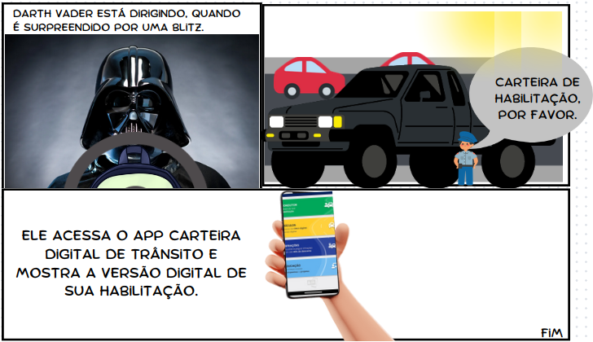

# Storyboard

## Introdução

Um Storyboard é uma forma de escrita que consiste em caixas organizadas logicamente
em uma sequência. Cada caixa representa um espaço para informações, imagens, símbolos
ou textos. Ele representa visualmente uma história por meio de quadros estáticos, que
podem conter desenhos, colagens, fotografias ou outras técnicas visuais.
(Storyboards, 2023)

## Storyboard 1

A figura 1 demonstra um caso de uso do aplicativo após um motorista ser multado por
cometer uma infração de trânsito.

O aplicativo pode ser acessado para verificar cobranças de multas.

**Figura 1**: Storyboard Vin Diesel

**Fonte**: [Breno](https://github.com/brenob6)

## Storyboard 2

A aplicativo também pode ser utilizado para obter documentos do veículo. Dessa maneira
situações em que o motorista não está com documentos em mão em uma blitz policial, por exemplo
são reduzidos. A figura 2 é um exemplo desse possível acontecimento.

**Figura 2**: Storyboard Darth Vader

**Fonte**: [Breno](https://github.com/brenob6)

## Storyboard 3

A Carteira Digital de Trânsito, pode ser utilizada para compartilhar documentos de veículos com
outros condutores. A figura 3 demonstra essa situação.

**Figura 3**: Storyboard Batman e Robin

**Fonte**: [Breno](https://github.com/brenob6)

## Requisitos Elicitados

Os requisitos elicitados com os storyboards estão dispostos na tabela 01.

Legenda:

- SB - Storyboard
- RF - Requisitos Funcionai
- RNF - Requisitos não funcionais

**Tabela 01**: Requisitos Funcionais

| Tipo | Descrição | Identificador | Implementação |
| :-:  | :-------- | :------------: | :-----------: |
| RF   | O usuário deve ser capaz de visualizar suas multas. | SB01 | Implementado |
| RF   | O aplicativo deve fornecer uma versão digital da carteira nacional de habilitação (CNH). | SB02 | Implementado |
| RF   | Deve ser possível compartilhar os documentos de um veículo com seus coatores. | SB03 | Implementado |
| RF   | O usuário deve conseguir solicitar a outro usuário o compartilhamento dos documentos do veículo. | SB04 | Implementado |
| RNF  | Deve ser possível acessar a CNH (digital) mesmo sem acesso à internet. | SB05 | Implementado |
| RNF  | Deve existir um prazo de validade do compartilhamento da CNH. | SB06 | Não implementado |
| RNF  | O aplicativo deve alertar o usuário caso seja multado. | SB07 | Não implementado |
| RNF  | O aplicativo deve disponibilizar diferentes formas de pagamento para as multas. | SB08 | Implementado |
| RNF  | O aplicativo deve alertar o usuário caso a multa esteja perto do vencimento. | SB09 | Não implementado |

**Fonte:** [Breno](https://github.com/brenob6)

## Bibliografia

> Storyboards, Disponível em: <https://retraining.inf.ufsc.br/guia/app/classificacoes/tecnicas-de-elicitacao-de-requisitos/entidades/tecnicas-de-elicitacao-de-requisitos-storyboards>.

## 📑 Histórico de versões 

Versão  |   Data    | Descrição | Autor(es)     | Revisor(es)|
:-----: | :----:    | ------    | ----------    | ----------|
|`1.0`|30/09/2023|Criação do documento | [Breno](https://github.com/brenob6) | [Luis Eduardo](https://github.com/LuisMiranda10)|
|`2.0`|20/10/2023|Adicionado tabela de requisitos elicitados|[Breno](https://github.com/brenob6)|  [Mayara Alves](https://github.com/Mayara-tech)
|`2.1`| 21/11/2023 |Correção Verificação Grupo 01: Adição do coluna de implementação na Tabela 01 | [Altino Arthur](https://github.com/arthurrochamoreira) | [Mayara Alves](https://github.com/Mayara-tech) |
