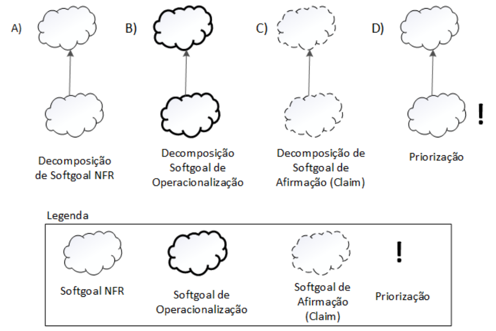
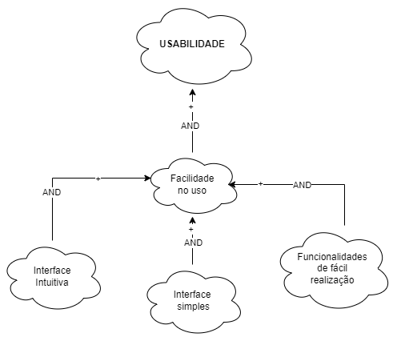
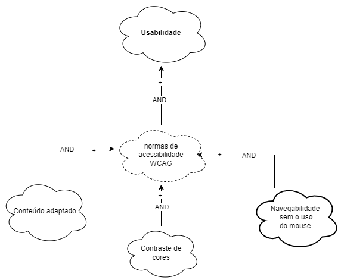

# NFR Framework 

## Introdução 

O Framework de Requisitos Não Funcionais (NFR, do inglês "Non-Functional Requirements") é uma abordagem essencial no desenvolvimento de software e engenharia de sistemas.O NFR Framework fornece uma estrutura organizada para coletar, analisar e documentar esses requisitos não funcionais. Isso ajuda as equipes de desenvolvimento e stakeholders a entenderem a importância de aspectos como tempo de resposta, segurança de dados, disponibilidade, entre outros, e a tomar decisões informadas durante o ciclo de vida do projeto.  
Este framework também auxilia na priorização dos requisitos não funcionais, considerando as restrições e necessidades específicas do projeto, permitindo que as equipes se concentrem nos aspectos mais críticos para atender às expectativas dos usuários e aos objetivos do negócio. No NFR Framework, faz-se o uso do modelo de Softgoal Interdependency Graph (SIG), quem em tradução para o português fica gráfico de interdependência de softgoals.

### Gráfico de Interdependência de Softgoals

O Gráfico de Interdependência de Softgoals (Softgoal Interdependency Graph - SIG) é uma representação visual do NFR Framework, que registra as posições da equipe de desenvolvimento em relação aos softgoals e ilustra suas interdependências de maneira gráfica e concisa. O termo "Softgoal", amplamente discutido no contexto deste framework, refere-se a um objetivo que carece de uma definição nítida e critérios de satisfação bem definidos. Esses objetivos são usados para representar Requisitos Não Funcionais (NFRs) e podem estar interligados, exercendo influência sobre outros elementos do sistema em questão.

Os Softgoals podem ser categorizados em três tipos distintos:

- **Softgoals NFR:** São requisitos não funcionais, que incluem critérios e atributos de qualidade desejados na análise, permitindo determinar sua implementação ou não implementação.

- **Softgoals de Operacionalização:** Representam funcionalidades concretas que servem como uma maneira de viabilizar ou não as características abstratas do sistema.

- **Softgoals de Afirmação:** São declarações em linguagem natural que podem ser incorporadas ao modelo para argumentar sobre pontos específicos de modelagem.

Cada um desses tipos de Softgoals pode ser desdobrado seguindo os seguintes métodos de decomposição:

- **Decomposição de Softgoals NFR:** Refina ou divide um Softgoal NFR em subobjetivos, ajudando a segmentar problemas complexos em partes menores, o que é útil para lidar com ambiguidades e prioridades.

- **Decomposição de Operacionalização:** Subdivide um Softgoal de Operacionalização em objetivos mais específicos, permitindo a definição de soluções gerais que podem ser transformadas em soluções mais específicas.

- **Decomposição de Afirmação (Claims):** Refina um Softgoal de Afirmação em subobjetivos adicionais. Isso é útil para fornecer justificativas sólidas para as decisões de projeto, apoiando ou refutando argumentos.

- **Priorização:** Refina um Softgoal em outro com o mesmo tipo e tópico, atribuindo uma prioridade associada a cada um, o que é útil para determinar a importância relativa dos objetivos e suas contribuições para o sistema.

Esse processo de desdobramento e priorização dos Softgoals é essencial para alcançar uma modelagem precisa e eficaz, especialmente em contextos nos quais os objetivos não são facilmente quantificáveis ou têm várias nuances.

 Figura 1: Tipos de Decomposição 

 
 

 Fonte: CHUNG et al.; 2000  

#### Contribuições entre Softgoals em um NFR Framework

Um aspecto fundamental é a relação de contribuição entre os Softgoals, que descreve como as mudanças nos estados de um Softgoal filho podem afetar o Softgoal pai. Essas contribuições são classificadas em diversos tipos, conforme apresentado na tabela a seguir:

| Contribuição | Representação | Descrição |
| :----------: | :-----------: | :-------: |
| AND | AND | O Softgoal pai é satisfeito somente se todos os Softgoals filhos forem satisfeitos, de acordo com a perspectiva dos envolvidos. |
| OR | OR | O Softgoal pai é satisfeito se pelo menos um dos Softgoals filhos for satisfeito, de acordo com a perspectiva dos envolvidos. |
| MAKE | ++ | Um Softgoal filho contribui de forma tão positiva que, sozinho, é capaz de satisfazer o Softgoal pai, de acordo com a perspectiva dos envolvidos. |
| HELP | + | Um Softgoal filho contribui de forma positiva, mas parcial, de modo que sozinho não é capaz de satisfazer o Softgoal pai, de acordo com a perspectiva dos envolvidos. |
| BREAK | -- | Um Softgoal filho contribui de forma tão negativa que, sozinho, nega o Softgoal pai, de acordo com a perspectiva dos envolvidos. |
| HURT | - | Um Softgoal filho contribui de forma negativa, mas parcial, de modo que sozinho não nega o Softgoal pai, de acordo com a perspectiva dos envolvidos. |
| UNKNOWN | ? | O Softgoal filho não afeta o Softgoal pai, e a relação é incerta. |
| EQUALS | = | Ambos compartilham o mesmo rótulo e estão intrinsecamente relacionados. |
| SOME | SOME - | Um Softgoal filho contribui de forma negativa, mas a intensidade dessa contribuição é desconhecida. |
| SOME | SOME + | Um Softgoal filho contribui de forma positiva, mas a intensidade dessa contribuição é desconhecida.

Esses conceitos de contribuição entre Softgoals são essenciais para a compreensão e modelagem de sistemas complexos, especialmente quando se lida com requisitos não funcionais e objetivos de qualidade. Eles proporcionam um meio preciso de descrever como as relações entre os Softgoals afetam o sistema como um todo.

## Metodologia
A abordagem adotada para a concepção do artefato foi fundamentada nos requisitos não funcionais, os quais foram delineados com base no nosso documento de especificação suplementar. Que, por sua vez, se pautou no modelo FURPS+ para a criação de 6 NFRs. Para melhor entendimento de cada categoria, foi feito um SIG (Softgoal Interdependency Graph), que possui informações sobre o NFR, como a descrição, a categoria, os conflitos, a origem, os critérios e outras informações, que foram divididos em 4 aspectos: Usabilidade, confiabilidade, desempenho e suportabilidade, como demonstrado na tabela 1. 

 Tabela 1: Requisitos Não Funcionais - RNF

|   Tipo  | Requisito                                                                                       | ID  |
| ---------- | --------------------------------------------------------------------------------             | ---------       |
| Usabilidade| O sistema não deve exigir que seus usuários sejam tecnófilos. Deve ser de fácil uso, sem necessidade prévia de treinamento para utilização do sistema.                                                                   | [NFR01](https://requisitos-de-software.github.io/2023.2-Carteira_Digital_de_Transito/modelagem/especificacao-suplementar/) 
| Usabilidade|O aplicativo deve seguir as normas de acessibilidade da WCAG        .                                                | [NFR02](https://requisitos-de-software.github.io/2023.2-Carteira_Digital_de_Transito/modelagem/especificacao-suplementar/) 
| Confiabilidade   | O sistema deve está disponível durante os 7 dias da semana, 24 horas por dia.                                   | [NFR03](https://requisitos-de-software.github.io/2023.2-Carteira_Digital_de_Transito/modelagem/especificacao-suplementar/) 
| Confiabilidade   | O aplicativo deve apresentar as políticas de privacidade, descrevendo quais dados serão coletados do usuário.                               | [NFR04](https://requisitos-de-software.github.io/2023.2-Carteira_Digital_de_Transito/modelagem/especificacao-suplementar/) 
| Desempenho | O aplicativo deve realizar suas operações em um tempo máximo de 2 segundos, caso não seja possível deve haver um feedback com indicador de progresso.                                  | [NFR05](https://requisitos-de-software.github.io/2023.2-Carteira_Digital_de_Transito/modelagem/especificacao-suplementar/) 
| Suportabilidade  |O aplicativo deve está disponível nas lojas virtuais dos principais sistemas operacionais (SO) utilizados em dispositiveis móveis.                                     | [NFR06](https://requisitos-de-software.github.io/2023.2-Carteira_Digital_de_Transito/modelagem/especificacao-suplementar/) 

<b>Fonte</b>:  <a href="https://github.com/Mayara-tech">Mayara Alves</a>

## NFR Usabilidade

Usabilidade, de acordo com a definição de Jakob Nielsen, é a medida que avalia quão fácil e agradável é a interação dos usuários com um sistema, seja um site, aplicativo ou software, no contexto de alcançar seus objetivos e realizar tarefas com eficácia. Na tabela 2 podemos observar os requisitos de usabilidade de o grupo elicitou, e nas figuras 2 e 3 podemos observar Softgoal Interdependency Grap do softgoal "Usabilidade" e a Propagação de impactos do softgoal "Usabilidade" 

 Tabela 2: Requisitos de Usabilidade - RNF

| Requisito                                                                                       | ID  |
| --------------------------------------------------------------------------------             | ---------       |
| O sistema não deve exigir que seus usuários sejam tecnófilos. Deve ser de fácil uso, sem necessidade prévia de treinamento para utilização do sistema.                                                                   | [NFR01](https://requisitos-de-software.github.io/2023.2-Carteira_Digital_de_Transito/modelagem/especificacao-suplementar/) 
|O aplicativo deve seguir as normas de acessibilidade da WCAG.                                                | [NFR02](https://requisitos-de-software.github.io/2023.2-Carteira_Digital_de_Transito/modelagem/especificacao-suplementar/) 

<b>Fonte</b>:  <a href="https://github.com/Mayara-tech">Mayara Alves</a>

#### Cartão especificação NFR1 - Facilidade no uso. 

 Cartão especificação NFR1 - Facilidade no uso

 
| Classificação         | Fácil Aprendizagem / Usabilidade | 
| ----------------------|--|
| Descrição             | O sistema não deve exigir que seus usuários sejam tecnófilos. Deve ser de fácil uso, sem necessidade prévia de treinamento para utilização do sistema.           |
| Justificativa         | Com um sistema simples o usuario não vai ter dificuldade em aprender a usar o aplicativo, assim terá menos chances dele abandonar o uso e te uma experiencia melhor com o app. |
| Origem do requisito   | RNF01 - Especificação suplementar |
| Critério de aceitação |- Os usuários novos devem ser capazes de realizar tarefas básicas no sistema sem a necessidade de treinamento formal ou extensas instruções.   - A interface do sistema deve ser intuitiva e autoexplicativa, com ícones e elementos de design facilmente compreensíveis.   - O sistema deve fornecer dicas ou orientações contextuais para auxiliar os usuários em tarefas mais complexas ou menos óbvias.   - A linguagem utilizada no sistema, incluindo rótulos de botões e mensagens de erro, deve ser clara e compreensível para o público-alvo.   - Os usuários devem ser capazes de realizar tarefas comuns, como criar um perfil, fazer login, buscar informações e concluir transações, de forma simples e direta |
| Prioridade            | Alta prioridade. Fonte: [TLS](https://requisitos-de-software.github.io/2023.2-Carteira_Digital_de_Transito/elicita%C3%A7%C3%A3o/prioriza%C3%A7%C3%A3o/three_level_scale/)|
| Conflito              | Nenhum |
| Historia              | 06 de novembro de 2023 |

<b>Fonte</b>:  <a href="https://github.com/Mayara-tech">Mayara Alves</a>

 Figura 2: SIG Facilidade no uso 

 

<b>Fonte</b>:  <a href="https://github.com/Mayara-tech">Mayara Alves</a>

#### Cartão especificação NFR2 - Acessibilidade. 

 Cartão especificação NFR2 - Acessibilidade

 
| Classificação         | Acessibilidade / Usabilidade | 
| ----------------------|--|
| Descrição             | O aplicativo deve seguir as normas de acessibilidade da WCAG           |
| Justificativa         | A exigência de seguir as normas de acessibilidade da WCAG é fundamental para garantir que o aplicativo seja acessível a todas as pessoas, independentemente de suas habilidades ou necessidades especiais, cumprindo princípios éticos e legais. Além disso, a conformidade com a acessibilidade amplia o público-alvo e a qualidade do produto, promovendo inclusão e melhor experiência para todos os usuários. |
| Origem do requisito   | RNF06 - Especificação suplementar |
| Critério de aceitação | - Realizar testes de teclado para verificar a navegabilidade sem o uso do mouse.   -Testar a navegação e interação com o aplicativo usando leitores de tela, como o JAWS ou NVDA, para garantir que informações e funcionalidades sejam adequadamente comunicadas.   - Verificar o contraste de cores em todo o aplicativo, garantindo que o texto seja legível para pessoas com deficiência visual.   - Testar o redimensionamento de texto e layout para assegurar que o conteúdo se adapte a diferentes tamanhos de tela sem perda de funcionalidade.   - Verificar a presença de alternativas textuais em todas as imagens, gráficos e mídias não textuais.   - Garantir que os formulários e campos interativos sejam acessíveis e utilizáveis por meio de leitores de tela e teclado.   - Testar a consistência e clareza da estrutura de cabeçalhos e rótulos de formulários para melhorar a compreensão e a navegação. |
| Prioridade            | Alta prioridade. Fonte: [TLS](https://requisitos-de-software.github.io/2023.2-Carteira_Digital_de_Transito/elicita%C3%A7%C3%A3o/prioriza%C3%A7%C3%A3o/three_level_scale/)|
| Conflito              | Nenhum |
| Historia              | 06 de novembro de 2023 |

<b>Fonte</b>:  <a href="https://github.com/Mayara-tech">Mayara Alves</a>

 Figura 3: SIG Acessibilidade 

 

<b>Fonte</b>:  <a href="https://github.com/Mayara-tech">Mayara Alves</a>

## NFR Confiabilidade 

 Tabela 03: Cartão especificação NFR03 - O sistema deve está disponível durante os 7 dias da semana, 24 horas por dia.

 
| Classificação         |Disponibilidade Contínua | 
| ----------------------|--|
| Descrição             | O sistema deve manter-se disponível ininterruptamente, durante os 7 dias da semana, 24 horas por dia, para atender às necessidades dos usuários e garantir um serviço confiável.           |
| Justificativa         | A disponibilidade ininterrupta é crucial para atender às expectativas dos usuários e garantir a confiabilidade do sistema. Os usuários podem precisar acessar o sistema a qualquer momento, independentemente do dia da semana ou da hora do dia. Portanto, é essencial que o sistema esteja sempre disponível para evitar interrupções nos serviços e proporcionar uma experiência satisfatória aos usuários. |
| Origem do requisito   | RNFX - Especificação suplementar |
| Critério de aceitação |- O sistema deve estar disponível 24 horas por dia, 7 dias por semana, com exceções permitidas apenas para manutenções programadas e devidamente comunicadas com antecedência aos usuários. - Durante qualquer período de manutenção programada, o sistema deve exibir uma mensagem de aviso aos usuários informando a data e a duração estimada da interrupção. - A disponibilidade do sistema deve ser monitorada continuamente, e quaisquer interrupções não programadas devem ser tratadas prontamente, com um tempo máximo de recuperação estabelecido para cada incidente. - Os registros de disponibilidade do sistema devem ser mantidos e periodicamente avaliados para garantir o cumprimento deste requisito. - A equipe de suporte e manutenção do sistema deve estar disponível para resolver problemas relacionados à disponibilidade 24 horas por dia, 7 dias por semana. |
| Prioridade            | Alta prioridade|
| Conflito              | Nenhum |
| Historia              | 06 de novembro de 2023 |

<b>Fonte</b>:  <a href="https://github.com/LimirioGuimaraes">Limírio Guimarães</a>

 Figura 4: SIG Disponibilidade Contínua 

 

<b>Fonte</b>:  <a href="https://github.com/LimirioGuimaraes">Limírio Guimarães</a>

 Tabela 04: Cartão especificação NFR04 - O aplicativo deve apresentar as políticas de privacidade, descrevendo quais dados serão coletados do usuário.

| Classificação         | Política de Privacidade e Transparência de Dados |
| ---------------------- | ----------------------------------------------- |
| Descrição             | O aplicativo deve apresentar de maneira clara, acessível e proeminente uma política de privacidade que descreva detalhadamente quais tipos de dados serão coletados do usuário durante o uso do aplicativo. A política deve também explicar como esses dados serão utilizados, compartilhados e armazenados. |
| Justificativa         | A privacidade do usuário é uma prioridade fundamental. A transparência na coleta e tratamento de dados é essencial para estabelecer a confiança do usuário e garantir a conformidade com regulamentos de proteção de dados. Além disso, a política de privacidade fornece aos usuários informações críticas para que eles possam tomar decisões informadas sobre o uso do aplicativo. |
| Origem do requisito   | RNF04 - Especificação Suplementar |
| Critério de aceitação | - A política de privacidade deve ser facilmente acessível no aplicativo, com um link direto na tela inicial ou uma seção de menu de fácil localização. - A política de privacidade deve ser redigida de maneira clara e compreensível, evitando linguagem técnica ou jurídica excessiva. - A política deve identificar todos os tipos de dados coletados, incluindo informações pessoais, dados de uso e quaisquer outros dados relevantes. - Deve ser especificado como os dados coletados serão usados, compartilhados e armazenados, incluindo detalhes sobre a segurança dos dados. - A política deve explicar os direitos do usuário em relação aos seus dados, incluindo o direito de acesso, retificação e exclusão.- Os usuários devem ser solicitados a aceitar a política de privacidade antes de usar o aplicativo, com a opção de recusar. |
| Prioridade            | Alta |
| Conflito              | Nenhum |
| Data da História      | 06 de novembro de 2023 |

 Figura 5: SIG Política de Privacidade e Transparência de Dados 

 
 

<b>Fonte</b>:  <a href="https://github.com/LimirioGuimaraes">Limírio Guimarães</a>

## NFR Desempenho

 Tabela 05: Cartão especificação NFR05 - O aplicativo deve realizar suas operações em um tempo máximo de 2 segundos, caso não seja possível deve haver um feedback com indicador de progresso.

| Classificação         | Desempenho e Feedback do Tempo de Resposta |
| ----------------------|------------------------------------------|
| Descrição             | O aplicativo deve realizar suas operações em um tempo máximo de 2 segundos, caso não seja possível deve haver um feedback com indicador de progresso. |
| Justificativa         | Garantir que o aplicativo forneça uma experiência responsiva e informe os usuários quando as operações levam mais tempo do que o esperado, melhorando a satisfação do usuário. |
| Origem do requisito   | RNF05 - Especificação Suplementar |
| Critério de aceitação |- O aplicativo deve concluir todas as operações dentro de 2 segundos após a solicitação do usuário. - Em caso de operações que excedam o limite de tempo, o aplicativo deve fornecer feedback de progresso claro.  - Priorizar o feedback para operações que excedem o limite de tempo. - Oferecer opções de cancelamento ou aguardo para operações que não cumpram o prazo. - Manter registros de desempenho para análise e otimização. |
| Prioridade            | Alta |
| Conflito              | Pode haver conflito com requisitos de desempenho de hardware e redes. |
| História              | 06 de novembro de 2023 |

<b>Fonte</b>:  <a href="https://github.com/LimirioGuimaraes">Limírio Guimarães</a>

 Figura 6: SIG  Desempenho e Feedback do Tempo de Resposta  

 
 

<b>Fonte</b>:  <a href="https://github.com/LimirioGuimaraes">Limírio Guimarães</a>

## NFR Suportabilidade

A suportabilidade defini que o aplicativo deve ser projetado e desenvolvido de forma a garantir a suportabilidade em diferentes ambientes e plataformas, visando a flexibilidade e a capacidade de adaptação para atender às necessidades dos usuários. deve ser projetado e desenvolvido de forma a garantir a suportabilidade em diferentes ambientes e plataformas, visando a flexibilidade e a capacidade de adaptação para atender às necessidades dos usuários.

 Tabela 2: Requisitos de Usabilidade - RNF

| Requisito                                                                                       | ID  |
| --------------------------------------------------------------------------------             | ---------       |
| O aplicativo deve está disponível nas lojas virtuais dos principais sistemas operacionais (SO) utilizados em dispositiveis móveis.          | [NFR13](https://requisitos-de-software.github.io/2023.2-Carteira_Digital_de_Transito/modelagem/especificacao-suplementar/) 

<b>Fonte</b>:  <a href="https://github.com/Mayara-tech">Mayara Alves</a>

#### Cartão especificação NFR6 - Suportabilidade. 

 Cartão especificação NFR6 - Suportabilidade

 
| Classificação         | Acessibilidade / Usabilidade | 
| ----------------------|--|
| Descrição             | O aplicativo deve está disponível nas lojas virtuais dos principais sistemas operacionais (SO) utilizados em dispositiveis móveis.         |
| Justificativa         |A disponibilidade do aplicativo nas principais lojas virtuais de sistemas operacionais móveis é crucial para ampliar o alcance de mercado, promover a acessibilidade universal e aumentar a credibilidade do aplicativo. |
| Origem do requisito   | RNF13 - Especificação suplementar |
| Critério de aceitação | - O aplicativo deve ser listado e disponível na loja de aplicativos da Apple (App Store) para dispositivos iOS e na loja de aplicativos do Google (Google Play) para dispositivos Android.   - A listagem do aplicativo deve cumprir todas as diretrizes e políticas estabelecidas pelas lojas virtuais, garantindo a aprovação e a permanência do aplicativo nas plataformas.   - O aplicativo deve ser atualizado regularmente para garantir a compatibilidade com as versões mais recentes dos sistemas operacionais e manter-se em conformidade com as políticas das lojas virtuais. |
| Prioridade            | Alta prioridade. Fonte: [TLS](https://requisitos-de-software.github.io/2023.2-Carteira_Digital_de_Transito/elicita%C3%A7%C3%A3o/prioriza%C3%A7%C3%A3o/three_level_scale/)|
| Conflito              | Nenhum |
| Historia              | 06 de novembro de 2023 |

 Fonte: Mayara Alves

 Figura 7: SIG Suportabilidade 

 

<b>Fonte</b>:  <a href="https://github.com/Mayara-tech">Mayara Alves</a>

## Bibliografia

> BARBOSA, S. D. J.; SILVA, B. S. Interação Humano-Computador. Rio de Janeiro: Elsevier, 2011.'

> REQUISITOS DE SOFTWARE. Bilheteria Digital. Distrito Federal, 2023. Disponível em: <https://requisitos-de-software.github.io/2023.1-BilheteriaDigital/>. Acesso em: 06/11/2023.

> REQUISITOS DE SOFTWARE. MEI - Microempreendedor Individual. Distrito Federal, 2022. Disponível em:  <https://requisitos-de-software.github.io/2022.2-MEI/>. Acesso em: 06/11/2023

> CHUNG, L.; NIXON, B. A.; YU, E.; MYLOPOULOS, J. Non-functional requirements in software engineering. Springer Science & Business Media: [s.n.], 2000. v. 5.

> SILVA, R. NFR4ES: Um Catálogo de Requisitos Não-Funcionais para Sistemas Embarcados. Tese (Mestrado em Engenharia de Software) - Centro de Informática, Universidade Federal de Pernambuco. Recife, p. 155. 2019.

## 📑Histórico de Versões

| Versão |    Data    |      Descrição      |       Autor     | Revisor(es)  |
| ------ | ---------- | ------------------- | --------------- | ------------ |
| 1.0    | 06/11/2023 | Criação do template | [Limirio Guimarães](https://github.com/LimirioGuimaraes) |[Mayara Alves](https://github.com/Mayara-tech) |
| 1.1   | 06/11/2023 | Criação do NFR de usabilidade |  [Mayara Alves](https://github.com/Mayara-tech) |[Limirio Guimarães](https://github.com/LimirioGuimaraes) |
| 1.2    | 06/11/2023 | Criação do NFR de Confiabilidade| [Limirio Guimarães](https://github.com/LimirioGuimaraes) |[Mayara Alves](https://github.com/Mayara-tech) |
| 1.3    | 06/11/2023 | Criação do NFR de Desempenho | [Limirio Guimarães](https://github.com/LimirioGuimaraes) |[Mayara Alves](https://github.com/Mayara-tech) |
| 1.4   | 06/11/2023 | Criação do NFR de suportabilidade |  [Mayara Alves](https://github.com/Mayara-tech) |[Limirio Guimarães](https://github.com/LimirioGuimaraes) |

