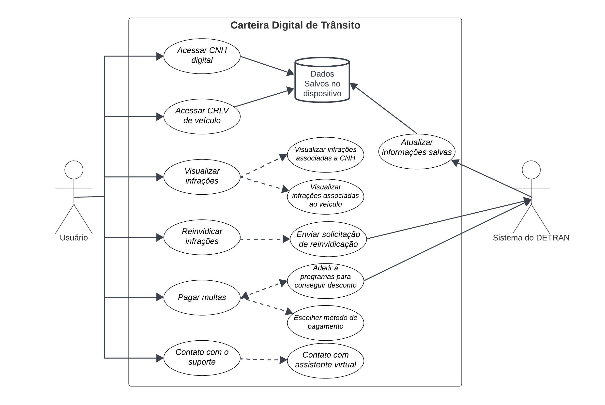

# Casos de Uso

## Introdução

Um caso de uso é uma forma de representar as interações entre um sistema ou aplicativo e os usuários ou entidades externas que se beneficiam dele. Um diagrama de caso de uso é uma ferramenta visual que usa símbolos e conectores UML para mostrar os casos de uso, os atores e o limite do sistema. Um diagrama de caso de uso ajuda a definir e organizar os requisitos funcionais do sistema, especificar o contexto e as metas do sistema e modelar o fluxo básico de eventos no caso de uso. Um diagrama de caso de uso UML é ideal para representar as metas de interações entre sistemas e usuários.

## Metodologia

O artefato que foi criado é um diagrama de casos de uso UML, que representa as interações entre o sistema e os usuários ou entidades externas. A abordagem utilizada para a criação do diagrama foi a tradicional, que segue os padrões e símbolos da UML. A ferramenta escolhida para a diagramação foi o LucidChart, um software online que permite criar diversos tipos de diagramas. Para entender melhor as necessidades e desejos dos usuários finais do sistema, foi utilizada a persona Jair Motonaro, que representa um tipo de usuário com características específicas. Com a persona Jair Motonaro, foi possível modelar cenários realistas de uso do sistema, levando em conta as diferentes necessidades e objetivos do usuário.

## Glossário

Um diagrama de casos de uso é uma forma poderosa de capturar requisitos, definindo as interações entre um sistema e seus usuários, conhecidos como "atores". Neste glossário, você encontrará explicações detalhadas de cada um dos elementos que compõem um diagrama de casos de uso. Vamos explorar os conceitos-chave que possibilitam a representação visual de sistemas de forma eficaz e compreensível.

<b>Tabela 1</b>: Elementos do diagrama de casos de uso

|    Símbolo    |     Nome     |    Descrição    |
| ------------- | ------------ | --------------- |
| | Caso de uso  | Representa uma funcionalidade ou objetivo do sistema. A elipse contém o nome do caso de uso dentro ou abaixo dela.|
|      | Ator         | Um ator é um elemento que participa das interações com o seu sistema ou aplicativo. Um ator pode ser uma pessoa, uma organização ou um sistema externo que tem algum interesse ou benefício no seu sistema.  |
|     | Sistema      | Representa o limite do sistema, ou seja, o escopo e o contexto do sistema que está sendo modelado. O retângulo pode conter os casos de uso que são internos ao sistema e separá-los dos atores que são externos ao sistema. |
| | Relações     | As flechas representam os relacionamentos entre os casos de uso e os atores ou entre os próprios casos de uso. Existem diferentes tipos de flechas que indicam diferentes tipos de relacionamentos, como associação, inclusão e extensão. A associação é uma linha sólida entre um ator e um caso de uso que indica uma interação entre eles. A inclusão é uma linha tracejada entre dois casos de uso que indica que um caso de uso é incluído em outro caso de uso. A extensão é uma linha tracejada com uma seta entre dois casos de uso que indica que um caso de uso é estendido por outro caso de uso. |

<b>Fonte: [Limirio Guimarães](https://github.com/LimirioGuimaraes)</b>

## Diagrama de Casos de Uso

A figura 1 demonstra o diagrama de casos de uso.

Figura 1: Casos de uso do app Carteira Digital de Trânsito

<b>Fonte: [Limirio Guimarães](https://github.com/LimirioGuimaraes)</b>

## Especialização dos casos de uso

As tabelas de 2 a 8 mostram a especialização dos casos de uso identificados.

Tabela 2: Acessar CNH digital

| **UC 1**              | **Acessar CNH digital**    |
|-----------------------|----------------------------|
| Descrição             | Este caso de uso descreve o processo pelo qual o usuário acessa a Carteira Nacional de Habilitação (CNH) digital armazenada no dispositivo.             |
| Ator                  | Usuário                    | 
| Frequência de uso     | Média                      | 
| Pré-condições         |- O aplicativo está instalado e em funcionamento no dispositivo do usuário.    |
| Ação                  |- O usuário abre o aplicativo da CNH Digital.  - O usuário seleciona a opção "Acessar CNH Digital".                                            |
| Fluxo principal       |- O aplicativo exibe as informações da CNH digital na tela.   - O usuário pode navegar pelas informações da CNH, como nome, foto, número da CNH, categoria, data de validade, entre outras.  - O usuário pode escolher sair do aplicativo a qualquer momento.                     |
| Fluxo alternativo     | Não há                     |
| Fluxo de exceção      | Se ocorrer algum erro durante o acesso à CNH digital, o aplicativo deve lidar com a exceção adequadamente, exibindo uma mensagem de erro e oferecendo opções para tentar novamente ou sair do aplicativo.                                          |
| Pós-condições         | O usuário pode visualizar as informações da CNH digital. |
| Data de criação       | 21/10/2023                 |
| Rastreabilidade       | xxxxx                      |

Fonte: [Limirio Guimarães](https://github.com/LimirioGuimaraes).

Tabela 3: Acessar CRLV digital

| **UC 2**              | **Acessar CRLV digital**     |
|-----------------------|------------------------------|
| Descrição             | Este caso de uso descreve o processo em que o usuário acessa o Certificado de Registro e Licenciamento de Veículo (CRLV) digital armazenado no dispositivo.|
| Ator                  | Usuário                      | 
| Frequência de uso     | Média                        |
| Pré-condições         | - O aplicativo está instalado e em funcionamento no dispositivo do usuário. |
| Ação                  | - O usuário abre o aplicativo CRLV Digital.  - O usuário seleciona a opção "Acessar CRLV Digital".|
| Fluxo principal       | 1. Se um CRLV digital for encontrado no banco de dados do dispositivo:  - O aplicativo exibe as informações do CRLV digital na tela.  - O usuário pode visualizar detalhes como placa do veículo, número do Renavam, informações do proprietário, data de licenciamento, entre outros. 2. Se nenhum CRLV digital for encontrado no banco de dados do dispositivo:  - O aplicativo exibe uma mensagem informando que não há CRLV cadastrado na conta do dispositivo. |
| Fluxo alternativo     | Não há.|
| Fluxo de exceção      | Em caso de erro durante o acesso ao CRLV digital, o aplicativo deve lidar com a exceção adequadamente, exibindo uma mensagem de erro e oferecendo opções para tentar novamente ou sair do aplicativo. |
| Pós-condições         | O usuário pode visualizar as informações do CRLV digital, se disponíveis no dispositivo.|
| Data de criação       | 21/10/2023                   |
| Rastreabilidade       | xxxxx |

Fonte: [Limirio Guimarães](https://github.com/LimirioGuimaraes).

Tabela 4: Visualizar Infrações

| **UC 3**              | **Visualizar Infrações**   |
|-----------------------|----------------------------|
| Descrição             | Este caso de uso permite ao usuário visualizar infrações de trânsito. Existem duas opções: visualizar infrações associadas à Carteira Nacional de Habilitação (CNH) do usuário e visualizar infrações associadas a um veículo específico. As informações detalhadas das infrações são exibidas ao usuário. |
| Ator                  | Usuário                      | 
| Frequência de uso     | Baixa |
| Pré-condições         | - O aplicativo está instalado e em funcionamento no dispositivo do usuário. - O dispositivo do usuário possui uma conexão ativa com a internet. |
| Ação                  | - O usuário abre o aplicativo. - O usuário seleciona a opção "Visualizar Infrações".  - O aplicativo apresenta ao usuário as duas opções: visualizar infrações associadas à CNH ou visualizar infrações associadas a um veículo.  - O usuário escolhe uma das opções.  - O aplicativo busca e exibe as informações detalhadas das infrações de acordo com a opção escolhida. |
| Fluxo principal       | 1. Para visualizar infrações associadas à CNH:  - O aplicativo busca e exibe as informações das infrações associadas à CNH.  2. Para visualizar infrações associadas a um veículo:  - O usuário escolhe um dos veículos a qual tem acesso a informação.  - O aplicativo busca e exibe as informações das infrações associadas ao veículo em questão. |
| Fluxo alternativo     | - Se não houver infrações associadas à CNH ou ao veículo, o aplicativo deve informar o usuário de que não foram encontradas infrações.  - O usuário pode optar por visualizar mais detalhes de cada infração listada. |
| Fluxo de exceção      | - Se ocorrer algum erro durante a busca ou exibição das infrações, o aplicativo deve lidar com a exceção adequadamente, exibindo uma mensagem de erro e oferecendo opções para tentar novamente ou sair do aplicativo. |
| Pós-condições         | - O usuário pode visualizar as informações detalhadas das infrações associadas à CNH ou ao veículo escolhido.   - O usuário pode optar por visualizar mais detalhes de cada infração.  |
| Data de criação       | 21/10/2023                   |
| Rastreabilidade       | xxxxx |

Fonte: [Limirio Guimarães](https://github.com/LimirioGuimaraes).

Tabela 5: Reivindicar Infrações

| **UC 4**              | **Reivindicar Infrações**  |
|-----------------------|----------------------------|
| Descrição             | Este caso de uso permite ao usuário abrir uma reivindicação em relação a uma multa de trânsito que tenha recebido. O objetivo é contestar ou esclarecer uma infração específica. |
| Ator                  | Usuário                      | 
| Frequência de uso     | Baixa |
| Pré-condições         | - O aplicativo está instalado e em funcionamento no dispositivo do usuário. - O dispositivo do usuário possui uma conexão ativa com a internet.   - O usuário recebeu uma notificação ou identificou uma infração específica que deseja contestar. |
| Ação                  | - O usuário abre o aplicativo.  - O usuário ecolhe uma infração para visualiza detalhes.  - Ao ver detalhes da infração o usuário clica na aba d reinvindivar infração. - O aplicativo permite ao usuário fornecer detalhes e justificativas para a reivindicação. |
| Fluxo principal       | - O aplicativo exibe os detalhes da infração selecionada.   - O usuário pode fornecer informações de reivindicação, anexar evidências, fornecer justificativas e enviar a reivindicação.   - Após o envio da reivindicação, o aplicativo registra a solicitação. |
| Fluxo alternativo     | - Se não houver infrações a serem reivindicadas, o aplicativo deve informar o usuário de que não foram encontradas infrações para reivindicar.   - O usuário pode optar por visualizar o status de suas reivindicações anteriores.   - O usuário pode anexar evidências, como fotos ou documentos, para apoiar sua reivindicação. |
| Fluxo de exceção      | Se ocorrer algum erro durante o envio da reivindicação, o aplicativo deve lidar com a exceção adequadamente, exibindo uma mensagem de erro e oferecendo opções para tentar novamente ou sair do aplicativo. |
| Pós-condições         | - O usuário registra uma reivindicação relacionada a uma infração de trânsito específica.   - O aplicativo armazena a reivindicação e envia para revisão e processamento pelas autoridades de trânsito. |
| Data de criação       | 21/10/2023                   |
| Rastreabilidade       | xxxxx |

Fonte: [Limirio Guimarães](https://github.com/LimirioGuimaraes).

Tabela 6: Pagar multas

| **UC 5**              | **Pagar Multas**         |
|-----------------------|--------------------------|
| Descrição             | Este caso de uso permite ao usuário pagar multas de trânsito. O usuário tem a opção de aderir a iniciativas do governo para ganhar descontos nas multas ou escolher um método de pagamento padrão. |
| Ator                  | Usuário                  | 
| Frequência de uso     | Baixa|
| Pré-condições         | - O aplicativo está instalado e em funcionamento no dispositivo do usuário. - O dispositivo do usuário possui uma conexão ativa com a internet.   - O usuário possui multas registradas no sistema. |
| Ação                  | - O usuário abre o aplicativo.   - o usuario seleciona a opção de visualizar infrações.  - O usuário escolhe uma infração para pagar a multa referente a ela.   - O aplicativo apresenta ao usuário as seguintes opções: 1. Aderir a iniciativas do governo para ganhar descontos nas multas.  2. Escolher um método de pagamento padrão.   - O usuário escolhe uma das opções.  - Dependendo da opção escolhida, o aplicativo guia o usuário pelo processo de pagamento. |
| Fluxo principal       | - Se o usuário escolhe aderir a iniciativas do governo:  1. O aplicativo lista as iniciativas disponíveis com detalhes sobre descontos e requisitos.   2. O usuário escolhe uma iniciativa e segue as instruções para aderir.  - Se o usuário escolhe um método de pagamento padrão:  1. O aplicativo permite ao usuário selecionar um método de pagamento.  2. O aplicativo fornece as informações necessárias para efetuar o pagamento de acordo com a opção selecionada. |
| Fluxo alternativo     | - O usuário pode optar por revisar um resumo de suas multas pendentes antes de prosseguir com o pagamento.   - O aplicativo pode oferecer opções de parcelamento para multas em casos específicos.|
| Fluxo de exceção      | Se ocorrer algum erro durante o processo de pagamento, o aplicativo deve lidar com a exceção adequadamente, exibindo uma mensagem de erro e oferecendo opções para tentar novamente ou sair do aplicativo. |
| Pós-condições         | - O usuário efetua o pagamento das multas de trânsito, sejam elas com descontos de iniciativas do governo ou através de um método de pagamento padrão.   - O usuário pode visualizar seu histórico de pagamentos e multas pagas. |
| Data de criação       | 21/10/2023               |
| Rastreabilidade       | xxxxx|

Fonte: [Limirio Guimarães](https://github.com/LimirioGuimaraes).

Tabela 7: Contato com o Suporte

| **UC 6**              | **Contato com o Suporte**  |
|-----------------------|---------------------------|
| Descrição             | Este caso de uso permite ao usuário entrar em contato com o suporte do aplicativo para tirar dúvidas, obter assistência ou resolver problemas por meio de um assistente virtual. |
| Ator                  | Usuário                   | 
| Frequência de uso     | Baixa |
| Pré-condições         | - O aplicativo está instalado e em funcionamento no dispositivo do usuário.  - O dispositivo do usuário possui uma conexão ativa com a internet. |
| Ação                  | - O usuário abre o aplicativo.  - O usuário acessa a seção de "Suporte" ou "Ajuda".  - O aplicativo disponibiliza uma opção para iniciar uma conversa com o assistente virtual de suporte.  - O usuário inicia a conversa com o assistente virtual.  - O usuário pode fazer perguntas, obter informações, relatar problemas e receber assistência do assistente virtual. |
| Fluxo principal       | - O assistente virtual interage com o usuário para resolver suas dúvidas ou problemas por meio de mensagens de texto ou chatbot.  - O assistente virtual pode fornecer informações, direcionar o usuário para recursos relevantes ou encaminhá-lo para suporte humano, se necessário.  - O usuário conclui a interação com o assistente virtual quando suas dúvidas são resolvidas ou seu problema é encaminhado para o suporte humano. |
| Fluxo alternativo     | Se a conversa com o assistente virtual não resolver o problema do usuário, ele pode optar por ser direcionado para suporte humano ou fornecer informações de contato para que o suporte entre em contato posteriormente. |
| Fluxo de exceção      | Se ocorrer algum erro durante a interação com o assistente virtual, o aplicativo deve lidar com a exceção adequadamente, exibindo uma mensagem de erro e oferecendo opções para tentar novamente ou relatar o problema de outra forma. |
| Pós-condições         | - O usuário obteve assistência, informações ou resolução para suas dúvidas ou problemas por meio do assistente virtual.   - O aplicativo pode registrar a interação com o assistente virtual para fins de acompanhamento e melhoria.  - O usuário pode encerrar a conversa a qualquer momento. |
| Data de criação       | 21/10/2023                |
| Rastreabilidade       | xxxxxxx |

Fonte: [Limirio Guimarães](https://github.com/LimirioGuimaraes).

Tabela 8: Atualizar Informações Salvas

| **UC 7**              | **Atualizar Informações Salvas**   |
|-----------------------|------------------------------------|
| Descrição             | Este caso de uso descreve o processo em que o sistema do Departamento de Trânsito (Detran) atualiza as informações salvas no aplicativo do usuário sempre que o aplicativo é utilizado com acesso à internet. |
| Ator                  | Sistema do Detran                    | 
| Frequência de uso     | Alta |
| Pré-condições         | - O aplicativo está instalado e em funcionamento no dispositivo do usuário.  - O dispositivo do usuário possui uma conexão ativa com a internet.|
| Ação                  | - O sistema do Detran detecta que o aplicativo do usuário está ativo e conectado à internet.   - O sistema do Detran verifica se há informações a serem atualizadas no aplicativo do usuário.  - Se houver informações a serem atualizadas, o sistema do Detran envia as atualizações para o aplicativo do usuário. |
| Fluxo principal       | - O sistema do Detran sincroniza automaticamente as informações no aplicativo do usuário com as informações mais recentes disponíveis.   - As informações podem incluir atualizações sobre a CNH, CRLV, multas, infrações, licenciamento, entre outras.   - O sistema do Detran registra a data da última sincronização. |
| Fluxo alternativo     | Se o sistema do Detran não detectar nenhuma informação a ser atualizada, a data de última sincronização é atualizada, mas o aplicativo do usuário permanece com as informações existentes previamente.|
| Fluxo de exceção      | Em caso de erro durante o processo de atualização, o sistema do Detran deve lidar com a exceção adequadamente e pode tentar a sincronização novamente posteriormente. |
| Pós-condições         | - As informações no aplicativo do usuário estão atualizadas com as informações mais recentes do sistema do Detran.   - O sistema do Detran registra a data da última sincronização bem-sucedida.   - O usuário tem acesso às informações atualizadas em seu aplicativo. |
| Data de criação       | 21/10/2023                           |
| Rastreabilidade       | xxxxxx |

Fonte: [Limirio Guimarães](https://github.com/LimirioGuimaraes).

## Bibliografia

> BARBOSA, S. D. J.; SILVA, B. S. Interação Humano-Computador. Rio de Janeiro: Elsevier, 2011.

> LUCIDCHART. Diagrama de caso de uso, 2021. Disponível em: <https://www.lucidchart.com/pages/pt/diagrama-de-caso-de-uso-uml>. Acesso em: 21/10/2023.

## Histórico de Versões

| Versão |    Data    |      Descrição      |       Autor     | Revisor(es)  |
| ------ | ---------- | ------------------- | --------------- | ------------ |
| 1.0    | 19/10/2023 | Criação do template | [Limirio Guimarães](https://github.com/LimirioGuimaraes) |  |
| 1.1    | 21/10/2023 | Adicionado introdução, metodologia e glossário | [Limirio Guimarães](https://github.com/LimirioGuimaraes) |  |
| 1.2    | 21/10/2023 | Adicionado diagrama de casos de uso | [Limirio Guimarães](https://github.com/LimirioGuimaraes) |  |
| 1.3    | 21/10/2023 | Adicionada as tabelas de especialização dos casos de uso| [Limirio Guimarães](https://github.com/LimirioGuimaraes) |  |