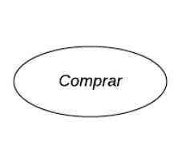

# Casos de Uso

## Introdução

Um caso de uso é uma forma de representar as interações entre um sistema ou aplicativo e os usuários ou entidades externas que se beneficiam dele. Um diagrama de caso de uso é uma ferramenta visual que usa símbolos e conectores UML para mostrar os casos de uso, os atores e o limite do sistema. Um diagrama de caso de uso ajuda a definir e organizar os requisitos funcionais do sistema, especificar o contexto e as metas do sistema e modelar o fluxo básico de eventos no caso de uso. Um diagrama de caso de uso UML é ideal para representar as metas de interações entre sistemas e usuários.

## Metodologia

O artefato que foi criado é um diagrama de casos de uso UML, que representa as interações entre o sistema e os usuários ou entidades externas. A abordagem utilizada para a criação do diagrama foi a tradicional, que segue os padrões e símbolos da UML. A ferramenta escolhida para a diagramação foi o LucidChart, um software online que permite criar diversos tipos de diagramas. Para entender melhor as necessidades e desejos dos usuários finais do sistema, foi utilizada a persona Jair Motonaro, que representa um tipo de usuário com características específicas. Com a persona Jair Motonaro, foi possível modelar cenários realistas de uso do sistema, levando em conta as diferentes necessidades e objetivos do usuário.

## Glossário

Um diagrama de casos de uso é uma forma poderosa de capturar requisitos, definindo as interações entre um sistema e seus usuários, conhecidos como "atores". Neste glossário, você encontrará explicações detalhadas de cada um dos elementos que compõem um diagrama de casos de uso. Vamos explorar os conceitos-chave que possibilitam a representação visual de sistemas de forma eficaz e compreensível.

<b>Tabela 1</b>: Elementos do diagrama de casos de uso

|    Símbolo    |     Nome     |    Descrição    |
| ------------- | ------------ | --------------- |
| | Caso de uso  | Representa uma funcionalidade ou objetivo do sistema. A elipse contém o nome do caso de uso dentro ou abaixo dela.|
|      | Ator         | Um ator é um elemento que participa das interações com o seu sistema ou aplicativo. Um ator pode ser uma pessoa, uma organização ou um sistema externo que tem algum interesse ou benefício no seu sistema.  |
|     | Sistema      | Representa o limite do sistema, ou seja, o escopo e o contexto do sistema que está sendo modelado. O retângulo pode conter os casos de uso que são internos ao sistema e separá-los dos atores que são externos ao sistema. |
| | Relações     | As flechas representam os relacionamentos entre os casos de uso e os atores ou entre os próprios casos de uso. Existem diferentes tipos de flechas que indicam diferentes tipos de relacionamentos, como associação, inclusão e extensão. A associação é uma linha sólida entre um ator e um caso de uso que indica uma interação entre eles. A inclusão é uma linha tracejada entre dois casos de uso que indica que um caso de uso é incluído em outro caso de uso. A extensão é uma linha tracejada com uma seta entre dois casos de uso que indica que um caso de uso é estendido por outro caso de uso. |

<b>Fonte: [Limirio Guimarães](https://github.com/LimirioGuimaraes)</b>

## Diagrama de Casos de Uso

A figura 1 demonstra o diagrama de casos de uso.

Figura 1: Casos de uso do app Carteira Digital de Trânsito

<b>Fonte: [Limirio Guimarães](https://github.com/LimirioGuimaraes)</b>

## Especialização dos casos de uso

As tabelas de 2 a 5 mostram a especialização dos casos de uso.

Tabela 2: xxx

| Cabeçalho 1 | Cabeçalho 2 | Cabeçalho 3 |
|-------------|-------------|-------------|
| Linha 1, Col 1 | Linha 1, Col 2 | Linha 1, Col 3 |
| Linha 2, Col 1 | Linha 2, Col 2 | Linha 2, Col 3 |
| Linha 3, Col 1 | Linha 3, Col 2 | Linha 3, Col 3 |

<b>Fonte:[Limirio Guimarães](https://github.com/LimirioGuimaraes) </b>

Tabela 3: xxx 

| Cabeçalho 1 | Cabeçalho 2 | Cabeçalho 3 |
|-------------|-------------|-------------|
| Linha 1, Col 1 | Linha 1, Col 2 | Linha 1, Col 3 |
| Linha 2, Col 1 | Linha 2, Col 2 | Linha 2, Col 3 |
| Linha 3, Col 1 | Linha 3, Col 2 | Linha 3, Col 3 |

<b>Fonte: [Limirio Guimarães](https://github.com/LimirioGuimaraes) </b>

Tabela 4: xxx

| Cabeçalho 1 | Cabeçalho 2 | Cabeçalho 3 |
|-------------|-------------|-------------|
| Linha 1, Col 1 | Linha 1, Col 2 | Linha 1, Col 3 |
| Linha 2, Col 1 | Linha 2, Col 2 | Linha 2, Col 3 |
| Linha 3, Col 1 | Linha 3, Col 2 | Linha 3, Col 3 |

<b>Fonte: [Limirio Guimarães](https://github.com/LimirioGuimaraes)</b>

Tabela 5: xxx 

| Cabeçalho 1 | Cabeçalho 2 | Cabeçalho 3 |
|-------------|-------------|-------------|
| Linha 1, Col 1 | Linha 1, Col 2 | Linha 1, Col 3 |
| Linha 2, Col 1 | Linha 2, Col 2 | Linha 2, Col 3 |
| Linha 3, Col 1 | Linha 3, Col 2 | Linha 3, Col 3 |

<b>Fonte: [Limirio Guimarães](https://github.com/LimirioGuimaraes)</b>

## Bibliografia

> BARBOSA, S. D. J.; SILVA, B. S. Interação Humano-Computador. Rio de Janeiro: Elsevier, 2011.

> LUCIDCHART. Diagrama de caso de uso, 2021. Disponível em: <https://www.lucidchart.com/pages/pt/diagrama-de-caso-de-uso-uml>. Acesso em: 21/10/2023.

## Histórico de Versões

| Versão |    Data    |      Descrição      |       Autor     | Revisor(es)  |
| ------ | ---------- | ------------------- | --------------- | ------------ |
| 1.0    | 19/10/2023 | Criação do template | [Limirio Guimarães](https://github.com/LimirioGuimaraes) |  |
| 1.1    | 21/10/2023 | Adicionado introdução, metodologia e glossário | [Limirio Guimarães](https://github.com/LimirioGuimaraes) |  |
