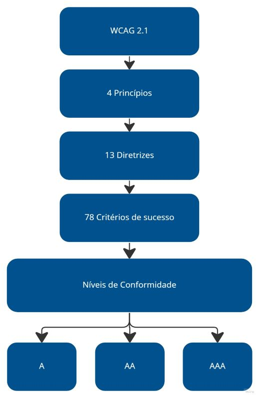

# Especificação Suplementar

## Introdução

Esse documento tem por objetivo descrever os requisitos não funcionais, *non-functional requirements*
(NFR), do software Carteira Digital de Trânsito. Os requisitos analisados foram classificados utilizando
o modelo FURPS+, que classifica os requisitos em funcionais, de usabilidade, de confiabilidade, de
suportabilidade, de desempenho, e de restrições. 

## Metodologia

Para a realizar a classificação dos requisitos fora utilizado a modelo FURPS+ de maneira adaptada. Não foi
utilizado a classifica Funcional do modelo, já que esse requisitos foram modelados em outros documentos
presentes no projeto.

## Funcionais

Não foi utilizada a classificação de funcionais proposto pela modelagem FURPS+, pois os requisitos funcionais
foram classificados em outros documentos: [casos de uso](./casosDeUso.md), [léxicos](./léxicos) e [cenários](./Cenarios).

## Usabilidade

1. Facilidade de uso do sistema pelo usuário.
2. Atividades críticas devem ser executas com um número máximo de ações.
3. Atividades típicas devem ser executadas em um curto período de tempo.
4. O sistema deve possuir um interface minimalista.
5. O sistema deve possuir um linguagem simples.
6. Acessibilidade.

### Requisito de Usabilidade 1

O sistema não deve exigir que seus usuários sejam tecnófilos. Deve ser de fácil uso, sem necessidade
prévia de treinamento para utilização do sistema. 

### Requisito de Usabilidade 2 e 3

Os usuários devem realizar as atividades críticas em um curto período de tempo, de no máximo
um minuto. Além disso, os objetivos críticos devem ser alcançados por um caminho curto, necessitando
uma pequena quantidade de ações do usuário, cerca de 5 ações.

### Requisito de usabilidade 4 e 5

O sistema deve possuir design minimalista, evitando que sejam mostradas infomações irrelevantes
ou pouco consultadas. Também deve conter uma linguagem simples, evitando utilização de termos
ou bordões técnicos.

### Requisito de usabilidade 6

O Art. 63 do Estatuto da Pessoa com Deficiência<a href="#REF1">^1^</a> esbelece:

> Art. 63. É obrigatória a acessibilidade nos sítios da internet mantidos por empresas
> com sede ou representação comercial no País ou por órgãos de governo, para uso da pessoa
> com deficiência, garantindo-lhe acesso às informações disponíveis, conforme as melhores
> práticas e diretrizes de acessibilidade adotadas internacionalmente.

As diretrizes adotadas internacionalmente são as Diretrizes de Acessibilidade para Conteúdo Web (WCAG),
desenvolvidas pela World Wide Web Consortium (W3C).

A WCAG 2.1 possui 4 princípios, 13 diretrizes e 78 critérios de sucesso.
Os critérios de sucesso atingidos vão definir os níveis de conformidade entre A, AA ou AAA.

A figura 1 mostra a estrutura da WCAG 2.1.

**Figura 1**: Descrição gráfica WCAG 2.1

{width="50%"}

Fonte: gov<a href="#REF2">^2^</a>

O aplicativo deve seguir as normas de acessibilidade da WCAG.

**Avaliação de Acessibilidade**

A avaliação de usabilidade seguirá os critérios estabelecidos pela WCAG 2.1: "A", "AA", "AAA".
A W3C Web Accessibility Initiative (WAI), disponibiliza ferramentas de teste automatizado, mas
é fundamental a avaliação humana por usuários e especialistas <a href="#REF2">^2^</a>.

## Confiabilidade

O quão confiável é o sistema.

0. Disponibilidade integral.
1. Políticas de privacidade.

### Requisito de confiabilidade 1

O sistema deve está disponível durante os 7 dias da semana, 24 horas por dia.

### Requisito de confiabilidade 2

- O aplicativo deve apresentar as políticas de privacidade, descrevendo quais dados serão coletados
do usuário.
- O aplicativo deve solicitar apenas o número mínimo de permissões necessárias para a compatibilidade
com o caso de uso em questão <a href="#REF3">^3^</a>.

## Desempenho

0. O aplicativo deve consumir poucos recursos do celular.
0. Velocidade nas operações.
0. Eficiência na disponibilidade de dados.

### Requisito de desempenho 1

- O aplicativo não deve utilizar mais do que 90MB de armazenamento interno do dispositivo.

### Requisito de desempenho 2

- O aplicativo deve realizar suas operações em um tempo máximo de 2 segundos, caso não seja
possível deve haver um feedback com indicador de progresso.<a href="#REF3">^3^</a>

### Requisito de desempenho 3

O sistema possuir uma integração eficiente API gov.

## Suportabilidade

1. O aplicativo deve está disponível nas lojas virtuais dos principais sistemas operacionais (SO) utilizados
em dispositiveis móveis.

### Requisito de suportabilidade 1

O aplicativo deve está disponível para Android e iOS, inclusive em versões mais antigas dos
SOs. De forma que 90% dos dispositivos ativos de cada SO sejam atendidos. <a href="#REF3">^4^</a>

## + Restrições

### Restrições de Design

Os aplicativos do governo seguem um conjunto de padrões de interface *design system*(DS) definidos pelo mesmo 
para os dispositivos móveis.

A identidade visual proposta pelo DS do governo. Os fundamentos visuais especificados pelo governo está
disposta na tabela 1.

**Legenda**

- **Fundamentos DS**: Os fundamentos do DS deverão ser utilizadas independente da sua versão nativa
(Android ou iOS). Esta característica é aplicada em: cores, espaçamento, estados, ilustração e tipografia.
- **Nativo**: As características da versão nativa (Android ou iOS) deverão ser mantidas
independente do que foi determinado nos fundamentos. Exemplos: sistemas de grids, superfície e elevação.
- **Opcional**: Os fundamentos podem ser utilizados, porém a prioridade será a versão nativa (Android ou iOS).
Exemplos: iconografia e movimento.

**Tabela 1**: Fundamentos Visuais

| |Web | Web Responsivo | Material Design |	iOS |
|:-|:-|:-|:-|:-|
|Cores          | 	Fundamentos DS| 	Fundamentos DS| 	Fundamentos DS  | 	Fundamentos DS  |
|Iconografia    | 	Fundamentos DS| 	Fundamentos DS| 	Opcional        | 	Opcional        |
|Espaçamento    | 	Fundamentos DS| 	Fundamentos DS| 	Fundamentos DS  | 	Fundamentos DS  |
|Estados        | 	Fundamentos DS| 	Fundamentos DS| 	Fundamentos DS  | 	Fundamentos DS  |
|Ilustração     | 	Fundamentos DS| 	Fundamentos DS| 	Fundamentos DS  | 	Fundamentos DS  |
|Sistema de Grid| 	Fundamentos DS| 	Fundamentos DS| 	Nativo          | 	Nativo          |
|Superfície     | 	Fundamentos DS| 	Fundamentos DS| 	Nativo          | 	Nativo          |
|Elevação       | 	Fundamentos DS| 	Fundamentos DS| 	Nativo          | 	Nativo          |
|Movimento      | 	Fundamentos DS| 	Fundamentos DS| 	Opcional        | 	Opcional        |
|Tipografia     | 	Fundamentos DS| 	Fundamentos DS| 	Fundamentos DS  | 	Fundamentos DS  |

 Fonte: gov.br<a href="#REF4">^5^</a>

Informações sobre os fundamentos visuais podem ser encontradas na 
[documentação](https://www.gov.br/ds/fundamentos-visuais/visao-geral) oficial do Gov.

### Requisitos de Implementação

- React Native ou qualquer outro framework que possibilite a criação de aplicativos mobiles híbridos.
- Biblioteca [Web Components GovBR-DS](https://gitlab.com/govbr-ds/wbc/govbr-ds-wbc).

### Requisitos Físicos

O aplicativo deve está disponível para dispositivos móveis.

## Referências

> 1. Presidência da republica, LEI Nº13.146, Disponível em: <https://www.jusbrasil.com.br/legislacao/205855325/lei-13146-15#art-63> Acessp: 25 de Outubro 2023.
> 5. gov.br **Acessibilidade** Disponpivel em: <https://www.gov.br/ds/acessibilidade> Acesso: 22 de Outubro 2023.
> 2. Developers **Principais critérios de qualidade do app**; Disponível em: <https://developer.android.com/docs/quality-guidelines/core-app-quality?hl=pt_br#ux>; Acesso: 22 de Outubro 2023
> 3. Developers **Compatibilidade com diferentes versões da plataforma**; Disponível em: <https://developer.android.com/training/basics/supporting-devices/platforms?hl=pt-br>; Acesso: 22 de Outubro 2023
> 4. gov.br **Padrão Digital de Governo** Disponível em: <https://www.gov.br/ds/padroes/mobile/android-e-ios>. Acesso em: 23 de Outubro 2023.

## Bibliografia
> REINEHR, Sheila, **Engenharia de Requisitos**; Sagah, Porto Alegre, 2020 

## 📑 Histórico de versões:

 Versão  |    Data    |Descrição|Autor(es)|Revisor(es)|                 
 :-----: | :--------: | :-----: | :-----: | :--------:| 
  `1.0`  | 22/10/23|Criação do documento| [Breno](https://github.com/brenob6) | [Mayara Alves](https://github.com/Mayara-tech)
