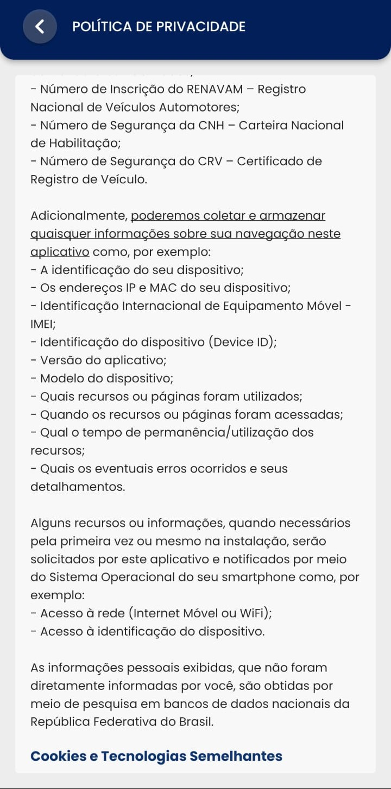
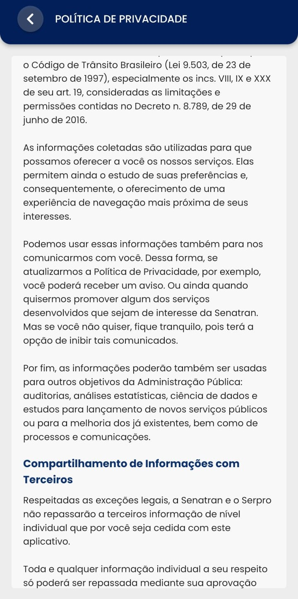
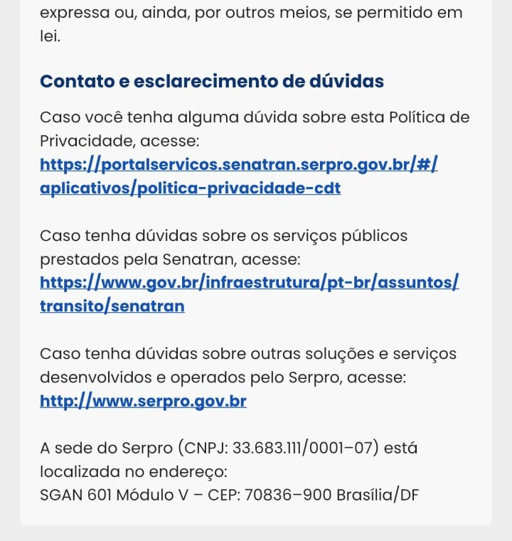

# Aplicativo selecionado

## Introdução

A seleção de um aplicativo para a disciplina de requisitos é um processo estratégico que pode influenciar significativamente o sucesso do desenvolvimento dos artefatos durante a disciplina. Portanto, a abordagem adotada pela equipe para escolha do aplicativo envolve a seleção de possiveis candidatos de acordo com os critérios de escolha e a revisão criteriosa com toda equipe para seleção do aplicativo escolhido, isso demonstra um compromisso com a qualidade e a eficiência do desenvolvimento da disciplina.

## Critérios de escolha 

* Aplicativo não ter sido trabalhado na disciplina ☑
* Facilidade de contato com o público-alvo ☑
* Aplicativo ser de uma comunidade ou governo ☑
* Disponibilidade de informações ☑

## Aplicativos sugeridos

* E-Título: O e-Título é a via digital do título de eleitor. Com ele, é possível ter acesso fácil e rápido às informações pessoais na Justiça Eleitoral. A nova versão, além de manter o fornecimento de certidão de quitação eleitoral e de crimes eleitorais, tem novidades: seus dados passam a ser protegidos por senha, além de permitir consultar débitos eleitorais e se cadastrar como mesário voluntário.

* Carteira Digital de Trânsito: A Carteira Digital de Trânsito (CDT) é a evolução da CNH Digital. Agora, além da Carteira Nacional de Habilitação - CNH, também é possível baixar a versão digital do Certificado de Registro e Licenciamento de Veículo – CRLV (Documento do Veículo).

* STJ CPE Mobile: Central do Processo Eletrônico móvel do Superior Tribunal de Justiça, informação processual, consulta de jurisprudência e peticionamento em suas mãos! O Tribunal da Cidadania com você em qualquer lugar!.

* Bitwarden - Password Manager: O Bitwarden é a maneira mais fácil e segura de armazenar todas as suas credenciais, mantendo-as convenientemente sincronizadas entre todos os seus dispositivos.

* Librera Reader: para PDF, EPUB: Librera Leitor - é um aplicativo gratuito para leitura confortável qualquer formato de livro: PDF, EPUB, EPUB3, MOBI, DJVU, FB2, FB2.ZIP, TXT, RTF, AZW, AZW3, HTML, XPS, CBZ, CBR.

* Kodi: Kodi® centro de mídia é uma fonte livre e aberta cross-platform media player software e entretenimento hub premiado para mídia digital para HTPCs (Home PCs teatro). Ele usa uma interface de usuário de 10 pés projetado para ser um player de mídia para a sala de estar, usando um controle remoto como o dispositivo de entrada principal. Sua interface gráfica do usuário (GUI) permite ao usuário navegar facilmente e exibir vídeos, fotos, podcasts e música a partir de um disco rígido, disco óptico, rede local e na internet usando apenas alguns botões.

* DFnoPonto: O DFnoPonto é um aplicativo do DFTrans com o propósito de disponibilizar os horários, itinerários gráficos e descritivos, informações georreferenciadas dos postos de atendimento do Sistema de Bilhetagem Autmoática (SBA) e serviços deste, como também, a disponibilização de leitor de QR Code nativo para consultas rápidas e práticas para o cidadão através de QR Code que estão presentes nas placas que serão instaladas gradativamente nas paradas de ônibus do Distrito Federal.
  
## Aplicativo escolhido 

Com base nos critérios estabelecidos e orientação do professor sobre os aspectos que devem ser avaliados, o grupo optou por escolher o aplicativo da carteira digital de trânsito para o estudo ao longo da disciplina. O principal aspecto que influenciou a escolha do aplicativo foi o diferencial do público-alvo diversificado e a familiaridade de toda a equipe com o aplicativo. O que proporciona uma maior intimidade da equipe com o aplicativo.

## Sobre o aplicativo 

A Carteira Digital de Trânsito é um aplicativo que guarda, no seu celular, sua carteira de motorista e o documento do veículo que esteja em seu nome. É uma forma segura de ter seus documentos sempre à mão, com a mesma validade dos documentos impressos. Outra vantagem é poder compartilhar o documento digital do veículo com as outras pessoas que o utilizam. 

### Recursos disponiveis no aplicativo
#### Habilitação

* CNH Digital para identificação offline;
* Aviso de vencimento da sua CNH.

#### Infrações

* Verificar e gerenciar as infrações do veículo;
* Pagar suas multas com até 40% de desconto.

#### Veículos

* CRLV digital (CRV + CLA);
* Compartilhar CRLV para até 5 pessoas;
* Indicar condutor principal do veículo;
* Aviso de recall, quando houver para o seu veículo.

## Termos de uso 

A fim de realizar o projeto de maneira ética e legal, o grupo decidiu verificar os termos de uso da plataforma Carteira Digital de Trânsito para garantir que possuíamos permissão explícita para realizar a análise. Após uma cuidadosa leitura dos termos de uso do aplicativo, o grupo constatou que o aplicativo permitir o uso do mesmo para estudo. Desta forma, segue abaixo as figuras de 1 a 5 referente aos termos de uso da plataforma disponibilizado pelo aplicativo referentes a politica de privacidade.
  

**Figura 1** - Politica de privacidade.

Fonte: Carteira Digital de Trânsito.

**Figura 2** - Politica de privacidade.

Fonte: Carteira Digital de Trânsito.

**Figura 3** - Politica de privacidade.

Fonte: Carteira Digital de Trânsito.

**Figura 4** - Politica de privacidade.

Fonte: Carteira Digital de Trânsito.

**Figura 5** - Politica de privacidade.

Fonte: Carteira Digital de Trânsito.

 Acessado em: 19/09/2023

## Bibliografia
> Bitwarden - Password Manager. Google Play, 2023. Disponível em: https://play.google.com/store/apps/details?id=com.x8bit.bitwarden&hl=pt_BR&gl=US. Acesso em: 29 de outubro de 2023 
> Carteira Digital de Trânsito. Google Play, 2023. Disponível em: https://play.google.com/store/apps/details?id=br.gov.serpro.cnhe&hl=pt_BR&gl=US. Acesso em: 29 de outubro de 2023 
> DFnoPonto. APKPure, 2023. Disponível em: https://apkpure.com/br/dfnoponto/df.gov.dftrans.dfnoponto/amp. Acesso em: 29 de outubro de 2023 
> e-Título. Google Play, 2023. Disponível em: https://play.google.com/store/apps/details?id=br.jus.tse.eleitoral.etitulo&hl=pt_BR&gl=US. Acesso em: 29 de outubro de 2023 
> Kodi. Google Play, 2023. Disponível em: https://play.google.com/store/apps/details?id=org.xbmc.kodi&hl=pt_BR&gl=US. Acesso em: 29 de outubro de 2023 
> Librera Reader: para PDF, EPUB. Google Play, 2023. Disponível em: https://play.google.com/store/apps/details?id=com.foobnix.pdf.reader&hl=pt_BR&gl=US. Acesso em: 29 de outubro de 2023 
> STJ CPE Mobile. Google Play, 2023. Disponível em: https://play.google.com/store/apps/details?id=br.jus.stj.cpemobile&hl=pt_BR&gl=US. Acesso em: 29 de outubro de 2023 

## 📑 Histórico de versões 

Versão  |   Data   | Descrição | Autor(es) | Revisor(es)
--------- | ------ | ------ | ---------- | ----------
`1.0` | 19/09/2023| Criação do documento | [Mayara Alves](https://github.com/Mayara-tech) | [Limirio Guimarães](https://github.com/LimirioGuimaraes)|
`1.1` | 28/09/2023 | Alterações após apresentação | [Milena Baruc](https://github.com/MilenaBaruc) | [Vinicius Mendes](https://github.com/yabamiah)|
`1.2` | 29/09/2023 | Alteração aplicativos sugeridos | [Milena Baruc](https://github.com/MilenaBaruc) | [Vinicius Mendes](https://github.com/yabamiah)|
`1.3` | 06/12/2023 | Correção do artefato | [Mayara Alves](https://github.com/Mayara-tech) |[Limirio Guimarães](https://github.com/LimirioGuimaraes)|
