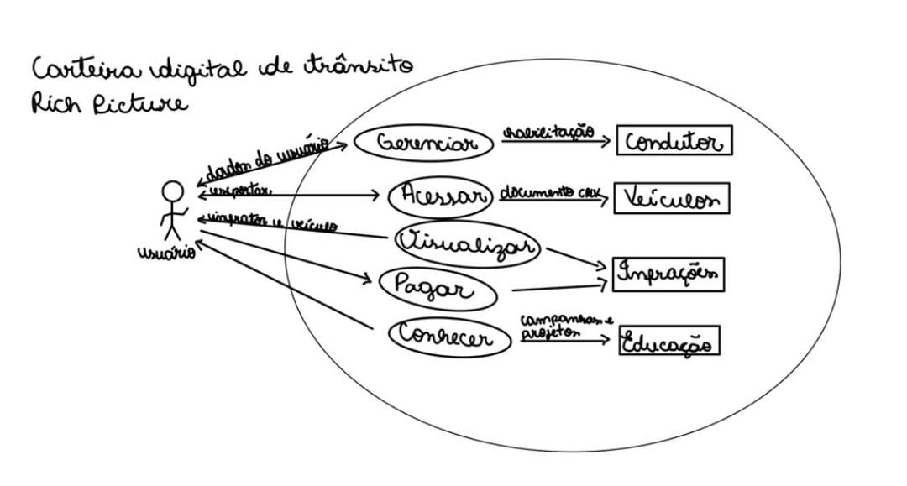
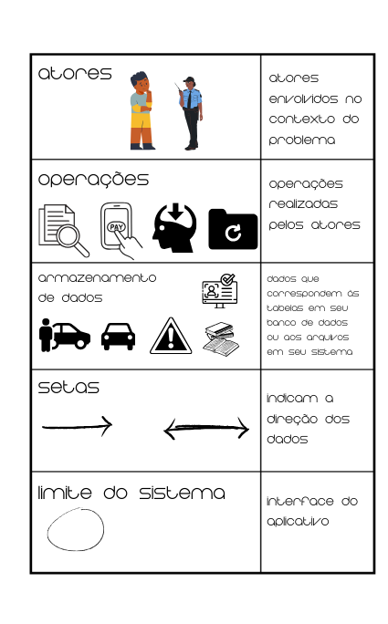

# Rich Picture

## Introdução

Um "Rich Picture" é uma representação visual que combina elementos gráficos e textuais para capturar de forma abrangente e holística a complexidade de um problema, sistema ou situação. No contexto da engenharia de software, ele é utilizado para abstrair o funcionamento de sistemas de software e se apresenta na forma de um diagrama com alguns elementos básicos como: atores, processos, armazenamento de dados, setas e limites do sistema. 

## Ferramentas Utilizadas
 Para construção do Rich Picture utilizado nas figuras 2 e 3 foi utilizada a ferramenta do canvas para a melhoria e correção de alguns aspectos relacionados a construção da imagem da figura 1 que foi a primeira versão elaborada do rich picture.

## Rich Picture

 
 <b>Figura 1.</b> Primeira versão do Rich Picture.

 
 
 <b>Fonte: </b> Milena Baruc.

 
 <b>Figura 2.</b> Segunda versão do Rich Picture revisado.

 
 
  <b>Fonte: </b> Milena Baruc.

 
 <b>Figura 3.</b> Legenda do Rich Picture.

     
 
 
 
  <b>Fonte: </b> Milena Baruc.

## Bibliografia 

> KLAUS POHL, RUPP CHRIS. Requirements Engineering Fundamentals. 2nd Edition, 2015. Disponível em: https://aprender3.unb.br/pluginfile.php/2523050/mod_resource/content/4 Requisitos%20%20Aula%2004%20-%20Parte%202%20RichPicture.pdf. Acesso em: 19/09/2023

## 📑 Histórico de versões:

 Versão  |    Data    |                        Descrição                        |                                             Autor(es)                                             |                  Revisor(es)                   
 :-----: | :--------: | :-----------------------------------------------------: | :-----------------------------------------------------------------------------------------------: | :--------------------------------------------: 
  `1.0`  | 14/09/2023 |            Criação do Rich Picture            | [Milena Baruc](https://github.com/MilenaBaruc) | [Mayara Alves](https://github.com/Mayara-tech)
  `1.1`  | 19/09/2023 |            Revisão do Rich Picture            | [Milena Baruc](https://github.com/MilenaBaruc) | [Mayara Alves](https://github.com/Mayara-tech), [Limírio Guimarães](https://github.com/LimirioGuimaraes)
