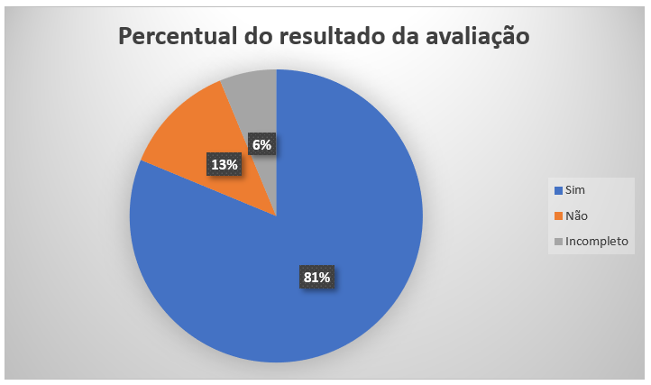

# Verificação Rich Picture 
 
## Introdução

Este documento é uma verificação do artefato [Rich Picture](https://requisitos-de-software.github.io/2023.2-Carteira_Digital_de_Transito/pr%C3%A9-rastreabilidade/rich%20picture/) na versão 1.1 de data 19/09/2023, autorado por [Milena Baruc](https://github.com/MilenaBaruc), que são integrantes do [grupo 02](https://requisitos-de-software.github.io/2023.2-Carteira_Digital_de_Transito/), cujo projeto tem como foco o aplicativo [Carteira Digital de Trânsito](https://play.google.com/store/apps/details?id=br.gov.serpro.cnhe&hl=pt_BR&gl=US), o propósito desta verificação é identificar possíveis problemas no artefato de pré-rastreabilidade. 

## Metodologia 

A verificação do artefato seguirá o [planejamento](https://requisitos-de-software.github.io/2023.2-Carteira_Digital_de_Transito/verificacao/grupo2/planejamendoDaVerificacao.md) estabelecido pelo nosso grupo. Conforme detalhado no planejamento, destaca-se a relevância do subtópico da metodologia neste documento, para apresentar a tabela contendo os checklists utilizados para realizar essa verificação deste artefato em especifico. Podemos observar o referido checklist referente a verificação do Rich Picture na Tabela 1. 

**Tabela 1** - Checklist - Rich Picture 

| ID | Descrição                                                                                                                      | Avaliação  | Observação  | Referência |  
|----|------------------------------------------------------------------------|------------| ------------ | ------------------------------------|
| 1  | O artefato possui Introdução?                                                                                                  | -          | -       |  - | 
| 2  | O artefato possui a metodologia utilizada?                                                                    		      | -          | -    | -|
| 3  | O artefato possui bibliografia/referências bibliográficas?                                                                     | -          | -  | - | 
| 4  | O artefato possui um histórico de versões com o id e descrição das versões, data, autores e revisores?                         | -          | -    | - | 
| 5  | Todas as tabelas e imagens são chamadas no texto, possuem legendas e fontes?                                                   | -          | -         | - | 
| 6  | Todos os textos estão na norma padrão?                                       						      | -          | -            | -| 
| 7 | O rich picture possui atores, operações, armazenamento de dados, setas e o limite do sistema?  | - | - | (Fonte: Requisitos – Aula 04. Milene Serrano e Maurício Serrano. Slide 14. " Componentes do rich picture: tores, operações, armazenamento de dados, setas e o limite do sistema. (pode ser observado no desenho do slide)")
| 8 | Foi utilizada alguma técnica na produção do rich picture? | - | - | ( Fonte: The Rich Picture: A Tool for Reasoning About Work Context – Pág. 24 "Drawing a rich picture requires that the analyst work closely with the stakeholders so that the pictures capture the situation and related concerns from the stakeholders’ points of view."
| 9 | O rich picture possui apenas estrutura suficiente para permitir registrar o processo e as preocupações? | -  | - | (Fonte: The Rich Picture: A Tool for Reasoning About Work Context – Pág. 24 "Include only enough structure to allow you to record the process and concerns. The latter requires that all the people who will use or could conceivably be affected by the introduction of the new system be included."
| 10 | O artefato está bem desenhado e é possível de ser entendido por ambas as partes? | - | - | (Fonte: The Rich Picture: A Tool for Reasoning About Work Context – Pág. 24 “Drawing a rich picture requires that the analyst work closely with the stakeholders so that the pictures capture the situation and related concerns from the stakeholders’ points of view.”
| 11 | O armazenamento de dados presente no Rich Picture está sendo representado graficamente por um retangulo?  | - | - | (Fonte: Software Development Project - CTEC2402. Pág. 4 "Data stores are essentially the tables in your database or files in the system. It is also necessary to show the type of data they contain. Only operations may read from or write to data stores. Represented graphically as rectangles.")
| 12 | O rich picture diz qual dado está sendo processado, qual está chegando ao sistema e qual informação está saindo?  | - | - | (Fonte: Software Development Project - CTEC2402. Pág. 1 “Rich pictures can help you to identify: • Business processes and their data requirements • The actors involved in the processes and their responsibilities"
| 13 | O rich picture dá uma ideia do que realmente está acontecendo? | -| - |  (Fonte: Não há fonte especifica que mostre que seja uma obrigatóriedade ao fazer um Rich Picture de colocar uma explicação dos componentes, entretanto e uma prática que ajuda na compreensão de todos do que está acontecendo, que é um dos requisitos para um bom Rich Picture. 
| 14 | Contém palavras-chave relevantes? | - | - | (Fonte: The Rich Picture: A Tool for Reasoning About Work Context – Pág. 24 "Do not attempt to record all the intricacies of process; a broad brush approach is usually all that is needed")
| 15 | Comunica mais ideias do que palavras? | -| - |   (Fonte: Não há fonte especifica que mostre que seja uma obrigatóriedade ao fazer um Rich Picture de colocar uma explicação dos componentes, entretanto e uma prática que ajuda na compreensão de todos do que está acontecendo, que é um dos requisitos para um bom Rich Picture. 
| 16 | Contém a explicação dos componentes? | - | - | (Fonte: Não há fonte especifica que mostre que seja uma obrigatóriedade ao fazer um Rich Picture de colocar uma explicação dos componentes, entretanto e uma prática que ajuda na compreensão de todos do que está acontecendo, que é um dos requisitos para um bom Rich Picture. 

Fonte: [Mayara Alves](https://github.com/Mayara-tech) 

 

## Desenvolvimento 

Na tabela 2 podemos observar o checklist preenchido após verificação do artefato Rich Picture, a verificação do artefato pode ser visualizada pelo [link](https://youtu.be/tReCyiuQ-Pg). Este checklist, minuciosamente preenchido, reflete os resultados, observações e considerações resultantes da análise realizada no artefato.

**Tabela 2** - Checklist Preenchido - Rich Picture 

| ID | Descrição                                                                                                                      | Avaliação  | Observação                                                             |
|----|--------------------------------------------------------------------------------------------------------------------------------|------------|------------------------------------------------------------------------|
| 1  | O artefato possui Introdução?                                                                                                  | Sim         |      |
| 2  | O artefato possui a metodologia utilizada?                                                                    		      | Não         |  artefato possui um texto descrevendo a metodologia porém o mesmo não está identificado como metodologia seguindo o padrão das demais páginas.   |
| 3  | O artefato possui bibliografia/referências bibliográficas?                                                                     | Incompleto         | Faltou coloca nas referências bibliograficas a ferramenta canvas que foi citada no texto.  |
| 4  | O artefato possui um histórico de versões com o id e descrição das versões, data, autores e revisores?                         | Sim          |    |
| 5  | Todas as tabelas e imagens são chamadas no texto, possuem legendas e fontes?                                                   | Sim        |    |
| 6  | Todos os textos estão na norma padrão?                                       						      | Sim          |           |
| 7 | O rich picture possui atores, operações, armazenamento de dados, setas e o limite do sistema?  | Sim | |
| 8 | Foi utilizada alguma técnica na produção do rich picture? | Não foi possível identificar | Não foi possível identificar a utilização alguma técnica logo que não esta identificado no texto. |
| 9 | O rich picture possui mais Imagens do que Texto? | Sim  | - |
| 10 | O artefato está bem desenhado e é possível de ser entendido por ambas as partes? | Sim | - |
| 11 | O armazenamento de dados presente no Rich Picture está sendo representado graficamente por um retangulo?  | Sim | - |
| 12 | O rich picture diz qual dado está sendo processado, qual está chegando ao sistema e qual informação está saindo?  | Sim | - |
| 13 | O rich picture dá uma ideia do que realmente está acontecendo? | Sim | - |
| 14 | Contém palavras-chave relevantes? | Sim | - |
| 15 | Comunica mais ideias do que palavras? | Sim | - |
| 16 | Contém a explicação dos componentes? | Sim | - |

Fonte: [Mayara Alves](https://github.com/Mayara-tech) 

## Sugestões de Melhorias

De maneira geral o artefato apresenta uma boa qualidade, uma boa formatação e uma boa padronização, além de ideias que foram documentadas de forma clara e concisa. Entretanto foram encontrados identificados alguns possíveis problemas em relação as especificações do check-list, sendo elas demonstradas na tabela 3. 

**Tabela 2** - Sugestões de melhoria - Rich Picture

| ID | Descrição do problema | Sugestão de melhoria |
| --- | ---------------------| ---------------------- |
| 02 |   artefato possui um texto descrevendo a metodologia porém o mesmo não está identificado como metodologia seguindo o padrão das demais páginas. |  É sugerido que a identificação do texto seja trocada para metodologia para seguir os padrões dos demais artefatos. |
| 03  | Faltou coloca nas referências bibliograficas a ferramenta canvas que foi citada no texto.  |  É sugerido que se coloque na referência bibliografica a ferramentas canvas que é citada no texto e a referencie do texto para referências bibliograficas.  |
| 08  | Não foi possível identificar a utilização alguma técnica na produção do rich picture | É sugerido que especifique na metodologia quais técnicas foram utilizada para elaboração do Rich Picture. |

Fonte: [Mayara Alves](https://github.com/Mayara-tech) 

## Acompanhamento

A figura 1 apresenta um gráfico com o percentual de respostas sim, não, incompleto ou não se aplica, obtidas através da checklist de verificação.

**Figura 1** - Percentual das respostas obtidas na verificação 

Fonte: [Mayara Alves](https://github.com/Mayara-tech) 

### Percentual de aproveitamento 

Para saber a porcentagem de aproveitamento do artefato, será utilizado a Equação na figura 2:

**Figura 1** - Percentual das respostas obtidas na verificação 

Fonte: [Mayara Alves](https://github.com/Mayara-tech) 

Através dos checklists realizados podemos observar que:

- 13/16 exigências são atendidas;
- 1/16 exigências estão incompletas;
- 2/16 exigências estão erradas ou não foram realizadas.
- 0/16 não se aplica.

onde 16 é a quantidade de itens avaliados na verificação.

Portanto, com base no cálculo apresentado, pode-se dizer que o aproveitamento deste artefato está em 71.87%.

## Retrabalho

Como proposto por Fagan, para o retrabalho a autora do artefato [Milena Baruc](https://github.com/MilenaBaruc) irá fazer as correções dos problemas apresentados seguindo a tabela de sugestão de correção apresentada anteriormente. O responsável por essa verificação fará uma revisão das correções feitas, checando se as correções são suficientes e se foi introduzido novos erros ou não. A tabela 3 a seguir apresenta o cronograma de correções.

**Tabela 3** - Cronograma de Correções.

| Data de Correção | Descrição                                                                             |                Responsável(eis)                |                 Revisor(es)                 |      Status      |
| :--------------: | :------------------------------------------------------------------------------------ | :--------------------------------------------: | :-----------------------------------------: | :--------------: |
|    30/11/2023    | Detalhar a utilização do uso das técnicas para a realização do RichPicture                   |  [Milena Baruc](https://github.com/MilenaBaruc)  | [Mayara Alves](https://github.com/Mayara-tech) |  |
|    30/11/2023    | Adição referência bibliografica do canvas | [Milena Baruc](https://github.com/nando3d3) | [Mayara Alves](https://github.com/Mayara-tech) |  |

Fonte: [Mayara Alves](https://github.com/Mayara-tech) 

## Bibliografia

> BARBOSA, S. D. J.; Silva, B. S. da; Silveira, M. S.; Gasparini, I.; Darin, T.; Barbosa, G. D. J. (2021);Interação Humano-Computador e Experiência do usuário.
> BILHETERIA DIGITAL. Interacao-Humano_computador. Distrito Federal, 2023. Disponível em: <https://interacao-humano-computador.github.io/2023.1-BilheteriaDigital/>. Acesso em: 10/11/2023. 

## 📑 Histórico de Versões

| Versão | Data       | Descrição                                       | Autor                                          | Revisor                                      |
| ------ | ---------- | ----------------------------------------------- | -----------------------------------------------| ---------------------------------------------|
| `1.0`  | 27/11/2023 | Adicionando verificação do artefato Rich Picture   | [Mayara Alves](https://github.com/Mayara-tech) | [Luis Miranda](https://github.com/LuisMiranda) |
