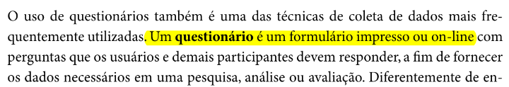
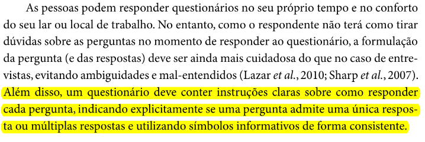
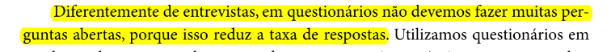
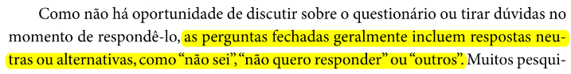
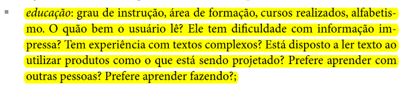
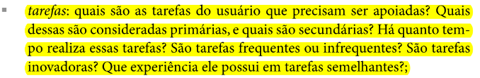
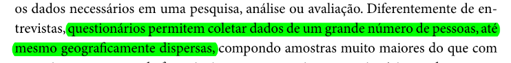

# Questionário

## Introdução

Este documento é uma verificação do artefato [Questionário](https://requisitos-de-software.github.io/2023.2-Carteira_Digital_de_Transito/elicita%C3%A7%C3%A3o/PerfildeUsuario/Questionario/) na versão 1.7 de data 20/11/2023, autorado por [Mayara alves](https://github.com/Mayara-tech), que é integrante do [grupo 02](https://github.com/Requisitos-de-Software/2023.2-Carteira_Digital_de_Transito), cujo projeto tem como foco o [Aplicativo Carteira Digital de Trânsito](https://play.google.com/store/apps/details?id=br.gov.serpro.cnhe&hl=pt_BR&gl=US), o propósito desta verificação é identificar possíveis problemas no artefato.

## Metodologia

A verificação do artefato seguirá o [planejamento](https://github.com/Requisitos-de-Software/2023.2-Carteira_Digital_de_Transito/blob/main/docs/verificacao/grupo2/planejamentoDaVerificacao.md) estabelecido pelo nosso grupo. Conforme detalhado no planejamento, destaca-se a relevância do subtópico da metodologia neste documento, para apresentar a tabela contendo os checklists utilizados para realizar essa verificação deste artefato em específico. Podemos observar o referido checklist referente a verificação do Cronograma na Tabela 1, as perguntas foram tiradas da verificação da [Questionário](https://requisitos-de-software.github.io/2023.2-Carteira_Digital_de_Transito/elicita%C3%A7%C3%A3o/PerfildeUsuario/Questionario/)feita anterirormente pelo grupo.

**Tabela 1** - Checklist Geral

| ID | Critério de Avaliação                           | Avaliação ( Sim/ Não / Não Aplicável )             | Observações                       | Referências                                                    |
|----| ------------------------------------------------|----------------------------------------------------|-----------------------------------|----------------------------------------------------------------|
| 1  | O histórico de versão é padronizado?                                           |     Sim       |            |  REQUISITOS DE SOFTWARE. Carteira Digital de Trânsito. Distrito Federal, 2023. Disponível em: <https://github.com/Requisitos-de-Software/2023.2-Carteira_Digital_de_Transito/>. Acesso em: 02/12/2023.          |            
| 2  | Possui o(s) autor(es) e o(s) revisor(es) do artefato?                          |     Sim       |            |  REQUISITOS DE SOFTWARE. Carteira Digital de Trânsito. Distrito Federal, 2023. Disponível em: <https://github.com/Requisitos-de-Software/2023.2-Carteira_Digital_de_Transito/>. Acesso em: 02/12/2023.          | 
| 3  | O artefato possui referências bibliográficas e/ou bibliografia?                |     Sim       |            |  REQUISITOS DE SOFTWARE. Carteira Digital de Trânsito. Distrito Federal, 2023. Disponível em: <https://github.com/Requisitos-de-Software/2023.2-Carteira_Digital_de_Transito/>. Acesso em: 02/12/2023.          | 
| 4  | Todos os textos estão na norma padrão?                                         |     Sim       |            |   REQUISITOS DE SOFTWARE. Carteira Digital de Trânsito. Distrito Federal, 2023. Disponível em: <https://github.com/Requisitos-de-Software/2023.2-Carteira_Digital_de_Transito/>. Acesso em: 02/12/2023.         | 
| 5  | Há introdução do artefato?                                                     |     Sim       |            |    REQUISITOS DE SOFTWARE. Carteira Digital de Trânsito. Distrito Federal, 2023. Disponível em: <https://github.com/Requisitos-de-Software/2023.2-Carteira_Digital_de_Transito/>. Acesso em: 02/12/2023.        | 
| 6  | Há metodologia de como foi conduzido o artefato?                               |     Sim       |            |  REQUISITOS DE SOFTWARE. Carteira Digital de Trânsito. Distrito Federal, 2023. Disponível em: <https://github.com/Requisitos-de-Software/2023.2-Carteira_Digital_de_Transito/>. Acesso em: 02/12/2023.          | 

Fonte: [Vinícius Mendes](https://github.com/yabamiah)

**Tabela 2** - Checklist Específico

| ID | Critério de avaliação | Avaliação (Sim/Não/Não aplicável) | Observações | Referências | Imagem da Referência |
|---|----------------------|------------------------------------|---------------|--------------|------------------------|
|01| Para realizar a técnica do Questionário, foi criado um formulário físico ou on-line? | | | Página: 150, Capítulo 6. Organização do Espaço de Problema. Livro: SIMONE DINIZ JUNQUEIRO BARBOSA, BRUNO SANTANA DA SILVA, Interação Humano-Computador, 1a. Edição, Editora Campus, 2010|  |
|02| As perguntas do questionário possuíam indicações claras de como respondê-las? (Se eram perguntas de múltiplas escolhas, pergunta textual curta ou longa, perguntas de escala numérica, etc...)| | | Página: 150, Capítulo 6. Organização do Espaço de Problema. Livro: SIMONE DINIZ JUNQUEIRO BARBOSA, BRUNO SANTANA DA SILVA, Interação Humano-Computador, 1a. Edição, Editora Campus, 2010|  |
|03| O questionário contém perguntas abertas (Perguntas onde os participantes podem responder de forma discursiva e livre) e perguntas fechadas (Perguntas com resposta de Sim/Não)? | | | Página: 150, Capítulo 6. Organização do Espaço de Problema. Livro: SIMONE DINIZ JUNQUEIRO BARBOSA, BRUNO SANTANA DA SILVA, Interação Humano-Computador, 1a. Edição, Editora Campus, 2010|  |
|04| O questionário possuí indicações claras de quais perguntas são obrigatórias? | | | Página: 150, Capítulo 6. Organização do Espaço de Problema. Livro: SIMONE DINIZ JUNQUEIRO BARBOSA, BRUNO SANTANA DA SILVA, Interação Humano-Computador, 1a. Edição, Editora Campus, 2010|  |
|05| O questionário contém mais perguntas fechadas do que abertas? | | | Página: 151, Capítulo 6. Organização do Espaço de Problema. Livro: SIMONE DINIZ JUNQUEIRO BARBOSA, BRUNO SANTANA DA SILVA, Interação Humano-Computador, 1a. Edição, Editora Campus, 2010|  |
|06| As perguntas fechadas do Questionário apresentam opções neutras como resposta? (Não sei, não quero responder, outros)| | | Página: 151, Capítulo 6. Organização do Espaço de Problema. Livro: SIMONE DINIZ JUNQUEIRO BARBOSA, BRUNO SANTANA DA SILVA, Interação Humano-Computador, 1a. Edição, Editora Campus, 2010| |
|07| O questionário contém perguntas sobre informações demográficas? (Idade, sexo e país)| | | Página: 134, Capítulo 6. Organização do Espaço de Problema. Livro: SIMONE DINIZ JUNQUEIRO BARBOSA, BRUNO SANTANA DA SILVA, Interação Humano-Computador, 1a. Edição, Editora Campus, 2010|  |
|08| O questionário contém perguntas sobre habilidades com tecnologias? (tempo de experiência com tecnologias e domínio sobre as tecnologias) | | | Página: 134, Capítulo 6. Organização do Espaço de Problema. Livro: SIMONE DINIZ JUNQUEIRO BARBOSA, BRUNO SANTANA DA SILVA, Interação Humano-Computador, 1a. Edição, Editora Campus, 2010|  |
|09| O questionário contém perguntas sobre educação? (grau de instrução e área de formação) | | | Página: 134, Capítulo 6. Organização do Espaço de Problema. Livro: SIMONE DINIZ JUNQUEIRO BARBOSA, BRUNO SANTANA DA SILVA, Interação Humano-Computador, 1a. Edição, Editora Campus, 2010| | 
|10| O questionário contém perguntas sobre a principal tarefas que realizam no contexto do aplicativo do projeto? (Exemplo: pagar conta, visualizar boleto, etc...) | | | Página: 134, Capítulo 6. Organização do Espaço de Problema. Livro: SIMONE DINIZ JUNQUEIRO BARBOSA, BRUNO SANTANA DA SILVA, Interação Humano-Computador, 1a. Edição, Editora Campus, 2010| |
|11| Foi gerado uma análise dos dados coletados pelo Questionário? (Gráficos, tabelas ou outras formas de visualização de dados) | | | Página: 150, Capítulo 6. Organização do Espaço de Problema. Livro: SIMONE DINIZ JUNQUEIRO BARBOSA, BRUNO SANTANA DA SILVA, Interação Humano-Computador, 1a. Edição, Editora Campus, 2010|  |
|12| No questionário foi apresentado o termo de consentimento de forma clara? | | | Página: 141, Capítulo 6. Organização do Espaço de Problema. Livro: SIMONE DINIZ JUNQUEIRO BARBOSA, BRUNO SANTANA DA SILVA, Interação Humano-Computador, 1a. Edição, Editora Campus, 2010|  |
|13| O questionário foi divulgado de forma dispersa? (Foi descrito se o questionário foi divulgado para pessoas dispersas geograficamente e de grupos diferentes) | | | Página: 150, Capítulo 6. Organização do Espaço de Problema. Livro: SIMONE DINIZ JUNQUEIRO BARBOSA, BRUNO SANTANA DA SILVA, Interação Humano-Computador, 1a. Edição, Editora Campus, 2010|   | 

Fonte: [Vinícius Mendes](https://github.com/yabamiah)

## Desenvolvimento

Na tabela 2 podemos observar o checklist preenchido após verificação do artefato. Este checklist, minuciosamente preenchido, reflete os resultados, observações e considerações resultantes da análise realizada no artefato. A inspeção foi feita por meio uma gravação individual, que está presentes na tabela 3.

**Tabela 3** - Checklist Geral

| ID | Critério de Avaliação                           | Avaliação ( Sim/ Não / Não Aplicável )             | Observações                       |
|----| ------------------------------------------------|----------------------------------------------------|-----------------------------------|
| 1  | O histórico de versão é padronizado?                                           |            |            |            
| 2  | Possui o(s) autor(es) e o(s) revisor(es) do artefato?                          |            |            |  
| 3  | O artefato possui referências bibliográficas e/ou bibliografia?                |            |            |   
| 4  | Todos os textos estão na norma padrão?                                         |            |            |   
| 5  | Há introdução do artefato?                                                     |            |            | 
| 6  | Há metodologia de como foi conduzido o artefato?                               |            |            |

Fonte: [Vinícius Mendes](https://github.com/yabamiah)

**Tabela 4** - Checklist preenchido

| ID | Critério de avaliação | Avaliação (Sim/Não/Não aplicável) | Observações |
|---|----------------------|------------------------------------|---------------|
|01| Para realizar a técnica do Questionário, foi criado um formulário físico ou on-line? |    |
|02| As perguntas do questionário possuíam indicações claras de como respondê-las? (Se eram perguntas de múltiplas escolhas, pergunta textual curta ou longa, perguntas de escala numérica, etc...)|     |
|03| O questionário contém perguntas abertas (Perguntas onde os participantes podem responder de forma discursiva e livre) e perguntas fechadas (Perguntas com resposta de Sim/Não)? |      |
|04| O questionário possuí indicações claras de quais perguntas são obrigatórias? |         |
|05| O questionário contém mais perguntas fechadas do que abertas? |          |
|06| As perguntas fechadas do Questionário apresentam opções neutras como resposta? (Não sei, não quero responder, outros)|       |
|07| O questionário contém perguntas sobre informações demográficas? (Idade, sexo e país)|        |
|08| O questionário contém perguntas sobre habilidades com tecnologias? (tempo de experiência com tecnologias e domínio sobre as tecnologias) |        |
|09| O questionário contém perguntas sobre educação? (grau de instrução e área de formação) |       |
|10| O questionário contém perguntas sobre a principal tarefas que realizam no contexto do aplicativo do projeto? (Exemplo: pagar conta, visualizar boleto, etc...) |       |
|11| Foi gerado uma análise dos dados coletados pelo Questionário? (Gráficos, tabelas ou outras formas de visualização de dados) |       |
|12| No questionário foi apresentado o termo de consentimento de forma clara? |        |
|13| O questionário foi divulgado de forma dispersa? (Foi descrito se o questionário foi divulgado para pessoas dispersas geograficamente e de grupos diferentes) |      |

Fonte: [Vinícius Mendes](https://github.com/yabamiah)

**Tabela 3** - Cronograma de verificação

| Participantes | Data | Horário | Link da gravação | Minutagem aonde começa |
|--------------|-------|---------|-------------------|---------|

## Sugestões de Melhorias

## Referência Bibliográfica
> Carteira Digital de Trânsito. Requisitos de Software. Distrito Federal, 2023. Disponível em: https://requisitos-de-software.github.io/2023.2-Carteira_Digital_de_Transito/. Acesso em: 02/12/2023

## Bibliografia
> SIMONE DINIZ JUNQUEIRO BARBOSA, BRUNO SANTANA DA SILVA, Interação Humano-Computador, 1a. Edição, Editora Campus, 2010

## 📑 Histórico de Versões

| Versão | Data | Descrição | Autor | Revisor |
|--------|-----|-------------|------|---------|
|`1.0`| 03/12/2023 | Criação do documento | [Vinícius Mendes](https://github.com/yabamiah)|  |
