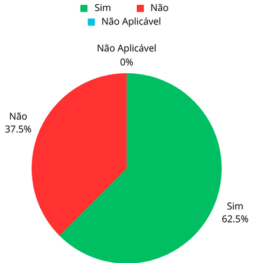

# Verificação do Artefato de Elicitação - 100$

## Introdução

Este documento é uma verificação do artefato [100$](https://github.com/Requisitos-de-Software/2023.2-Carteira_Digital_de_Transito/blob/Verificacao-Luis-Vinicius-Altino/docs/elicita%C3%A7%C3%A3o/prioriza%C3%A7%C3%A3o/100.md) na versão 1.0 de data 04/10/2023, autorado por  [Limirio Guimarães](https://github.com/LimirioGuimaraes), que é integrante do [Grupo 2](https://github.com/Requisitos-de-Software/2023.2-Carteira_Digital_de_Transito). O propósito desta verificação é identificar possíveis problemas no artefato.

## Metodologia

A verificação do artefato seguirá o [planejamento]() desenvolvido pelo nosso grupo. Conforme detalhado no planejamento, destaca-se a relevância do subtópico da metologia neste documento, onde será apresentada a tabela contendo os checklists gerais e específicos utilizados para realizar essa verificação. O referido checklist podem ser consultados na Tabela 1 e 2.

**Tabela 1** - Checklist Geral

| ID | Critério de Avaliação                           | Avaliação ( Sim/ Não / Não Aplicável )             | Observações                       | Referências                                                    |
|----| ------------------------------------------------|----------------------------------------------------|-----------------------------------|----------------------------------------------------------------|
| 1  | O histórico de versão é padronizado?                                           |            |            |  REQUISITOS DE SOFTWARE. Carteira Digital de Trânsito. Distrito Federal, 2023. Disponível em: <https://github.com/Requisitos-de-Software/2023.2-Carteira_Digital_de_Transito/>. Acesso em: 02/12/2023.          |            
| 2  | Possui o(s) autor(es) e o(s) revisor(es) do artefato?                          |            |            |  REQUISITOS DE SOFTWARE. Carteira Digital de Trânsito. Distrito Federal, 2023. Disponível em: <https://github.com/Requisitos-de-Software/2023.2-Carteira_Digital_de_Transito/>. Acesso em: 02/12/2023.          | 
| 3  | O artefato possui referências bibliográficas e/ou bibliografia?                |            |            |  REQUISITOS DE SOFTWARE. Carteira Digital de Trânsito. Distrito Federal, 2023. Disponível em: <https://github.com/Requisitos-de-Software/2023.2-Carteira_Digital_de_Transito/>. Acesso em: 02/12/2023.          | 
| 4  | Todos os textos estão na norma padrão?                                         |            |            |   REQUISITOS DE SOFTWARE. Carteira Digital de Trânsito. Distrito Federal, 2023. Disponível em: <https://github.com/Requisitos-de-Software/2023.2-Carteira_Digital_de_Transito/>. Acesso em: 02/12/2023.         | 
| 5  | Há introdução do artefato?                                                     |            |            |    REQUISITOS DE SOFTWARE. Carteira Digital de Trânsito. Distrito Federal, 2023. Disponível em: <https://github.com/Requisitos-de-Software/2023.2-Carteira_Digital_de_Transito/>. Acesso em: 02/12/2023.        | 
| 6  | Há metodologia de como foi conduzido o artefato?                               |            |            |  REQUISITOS DE SOFTWARE. Carteira Digital de Trânsito. Distrito Federal, 2023. Disponível em: <https://github.com/Requisitos-de-Software/2023.2-Carteira_Digital_de_Transito/>. Acesso em: 02/12/2023.          | 

Fonte: <a href="https://github.com/LuisMiranda10">Luis Miranda</a>

**Tabela 2** - CheckList Específico
                                                                                                                                                                                                     
| ID | Critério de Avaliação                           | Avaliação ( Sim/ Não / Não Aplicável )             | Observações                       | Referências                                                    |
|----| ------------------------------------------------|----------------------------------------------------|-----------------------------------|----------------------------------------------------------------|
| 1  |  A definição das prioridades foi realizada com um usuário real?  |                                        |                                   |  Página: 321, Capítulo 16. First Thing First: Setting requirement priorities . Livro: Karl Wiegers and Joy Beatty, Software Requirements, 3a. Edição, Microsoft.                                                             |
| 2  |  O perfil do usuário sem adequa ao usuário estabelecido?       |                                        |                                   |  Página: 321-322, Capítulo 16. First Thing First: Setting requirement priorities . Livro: Karl Wiegers and Joy Beatty, Software Requirements, 3a. Edição, Microsoft.                                                              |
| 3  |  A soma das distruição feita pelo usuário deu o valor o pré-estabelecido (no caso 100$)    |                                        |                                   |  Página: 321-322, Capítulo 16. First Thing First: Setting requirement priorities . Livro: Karl Wiegers and Joy Beatty, Software Requirements, 3a. Edição, Microsoft.                                                              |
| 4  |  Cada requisito priorizado foi associado a uma técnica de elicitação que tinha sido identificada?                                              |                                        |                                   |  Página: 322-323, Capítulo 16. First Thing First: Setting requirement priorities . Livro: Karl Wiegers and Joy Beatty, Software Requirements, 3a. Edição, Microsoft.                                                              |
| 5  |  Os requisitos foram divididos por ordem de prioridade para um melhor entendimento das escolhas do usuário?                                               |                                        |                                   |  Página: 323, Capítulo 16. First Thing First: Setting requirement priorities . Livro: Karl Wiegers and Joy Beatty, Software Requirements, 3a. Edição, Microsoft.                                                             |
| 6  |  O processo de priorização teve como consideração as interdependências entre os requisitos?                                               |                                        |                                   |  Página: 324, Capítulo 16. First Thing First: Setting requirement priorities . Livro: Karl Wiegers and Joy Beatty, Software Requirements, 3a. Edição, Microsoft.                                                             |
| 7  |  Os requisitos priorizados passaram por algum processo de validação?                                               |                                                    |                                    | Página: 324-325, Capítulo 16. First Thing First: Setting requirement priorities . Livro: Karl Wiegers and Joy Beatty, Software Requirements, 3a. Edição, Microsoft.                                                               |                                                                                                                                                                                                            
| 8  |  Foi apresentado o custo e  risco que o usuário teria ao fazer a escolha de distribuição sobre a implementação?                                               |                                                    |                                    | Página: 322-325, Capítulo 16. First Thing First: Setting requirement priorities . Livro: Karl Wiegers and Joy Beatty, Software Requirements, 3a. Edição, Microsoft.                                                                    |                                                                                                                                                                                                            

Fonte: <a href="https://github.com/LuisMiranda10">Luis Miranda</a>

## Desenvolvimento

Na tabela 3 e 4 podemos observar o checklist preenchido após verificação do artefato 100$. Este checklist, minuciosamente preenchido, reflete os resultados, observações e considerações resultantes da análise realizada no artefato.

**Tabela 3** - Checklist Geral

| ID | Critério de Avaliação                           | Avaliação ( Sim/ Não / Não Aplicável )             | Observações                       |
|----| ------------------------------------------------|----------------------------------------------------|-----------------------------------|
| 1  | O histórico de versão é padronizado?                                           |   Sim         |            |                        
| 2  | Possui o(s) autor(es) e o(s) revisor(es) do artefato?                          |  Sim          |            |            
| 3  | O artefato possui referências bibliográficas e/ou bibliografia?                |  Sim          |            |            
| 4  | Todos os textos estão na norma padrão?                                         |  Sim          |            |             
| 5  | Há introdução do artefato?                                                     |  Sim          |            |             
| 6  | Há metodologia de como foi conduzido o artefato?                               |  Sim           |            |             

Fonte: <a href="https://github.com/LuisMiranda10">Luis Miranda</a>

**Tabela 4** - CheckList Específico 

| ID | Critério de Avaliação                           | Avaliação ( Sim/ Não / Não Aplicável )             | Observações                       | 
|----| ------------------------------------------------|----------------------------------------------------|-----------------------------------|
| 1  |  A definição das prioridades foi realizada com um usuário real?  |    Sim                                   |                                   | 
| 2  |  O perfil do usuário sem adequa ao usuário estabelecido?       |     Sim                                 |                                   |  
| 3  |  A soma da distribuição feita pelo usuário deu o valor o pré-estabelecido (no caso 100$)    |       Sim                           |                                   |  
| 4  |  Cada requisito priorizado foi associado a uma técnica de elicitação que tinha sido identificada?                                              |      Sim                              |                                   |                                                          
| 5  |  Os requisitos foram divididos por ordem de prioridade para um melhor entendimento das escolhas do usuário?                                               |      Não                                |                                   |                                                          
| 6  |  O processo de priorização teve como consideração as interdependências entre os requisitos?                                               |    Não                                   |                                   |                                                            
| 7  |  Os requisitos priorizados passaram por algum processo de validação?                                               |        Sim                                           |                                    |                                                                                                                                                                                                              
| 8  |  Foi apresentado o custo e risco que o usuário teria ao fazer a escolha de distribuição sobre a implementação?                                               |        Não                                         |                                    |       

Fonte: <a href="https://github.com/LuisMiranda10">Luis Miranda</a>

## Inspeção Individual

Na tabela 5 está o link da gravação da inspeção do artefato.
 
**Tabela 5** - Cronograma da Inspeção

| Participantes | Data | Horário | Link da Gravação |
|--------------|-------|---------|------------------|
| Luis Miranda | 03/12/2023 | 21:36/21:49|  [Link da gravação](https://youtu.be/_Mm283nclZs)        |

## Sugestões de Melhorias

Foi encontrado 3 sugestões de melhoria neste artefato. Nesta secção será apresentado na tabela 6, a descrição do problema e as sugestões de melhoria do [grupo](https://github.com/Requisitos-de-Software/2023.2-Carteira_Digital_de_Transito) para o artefato em questão.

**Tabela 6** - Sugestões de melhoria - Cronograma

| ID | Descrição do problema | Sugestão de melhoria |
| --- | ---------------------| ---------------------- |
| 05  |    Os resultados não foram divididos por ordem de prioridade             | Se faz importante dividir para que se tenha uma compreensão maior sobre os resultados obtidos          |
| 06  |  Durante o processo de priorização não se teve como consideração as interdepêndencias entre os requisitos  |  Se faz importante3 a presença de uma avalição completa e mais eficaz      |
| 08  | Não foi apresentado o custo e risco que o usuário teria ao fazer a escolha de distribuição sobre a implementação | É necessário a presença do custo e risco de cada implementação  |

Fonte: <a href="https://github.com/LuisMiranda10">Luis Miranda</a>

## Resultados

Abaixo estão os resultados obtidos na verificação do artefato [100$](https://github.com/Requisitos-de-Software/2023.2-Carteira_Digital_de_Transito/blob/main/docs/elicita%C3%A7%C3%A3o/prioriza%C3%A7%C3%A3o/100.md) na forma de um gráfico de pizza, onde são apresentadas a quantidade de "sim", "não" e "não aplicável" obtidos na verificação.

  

<b>Figura 1:</b> Resultados do artefato 100$ Checklist Geral

Fonte: <a href="https://github.com/LuisMiranda10">Luis Miranda</a>

<b>Figura 2:</b> Resultados do artefato 100$ Checklist Especifico

Fonte: <a href="https://github.com/LuisMiranda10">Luis Miranda</a>

## Referência Bibliográfica
> Carteira Digital de Trânsito. Requisitos de Software. Distrito Federal, 2023. Disponível em: https://requisitos-de-software.github.io/2023.2-Carteira_Digital_de_Transito/. Acesso em: 02/12/2023

## Bibliografia
> SIMONE DINIZ JUNQUEIRO BARBOSA, BRUNO SANTANA DA SILVA, Interação Humano-Computador, 1a. Edição, Editora Campus, 2010

Fonte: <a href="https://github.com/LuisMiranda10">Luis Miranda</a>

## 📑 Histórico de Versões

| Versão | Data       | Descrição                                       | Autor                                          | Revisor                                      |
| ------ | ---------- | ----------------------------------------------- | -----------------------------------------------| ---------------------------------------------|
| `1.0`  | 02/12/2023 | Criação do Documento | [Luis Miranda](https://github.com/LuisMiranda10)  | [Vinicius Mendes](https://github.com/yabamiah)                      |
