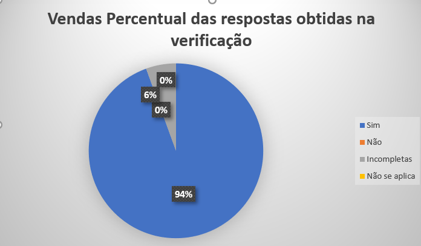

# Verificação First Things Firts
 
## Introdução

Este documento é uma verificação do artefato [First Things Firts](https://requisitos-de-software.github.io/2023.2-Carteira_Digital_de_Transito/elicita%C3%A7%C3%A3o/prioriza%C3%A7%C3%A3o/first_things_first/) na versão 2.3 de data 25/10/2023, autorado por [Milena Baruc](https://github.com/MilenaBaruc) e [Luis Miranda](https://github.com/LuisMiranda10), que é integrante do [grupo 02](https://requisitos-de-software.github.io/2023.2-Carteira_Digital_de_Transito/), cujo projeto tem como foco o aplicativo [Carteira Digital de Trânsito](https://play.google.com/store/apps/details?id=br.gov.serpro.cnhe&hl=pt_BR&gl=US), o propósito desta verificação é identificar possíveis problemas no artefato de priorização.

## Metodologia 

A verificação do artefato seguirá o [planejamento](https://requisitos-de-software.github.io/2023.2-Carteira_Digital_de_Transito/verificacao/grupo2/planejamendoDaVerificacao.md) estabelecido pelo nosso grupo. Conforme detalhado no planejamento, destaca-se a relevância do subtópico da metodologia neste documento, para apresentar a tabela contendo os checklists utilizados para realizar essa verificação deste artefato em especifico. Podemos observar o referido checklist referente a verificação do First Things Firts na Tabela 1. 

**Tabela 1** - Checklist - First Things Firts

| ID | Descrição                                                                                                                      | Avaliação  | Observação                                                             |
|----|--------------------------------------------------------------------------------------------------------------------------------|------------|------------------------------------------------------------------------|
| 1  | O artefato possui Introdução?                                                                                                  | -          | -       |
| 2  | O artefato possui a metodologia utilizada?                                                                    		      | -          | -    |
| 3  | O artefato possui bibliografia/referências bibliográficas?                                                                     | -          | -  |
| 4  | O artefato possui um histórico de versões com o id e descrição das versões, data, autores e revisores?                         | -          | -    |
| 5  | Todas as tabelas e imagens são chamadas no texto, possuem legendas e fontes?                                                   | -          | -         |
| 6  | Todos os textos estão na norma padrão?                                       						      | -          | -            |
| 7  | Foram listados todos os requisitos a serem priorizados?                                                                                              | -          | -       |
| 8 | Os requisitos são unicos e não se repetem?                                  						      | -          | -            |
| 9  | Os benefícios relativos de cada recursos ao cliente/negócio é estimado em uma escala de 1 a 9?                                         		      | -          | -    |
| 10  | O peso relativo desses itens são apresentados?                                                                   | -          | -  |
| 11 | 	A fórmula utilizada é (Benefício Relativo × Peso Relativo) + (Penalidade Relativa × Peso Relativo)?                                               | -          | -         |
| 12 | Os custos relativos de implementação foram estimados em uma escala de 1 a 9?                                   						      | -          | -            |
| 13 | 	A lista de requisitos foi ordenada decrescentemente em relação a prioridade?                                                                  		      | -          | -    |
| 14 |  Os riscos dos requisitos em relação ao risco relativo total são apresentados?                                                                   | -          | -  |
| 15 |  Os participantes e suas funções são apresentados?                       | -          | -    |
| 16 |  Foi documentada a reunião com os participantes? Existe uma gravação?                                                 | -          | -         |
| 17 |  Quem realizou essas estimativas foram representantes dos clientes?                         | -          | -    |
| 18 |  Há participação do cliente e/ou persona na priorização de requisitos?     | -          | -  |

Fonte: [Mayara Alves](https://github.com/Mayara-tech) 

 

## Desenvolvimento 

Na tabela 2 podemos observar o checklist preenchido após verificação do artefatoFirst Things Firts. Este checklist, minuciosamente preenchido, reflete os resultados, observações e considerações resultantes da análise realizada no artefato.

**Tabela 2** - Checklist Preenchido - First Things Firts

| ID | Descrição                                                                                                                      | Avaliação  | Observação                                                             |
|----|--------------------------------------------------------------------------------------------------------------------------------|------------|------------------------------------------------------------------------|
| 1  | O artefato possui Introdução?                                                                                                  | Sim          | -       |
| 2  | O artefato possui a metodologia utilizada?                                                                    		      | Sim         | -    |
| 3  | O artefato possui bibliografia/referências bibliográficas?                                                                     | Sim         | -  |
| 4  | O artefato possui um histórico de versões com o id e descrição das versões, data, autores e revisores?                         | Sim        | -    |
| 5  | Todas as tabelas e imagens são chamadas no texto, possuem legendas e fontes?                                                   | Incompleto        | A tabela de resultado da priorização esta quebrada.        |
| 6  | Todos os textos estão na norma padrão?                                       						      | Sim         | -            |
| 7  | Foram listados todos os requisitos a serem priorizados?                                                                                              | Sim         | -       |
| 8 | Os requisitos são unicos e não se repetem?                                  						      | Sim          | -            |
| 9  | Os benefícios relativos de cada recursos ao cliente/negócio é estimado em uma escala de 1 a 9?                                         		      | Sim        | -    |
| 10  | O peso relativo desses itens são apresentados?                                                                   |Sim       | -  |
| 11 | 	A fórmula utilizada é (Benefício Relativo × Peso Relativo) + (Penalidade Relativa × Peso Relativo)?                                               | Sim         | -         |
| 12 | Os custos relativos de implementação foram estimados em uma escala de 1 a 9?                                   						      |Sim         | -            |
| 13 | 	A lista de requisitos foi ordenada decrescentemente em relação a prioridade?                                                                  		      | Sim        | -    |
| 14 |  Os riscos dos requisitos em relação ao risco relativo total são apresentados?                                                                   | Sim         | -  |
| 15 |  Os participantes e suas funções são apresentados?                       | Sim       |    |
| 16 |  Foi documentada a reunião com os participantes? Existe uma gravação?                                                 | Sim        | -         |
| 17 |  Quem realizou essas estimativas foram representantes dos clientes?                         | Sim          | -    |
| 18 |  Há participação do cliente e/ou persona na priorização de requisitos?     | Sim        | -  |

Fonte: [Mayara Alves](https://github.com/Mayara-tech) 

## Sugestões de Melhorias

De maneira geral o artefato apresenta uma boa qualidade, uma boa formatação e uma boa padronização, além de ideias que foram documentadas de forma clara e concisa. Entretanto foram encontrados identificados alguns possíveis problemas em relação as especificações do check-list, sendo elas demonstradas na tabela 3. 

**Tabela 3** - Sugestões de melhoria - First Things Firts

| ID | Descrição do problema | Sugestão de melhoria   |
| --- | ---------------------| ---------------------- |
|  5   | A tabela de resultado da priorização esta quebrada.                       |  É sugerido que faça os ajustes necessários nos caminho da imagem no md.                     | 

Fonte: [Mayara Alves](https://github.com/Mayara-tech) 

## Acompanhamento

A figura 1 apresenta um gráfico com o percentual de respostas sim, não, incompleto ou não se aplica, obtidas através da checklist de verificação.

**Figura 1** - Percentual das respostas obtidas na verificação 

Fonte: [Mayara Alves](https://github.com/Mayara-tech) 

### Percentual de aproveitamento 

Para saber a porcentagem de aproveitamento do artefato, será utilizado a Equação na figura 2:

**Figura 2** - Equação de percentual de aproveitamento

Fonte: [Mayara Alves](https://github.com/Mayara-tech) 

Através dos checklists realizados podemos observar que:

17/18  exigências são atendidas;
1/18 exigências estão incompletas;
0/18 exigências estão erradas ou não foram realizadas.
0/18 não se aplica.

onde 18 é a quantidade de itens avaliados na verificação.

Portanto, com base no cálculo apresentado, pode-se dizer que o aproveitamento deste artefato está em 97,2%.

## Retrabalho

Como proposto por Fagan, para o retrabalho os autores do artefato [Milena Baruc](https://github.com/MilenaBaruc) e [Luis Miranda](https://github.com/LuisMiranda10) irão fazer as correções dos problemas apresentados seguindo a tabela de sugestão de correção apresentada anteriormente. O responsável por essa verificação fará uma revisão das correções feitas, checando se as correções são suficientes e se foi introduzido novos erros ou não. A tabela 4 a seguir apresenta o cronograma de correções.

**Tabela 4** - Cronograma de Correções.

| Data de Correção | Descrição                                                                             |                Responsável(eis)                |                 Revisor(es)                 |      Status      |
| :--------------: | :------------------------------------------------------------------------------------ | :--------------------------------------------: | :-----------------------------------------: | :--------------: |
|    05/12/2023    | Correção da tabela de resultados             |  [Milena Baruc](https://github.com/MilenaBaruc) e [Luis Miranda](https://github.com/LuisMiranda10)  | [Mayara Alves](https://github.com/Mayara-tech) ||

Fonte: [Mayara Alves](https://github.com/Mayara-tech) 

## Bibliografia

> BARBOSA, S. D. J.; Silva, B. S. da; Silveira, M. S.; Gasparini, I.; Darin, T.; Barbosa, G. D. J. (2021);Interação Humano-Computador e Experiência do usuário.
> 
> BILHETERIA DIGITAL. Interacao-Humano_computador. Distrito Federal, 2023. Disponível em: <https://interacao-humano-computador.github.io/2023.1-BilheteriaDigital/>. Acesso em: 26/11/2023. 
>
> VICTOR, Lucas. [Planejamento de Verificação da Entrega 2](https://github.com/Requisitos-de-Software/2023.2-Economia-DF/blob/main/docs/verificacao/Grupo-02/Entrega-02/planejamento-verificacao-e2-grupo2.md), GAMA, FGA, 2023. Acesso em: 26 de novembro de 2023.

## 📑 Histórico de Versões

| Versão | Data       | Descrição                                       | Autor                                          | Revisor                                      |
| ------ | ---------- | ----------------------------------------------- | -----------------------------------------------| ---------------------------------------------|
| `1.0`  | 27/11/2023 | Adicionando verificação do artefato First Things Firts   | [Mayara Alves](https://github.com/Mayara-tech) |  [Luis Miranda](https://github.com/LuisMiranda)|
