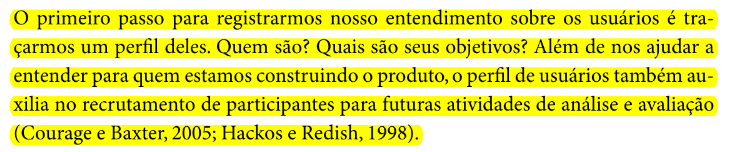
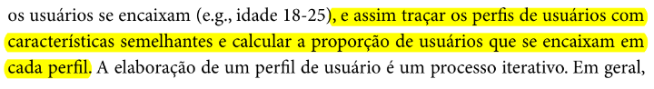
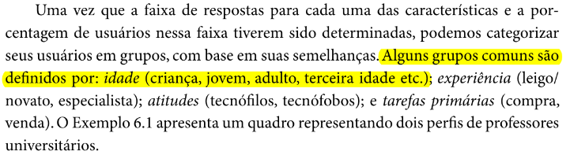
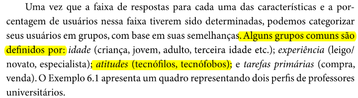
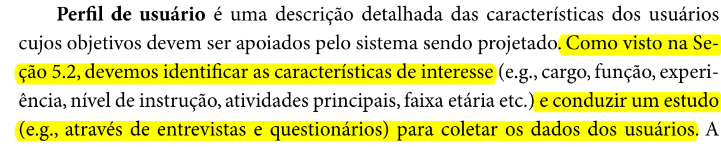
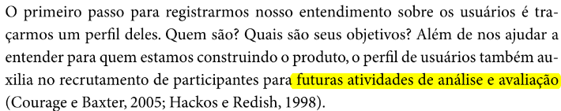

## Perfil de Usuário

## Introdução

Este documento é uma verificação do artefato [Perfil de Usuário](https://requisitos-de-software.github.io/2023.2-Carteira_Digital_de_Transito/elicita%C3%A7%C3%A3o/PerfildeUsuario/PerfilUsuario/) na versão 1.7 de data 20/11/2023, autorado por [Mayara Alves](https://github.com/Mayara-tech), que é integrante do [grupo 02](https://github.com/Requisitos-de-Software/2023.2-Carteira_Digital_de_Transito), cujo projeto tem como foco o [Aplicativo Carteira Digital de Trânsito](https://play.google.com/store/apps/details?id=br.gov.serpro.cnhe&hl=pt_BR&gl=US), o propósito desta verificação é identificar possíveis problemas no artefato.

## Metodologia

A verificação do artefato seguirá o [planejamento](https://github.com/Requisitos-de-Software/2023.2-Carteira_Digital_de_Transito/blob/main/docs/verificacao/grupo2/planejamentoDaVerificacao.md) estabelecido pelo nosso grupo. Conforme detalhado no planejamento, destaca-se a relevância do subtópico da metodologia neste documento, para apresentar a tabela contendo os checklists utilizados para realizar essa verificação deste artefato em específico. Podemos observar o referido checklist referente a verificação do Cronograma na Tabela 1, as perguntas foram tiradas da verificação da [Perfil de Usuário](https://requisitos-de-software.github.io/2023.2-Carteira_Digital_de_Transito/elicita%C3%A7%C3%A3o/PerfildeUsuario/PerfilUsuario/) feita anterirormente pelo grupo.

  
**Tabela 1** - Checklist Geral

| ID | Critério de Avaliação                           | Avaliação ( Sim/ Não / Não Aplicável )             | Observações                       | Referências                                                    |
|----| ------------------------------------------------|----------------------------------------------------|-----------------------------------|----------------------------------------------------------------|
| 1  | O histórico de versão é padronizado?                                           |     Sim       |            |  REQUISITOS DE SOFTWARE. Carteira Digital de Trânsito. Distrito Federal, 2023. Disponível em: <https://github.com/Requisitos-de-Software/2023.2-Carteira_Digital_de_Transito/>. Acesso em: 02/12/2023.          |            
| 2  | Possui o(s) autor(es) e o(s) revisor(es) do artefato?                          |     Sim       |            |  REQUISITOS DE SOFTWARE. Carteira Digital de Trânsito. Distrito Federal, 2023. Disponível em: <https://github.com/Requisitos-de-Software/2023.2-Carteira_Digital_de_Transito/>. Acesso em: 02/12/2023.          | 
| 3  | O artefato possui referências bibliográficas e/ou bibliografia?                |     Sim       |            |  REQUISITOS DE SOFTWARE. Carteira Digital de Trânsito. Distrito Federal, 2023. Disponível em: <https://github.com/Requisitos-de-Software/2023.2-Carteira_Digital_de_Transito/>. Acesso em: 02/12/2023.          | 
| 4  | Todos os textos estão na norma padrão?                                         |     Sim       |            |   REQUISITOS DE SOFTWARE. Carteira Digital de Trânsito. Distrito Federal, 2023. Disponível em: <https://github.com/Requisitos-de-Software/2023.2-Carteira_Digital_de_Transito/>. Acesso em: 02/12/2023.         | 
| 5  | Há introdução do artefato?                                                     |     Sim       |            |    REQUISITOS DE SOFTWARE. Carteira Digital de Trânsito. Distrito Federal, 2023. Disponível em: <https://github.com/Requisitos-de-Software/2023.2-Carteira_Digital_de_Transito/>. Acesso em: 02/12/2023.        | 
| 6  | Há metodologia de como foi conduzido o artefato?                               |     Sim       |            |  REQUISITOS DE SOFTWARE. Carteira Digital de Trânsito. Distrito Federal, 2023. Disponível em: <https://github.com/Requisitos-de-Software/2023.2-Carteira_Digital_de_Transito/>. Acesso em: 02/12/2023.          | 

Fonte: [Vinícius Mendes](https://github.com/yabamiah)

**Tabela 2** - Checklist Específico

| ID | Critério de avaliação | Avaliação (Sim/Não/Não aplicável) | Observações | Referências | Imagens da Referência |
|---|----------------------|------------------------------------|---------------|--------------|------------------------|
|01| Ao ler o Perfil de Usuário, é possível identificar quem são? (Adultos, adolescentes, pessoas tecnófilas ou tecnófobos) | | | Página: 174, Capítulo 6. Organização do Espaço de Problema. Livro: SIMONE DINIZ JUNQUEIRO BARBOSA, BRUNO SANTANA DA SILVA, Interação Humano-Computador, 1a. Edição, Editora Campus, 2010 |  |
|02| Ao ler o Perfil de Usuário, é possível identificar quais são os seus objetivos? (Objetivos relacionados com o propósito do aplicativo do projeto)| | | Página: 174, Capítulo 6. Organização do Espaço de Problema. Livro: SIMONE DINIZ JUNQUEIRO BARBOSA, BRUNO SANTANA DA SILVA, Interação Humano-Computador, 1a. Edição, Editora Campus, 2010|  |
|03| Foi traçado perfis de usuários resultantes da coleta de dados? | | | Página: 174, Capítulo 6. Organização do Espaço de Problema. Livro: SIMONE DINIZ JUNQUEIRO BARBOSA, BRUNO SANTANA DA SILVA, Interação Humano-Computador, 1a. Edição, Editora Campus, 2010|  |
|04| No Perfil de Usuário, foi descrito a faixa de idade da maioria dos usuários?(Criança, jovem, adulto e terceira idade) | | | Página: 175, Capítulo 6. Organização do Espaço de Problema. Livro: SIMONE DINIZ JUNQUEIRO BARBOSA, BRUNO SANTANA DA SILVA, Interação Humano-Computador, 1a. Edição, Editora Campus, 2010|  |
|05| No Perfil de Usuário, foi descrito a se são experientes ou não em suas áreas? (leigo/novato/especialista) | | | Página: 175, Capítulo 6. Organização do Espaço de Problema. Livro: SIMONE DINIZ JUNQUEIRO BARBOSA, BRUNO SANTANA DA SILVA, Interação Humano-Computador, 1a. Edição, Editora Campus, 2010|  |
|06| No Perfil de Usuário, foi descrito qual tipo de relação a maioria dos usuários tem com tecnologias? (Se são tecnófilos ou tecnófobos)| | | Página: 175, Capítulo 6. Organização do Espaço de Problema. Livro: SIMONE DINIZ JUNQUEIRO BARBOSA, BRUNO SANTANA DA SILVA, Interação Humano-Computador, 1a. Edição, Editora Campus, 2010|  |
|07| No Perfil de Usuário, foi descrito qual é a tarefa primária que a maioria dos usuários realizam?(Atividade com relação ao contexto do aplicativo do projeto) | | | Página: 175o, Capítulo 6. Organização do Espaço de Problema. Livro: SIMONE DINIZ JUNQUEIRO BARBOSA, BRUNO SANTANA DA SILVA, Interação Humano-Computador, 1a. Edição, Editora Campus, 2010| |
|08| Foi descrito qual técnica foi utilizada para conduzir a coleta dos dados dos usuários? (Como entrevistas, questionários, análise documental, etc...) | | | Página: 174, Capítulo 6. Organização do Espaço de Problema. Livro: SIMONE DINIZ JUNQUEIRO BARBOSA, BRUNO SANTANA DA SILVA, Interação Humano-Computador, 1a. Edição, Editora Campus, 2010|  |
|09| Foi apresentado os resultados dos dados coletas pela técnica? | | | Página: 174, Capítulo 6. Organização do Espaço de Problema. Livro: SIMONE DINIZ JUNQUEIRO BARBOSA, BRUNO SANTANA DA SILVA, Interação Humano-Computador, 1a. Edição, Editora Campus, 2010|  |

Fonte: [Vinícius Mendes](https://github.com/yabamiah)

## Desenvolvimento

Na tabela 2 podemos observar o checklist preenchido após verificação do artefato. Este checklist, minuciosamente preenchido, reflete os resultados, observações e considerações resultantes da análise realizada no artefato. A inspeção foi feita por meio uma gravação individual, que está presentes na tabela 3.

**Tabela 3** - Checklist Geral

| ID | Critério de Avaliação                           | Avaliação ( Sim/ Não / Não Aplicável )             | Observações                       |
|----| ------------------------------------------------|----------------------------------------------------|-----------------------------------|
| 1  | O histórico de versão é padronizado?                                           |     Sim       |            |            
| 2  | Possui o(s) autor(es) e o(s) revisor(es) do artefato?                          |     Sim       |            |  
| 3  | O artefato possui referências bibliográficas e/ou bibliografia?                |     Sim       |            |   
| 4  | Todos os textos estão na norma padrão?                                         |     Sim       |            |   
| 5  | Há introdução do artefato?                                                     |     Sim       |            | 
| 6  | Há metodologia de como foi conduzido o artefato?                               |     Sim       |            |

Fonte: [Vinícius Mendes](https://github.com/yabamiah)

**Tabela 4** - Checklist preenchido

| ID | Critério de avaliação | Avaliação (Sim/Não/Não aplicável) | Observações |
|---|----------------------|------------------------------------|---------------|
|01| Ao ler o Perfil de Usuário, é possível identificar quem são? (Adultos, adolescentes, pessoas tecnófilas ou tecnófobos) |   Sim   |   |
|02| Ao ler o Perfil de Usuário, é possível identificar quais são os seus objetivos? (Objetivos relacionados com o propósito do aplicativo do projeto)| Não    |
|03| Foi traçado perfis de usuários resultantes da coleta de dados? |   Sim  | Poderia ter colocado um link para o método utilizado para coletar dados|
|04| No Perfil de Usuário, foi descrito a faixa de idade da maioria dos usuários?(Criança, jovem, adulto e terceira idade) |       Sim   |
|05| No Perfil de Usuário, foi descrito a se são experientes ou não em suas áreas? (leigo/novato/especialista) |  Sim         |
|06| No Perfil de Usuário, foi descrito qual tipo de relação a maioria dos usuários tem com tecnologias? (Se são tecnófilos ou tecnófobos)|  Sim          |
|07| No Perfil de Usuário, foi descrito qual é a tarefa primária que a maioria dos usuários realizam?(Atividade com relação ao contexto do aplicativo do projeto) | Sim  |
|08| Foi descrito qual técnica foi utilizada para conduzir a coleta dos dados dos usuários? (Como entrevistas, questionários, análise documental, etc...) |   Sim       | Na seção "Definição do Perfil de Usuário" não foi citado a técnica de análise documental|
|09| Foi apresentado os resultados dos dados coletas pela técnica? |    Sim    |    Indo na documentação das  técnicas utilizadas é possível ver 

Fonte: [Vinícius Mendes](https://github.com/yabamiah)

**Tabela 3** - Cronograma de verificação

| Participantes | Data | Horário |
|--------------|-------|---------|
| Vinícius Mendes | 03/12/2023 | 15:00/15:10 |

## Sugestões de Melhorias
De acorda com a inspeção feita, foi possível encontrar algumas possíveis melhorias para o artefato em questão, as melhorias serão descritas logo abaixo junto ao ID da verificação:
- **ID03 e ID08**: Poderia ter colocado uma linkagem para as técnicas utilizadas
- **ID02**: Não foi apresentado 
- **ID08**: Para não causar ambiguidade, deve ser descrito que foi utilizado a técnica de análise documental na seção "Definição do Perfil de Usuário"

## Acompanhamento
Logo abaixo, será apresentado as **Figuras 1 e 2**, que irão representar o porcentual de aproveitamento dos checklists, utilizando como o parâmetro "Sim", "Não" e "Não aplicável".

## Porcentual de aproveitamento do Checklist geral

**Figura 1** - Gráfico de setores do porcentual de aproveitamento do checklist geral
.png)

Fonte: [Vinícius Mendes](https://github.com/yabamiah)
### Porcentual de aproveitamento do Checklist específico

**Figura 2** - Gráfico de setores do porcentual de aproveitamento do checklist específico

Fonte: [Vinícius Mendes](https://github.com/yabamiah)

## Referência Bibliográfica
> Carteira Digital de Trânsito. Requisitos de Software. Distrito Federal, 2023. Disponível em: https://requisitos-de-software.github.io/2023.2-Carteira_Digital_de_Transito/. Acesso em: 02/12/2023

## Bibliografia
> SIMONE DINIZ JUNQUEIRO BARBOSA, BRUNO SANTANA DA SILVA, Interação Humano-Computador, 1a. Edição, Editora Campus, 2010

## 📑 Histórico de Versões

| Versão | Data | Descrição | Autor | Revisor |
|-------|------|-----------|---------|--------|
|`1.0`| 03/12/2023| Criação do documento | [Vinícius Mendes](https://github.com/yabamiah)| [Mayara Alves](https://github.com/Mayara-tech)|
