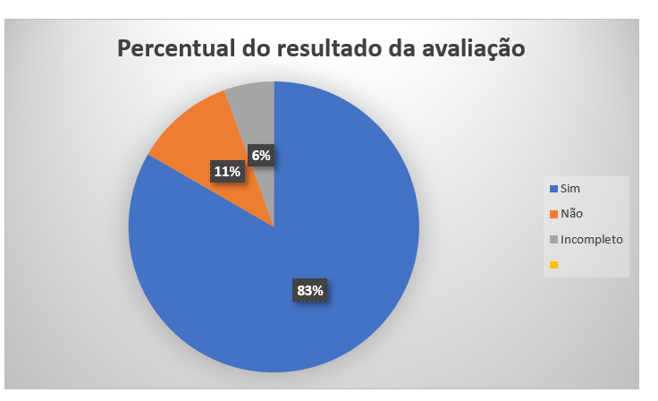

# Verificação Storyboard 
 
## Introdução

Este documento é uma verificação do artefato [Storyboard](https://requisitos-de-software.github.io/2023.2-Carteira_Digital_de_Transito/elicita%C3%A7%C3%A3o/storyboard/) na versão 2.1 de data 21/11/2023, autorado por [Breno Queiroz](https://github.com/brenob6), que é integrante do [grupo 02](https://requisitos-de-software.github.io/2023.2-Carteira_Digital_de_Transito/), cujo projeto tem como foco o aplicativo [Carteira Digital de Trânsito](https://play.google.com/store/apps/details?id=br.gov.serpro.cnhe&hl=pt_BR&gl=US), o propósito desta verificação é identificar possíveis problemas no artefato de elicitação.

## Metodologia 

A verificação do artefato seguirá o [planejamento](https://requisitos-de-software.github.io/2023.2-Carteira_Digital_de_Transito/verificacao/grupo2/planejamendoDaVerificacao.md) estabelecido pelo nosso grupo. Conforme detalhado no planejamento, destaca-se a relevância do subtópico da metodologia neste documento, para apresentar a tabela contendo os checklists utilizados para realizar essa verificação deste artefato em especifico. Podemos observar o referido checklist referente a verificação do Storyboard na Tabela 1. 

**Tabela 1** - Checklist - Storyboard

| ID | Descrição                                                                                                                      | Avaliação  | Observação                                                             |
|----|--------------------------------------------------------------------------------------------------------------------------------|------------|------------------------------------------------------------------------|
| 1  | O artefato possui Introdução?                                                                                                  | -          | -       |
| 2  | O artefato possui a metodologia utilizada?                                                                    		      | -          | -    |
| 3  | O artefato possui bibliografia/referências bibliográficas?                                                                     | -          | -  |
| 4  | O artefato possui um histórico de versões com o id e descrição das versões, data, autores e revisores?                         | -          | -    |
| 5  | Todas as tabelas e imagens são chamadas no texto, possuem legendas e fontes?                                                   | -          | -         |
| 6  | Todos os textos estão na norma padrão?                                       						      | -          | -            |
| 7  | Foi mostrado como o storyboard foi criado?                                               | -          | -             | 
| 8  | O storyboard apresenta a utilização típica do aplicativo?                                               | -          | -             | 
| 9  | Foi mostrado os requisitos elicitados com os storyboards?                                              | -          | -             | 
| 10  | Os requisitos elicitados foram classificados corretamente?                                              | -          | -             | 
| 11  | Foram elicitados requisitos que não estavam presentes no aplicativo?                                           | -          | -             | 
| 12  | Todos os requisitos são testáveis?                                                                        | -             | -            |
| 13  | É definido os atores do documento?                                                                        | -             | -            |
| 14  | O Storyboard é adequado para compreensão por parte da equipe de desenvolvimento e dos usuários?           | -           | -            |
| 15  | Os objetivos do storyboard estão claramente definidos e alinhados com os objetivos do aplicativo?          | -           | -            |
| 16  | As cenas do storyboard estão organizadas em uma sequência temporal lógica, refletindo a ordem de interações do usuário?  | -            | -
| 17  | Os storyboards abrange uma variedade de cenários que representam diferentes casos de uso e situações possíveis? | -         | -    
| 18  | As representações visuais, como wireframes ou esboços, são claras e ajudam na compreensão das interações propostas?     | -       | -      

Fonte: [Mayara Alves](https://github.com/Mayara-tech) 

 

## Desenvolvimento 

Na tabela 2 podemos observar o checklist preenchido após verificação do artefato Storyboard. Este checklist, minuciosamente preenchido, reflete os resultados, observações e considerações resultantes da análise realizada no artefato.

**Tabela 2** - Checklist Preenchido - Storyboard

| ID | Descrição                                                                                                                      | Avaliação  | Observação                                                             |
|----|--------------------------------------------------------------------------------------------------------------------------------|------------|------------------------------------------------------------------------|
| 1  | O artefato possui Introdução?                                                                                                  | Sim          | -       |
| 2  | O artefato possui a metodologia utilizada?                                                                    		      | Não         | O artefato não possui a metodologia utilizada para sua construção.     |
| 3  | O artefato possui bibliografia/referências bibliográficas?                                                                     | Incompleto         | Não é referenciado o aplicativo ou site utilizado para criação dos Storyboards |
| 4  | O artefato possui um histórico de versões com o id e descrição das versões, data, autores e revisores?                         | Sim         | -    |
| 5  | Todas as tabelas e imagens são chamadas no texto, possuem legendas e fontes?                                                   | Sim       | -         |
| 6  | Todos os textos estão na norma padrão?                                       						      | Sim        | -            |
| 7  | Foi mostrado como o storyboard foi criado?                                               | Não         | O artefato não possui metodologia deixando assim inacessível como foi realizado a construção do artefato.            | 
| 8  | O storyboard apresenta a utilização típica do aplicativo?                                               | Sim          | -             | 
| 9  | Foi mostrado os requisitos elicitados com os storyboards?                                              | Sim         | -             | 
| 10  | Os requisitos elicitados foram classificados corretamente?                                              | Sim         | -             | 
| 11  | Foram elicitados requisitos que não estavam presentes no aplicativo?                                           | Sim         | -             | 
| 12  | Todos os requisitos são testáveis?                                                                        | Sim            | -            |
| 13  | É definido os atores do documento?                                                                        | Sim             | -            |
| 14  | O Storyboard é adequado para compreensão por parte da equipe de desenvolvimento e dos usuários?           | Sim          | -            |
| 15  | Os objetivos do storyboard estão claramente definidos e alinhados com os objetivos do aplicativo?          | Sim           | -            |
| 16  | As cenas do storyboard estão organizadas em uma sequência temporal lógica, refletindo a ordem de interações do usuário?  | Sim           | -
| 17  | Os storyboards abrange uma variedade de cenários que representam diferentes casos de uso e situações possíveis? | Sim        | -    
| 18  | As representações visuais, como wireframes ou esboços, são claras e ajudam na compreensão das interações propostas?     | Sim       | -      

Fonte: [Mayara Alves](https://github.com/Mayara-tech) 

## Sugestões de Melhorias

De maneira geral o artefato apresenta uma boa qualidade, uma boa formatação e uma boa padronização, além de ideias que foram documentadas de forma clara e concisa. Entretanto foram encontrados identificados alguns possíveis problemas em relação as especificações do check-list, sendo elas demonstradas na tabela 3. 

**Tabela 3** - Sugestões de melhoria - Storyboard

| ID | Descrição do problema | Sugestão de melhoria |
| --- | ---------------------| ---------------------- |
| 02 | O artefato não possui a metodologia utilizada para sua construção.   |  É sugerido a elaboração de uma metodologia abordando a construção do Storyboard. |
| 03 | Não é referenciado o aplicativo ou site utilizado para criação dos Storyboards  |  É sugerido que se coloque na referência a ferramenta utilizada para criação do Storyboard.  |
| 07 | Foi mostrado como o storyboard foi criado? | É sugerido que especifique na metodologia quais técnicas foram utilizada para elaboração do Storyboard. |

Fonte: [Mayara Alves](https://github.com/Mayara-tech) 

## Acompanhamento

A figura 1 apresenta um gráfico com o percentual de respostas sim, não, incompleto ou não se aplica, obtidas através da checklist de verificação.

**Figura 1** - Percentual das respostas obtidas na verificação 

Fonte: [Mayara Alves](https://github.com/Mayara-tech) 

### Percentual de aproveitamento 

Para saber a porcentagem de aproveitamento do artefato, será utilizado a Equação na figura 2:

**Figura 2** - Equação de percentual de aproveitamento

Fonte: [Mayara Alves](https://github.com/Mayara-tech) 

Através dos checklists realizados podemos observar que:

- 15/18  exigências são atendidas;
- 1/18 exigências estão incompletas;
- 2/18 exigências estão erradas ou não foram realizadas.
- 0/18 não se aplica.

onde 18 é a quantidade de itens avaliados na verificação.

Portanto, com base no cálculo apresentado, pode-se dizer que o aproveitamento deste artefato está em 75%.

## Retrabalho

Como proposto por Fagan, para o retrabalho o autor do artefato [Breno Queiroz](https://github.com/Brenob6) irá fazer as correções dos problemas apresentados seguindo a tabela de sugestão de correção apresentada anteriormente. O responsável por essa verificação fará uma revisão das correções feitas, checando se as correções são suficientes e se foi introduzido novos erros ou não. A tabela 4 a seguir apresenta o cronograma de correções.

**Tabela 4** - Cronograma de Correções.

| Data de Correção | Descrição                                                                             |                Responsável(eis)                |                 Revisor(es)                 |      Status      |
| :--------------: | :------------------------------------------------------------------------------------ | :--------------------------------------------: | :-----------------------------------------: | :--------------: |
|    30/11/2023    | Criação da metodologia                 |  [Breno Queiroz](https://github.com/Brenob6)  | [Mayara Alves](https://github.com/Mayara-tech) |  |
|    30/11/2023    | Adição da ferramenta utilizada para construção do Storyboard as referências | [Breno Queiroz](https://github.com/Brenob6) | [Mayara Alves](https://github.com/Mayara-tech) |  |

Fonte: [Mayara Alves](https://github.com/Mayara-tech) 

## Bibliografia

> BARBOSA, S. D. J.; Silva, B. S. da; Silveira, M. S.; Gasparini, I.; Darin, T.; Barbosa, G. D. J. (2021);Interação Humano-Computador e Experiência do usuário.
> 
> BILHETERIA DIGITAL. Interacao-Humano_computador. Distrito Federal, 2023. Disponível em: <https://interacao-humano-computador.github.io/2023.1-BilheteriaDigital/>. Acesso em: 26/11/2023. 
>
> VICTOR, Lucas. [Planejamento de Verificação da Entrega 2](https://github.com/Requisitos-de-Software/2023.2-Economia-DF/blob/main/docs/verificacao/Grupo-02/Entrega-02/planejamento-verificacao-e2-grupo2.md), GAMA, FGA, 2023. Acesso em: 26 de novembro de 2023.

## 📑 Histórico de Versões

| Versão | Data       | Descrição                                       | Autor                                          | Revisor                                      |
| ------ | ---------- | ----------------------------------------------- | -----------------------------------------------| ---------------------------------------------|
| `1.0`  | 26/11/2023 | Adicionando verificação do artefato Storyboard   | [Mayara Alves](https://github.com/Mayara-tech) | [Luis Miranda](https://github.com/LuisMiranda) |
