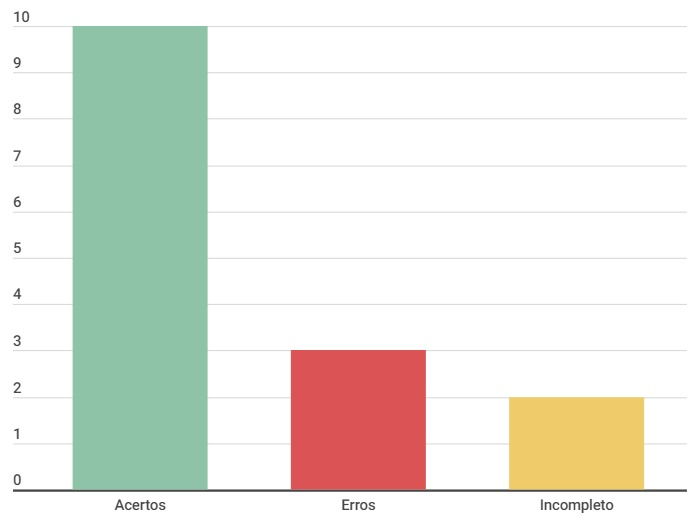

# Entrevista

## Introdução

Este documento é uma verificação do artefato [Entrevista](../../../elicitação/entrevista.md) na versão 1.1 de data 21/11/2023, autorado por [Altino Arthur](https://github.com/arthurrochamoreira), que é integrante do [grupo 02](https://github.com/Requisitos-de-Software/2023.2-Carteira_Digital_de_Transito), cujo projeto tem como foco o [Aplicativo Carteira Digital de Trânsito](https://play.google.com/store/apps/details?id=br.gov.serpro.cnhe&hl=pt_BR&gl=US), o propósito desta verificação é identificar possíveis problemas no artefato.

## Metodologia

A verificação do artefato seguirá o [planejamento](../../grupo2/planejamentoDaVerificacao.md) estabelecido pelo nosso grupo. Conforme detalhado no planejamento, destaca-se a relevância do subtópico da metodologia neste documento, para apresentar a tabela contendo os checklists utilizados para realizar essa verificação deste artefato em específico. Podemos observar o referido checklist referente a verificação do Cronograma na Tabela 1, as perguntas foram tiradas da verificação da [entrevista](https://requisitos-de-software.github.io/2023.2-Economia-DF/verificacao/Grupo-02/Entrega-02/entrevista/) feita anterirormente pelo grupo 1.

**Tabela 1** - Checklist

| ID | Descrição                                                                           | Avaliação  | Observação |
|----|-------------------------------------------------------------------------------------|------------|------------|
| 1  | O histórico de versão é padronizado?                                                |      -     |     -      |
| 2  | Possui o(s) autor(es) e o(s) revisor(es) do artefato?                               |      -     |     -      |
| 3  | O artefato possui referências bibliográficas e/ou bibliografia?                     |      -     |     -      |
| 4  | Todas as tabelas e imagens são chamadas no texto, possuem legendas e fontes?        |      -     |     -      |
| 5  | Todos os textos estão na norma padrão?                                              |      -     |     -      |
| 6  | Há introdução do artefato?                                                          |      -     |     -      |
| 7  | O artefato possui uma introdução condizente com o conteúdo do texto?                |      -     |     -      |
| 8  | Todas as bibliografias/referências bibliográficas são utilizadas no texto?          |      -     |     -      |
| 9  | As metodologias do texto definem de forma condizente as formas e os métodos que o grupo realizou o artefato? |      -     |     -      |
|10  | As diretrizes foram seguidas?                                                       |      -     |     -      |
|11  | Foi explicada como seria feita a entrevista?                                        |      -     |     -      |
|12  | Houve preparação para a entrevista?                                                 |      -     |     -      |
|13  | Formato da entrevista definido e adequado?                                          |      -     |     -      |
|14  | Forma de registro adequado?                                                         |      -     |     -      |
|15  | Foram registradas as respostas?                                                     |      -     |     -      |
| 16 | Finalização organizada?                                                             |      -     |     -      |
| 17 | Houve consentimento do entrevistado?                                                |      -     |     -      |

Fonte: [Milena Baruc](https://github.com/MilenaBaruc)

## Desenvolvimento

Na tabela 2 podemos observar o checklist preenchido após verificação do artefato. Este checklist, minuciosamente preenchido, reflete os resultados, observações e considerações resultantes da análise realizada no artefato. A inspeção foi feita por meio de uma gravação em dupla, que está presentes na tabela 3.

**Tabela 2** - Checklist preenchido

| ID | Descrição                                                                           | Avaliação  | Observação |
|----|-------------------------------------------------------------------------------------|------------|------------|
| 1  | O histórico de versão é padronizado?                                                | Não  | está para a direita do título  |
| 2  | Possui o(s) autor(es) e o(s) revisor(es) do artefato?                               |    Não    |    Está sem revisor      |
| 3  | O artefato possui referências bibliográficas e/ou bibliografia?                     |     Incompleto     |     Referência está sem número      |
| 4  | Todas as tabelas e imagens são chamadas no texto, possuem legendas e fontes?        |     Incompleto    |    Tabela 1 com problema e sem fonte      |
| 5  | Todos os textos estão na norma padrão?                                              |     Sim    |     -      |
| 6  | Há introdução do artefato?                                                          |     Sim    |     -      |
| 7  | O artefato possui uma introdução condizente com o conteúdo do texto?                |      Sim   |     -      |
| 8  | Todas as bibliografias/referências bibliográficas são utilizadas no texto?          |     Sim     |     -      |
| 9  | As metodologias do texto definem de forma condizente as formas e os métodos que o grupo realizou o artefato? |    Sim    |     -      |
|10  | As diretrizes foram seguidas?                                                       |    Sim     |     -      |
|11  | Foi explicada como seria feita a entrevista?                                        |    Sim     |     -      |
|12  | Houve preparação para a entrevista?                                                 |    Sim     |     -      |
|13  | Formato da entrevista definido e adequado?                                          |    Sim     |     -      |
|14  | Forma de registro adequado?                                                         |    Sim     |     -      |
|15  | Foram registradas as respostas?                                                     |    Não     | Falta uma tabela contendo as respostas do usuário |
| 16 | Finalização organizada?                                                             |   Sim      |     -      |
| 17 | Houve consentimento do entrevistado?                                                |   Sim      |     -      |

Fonte: [Milena Baruc](https://github.com/MilenaBaruc)

**Tabela 3** - Cronograma de verificação

| Participantes | Data | Horário | Link da gravação |
| -------------------------------------------------------------------------------------------- | ---------- | ----- | ------------------- |
| [Milena Baruc](https://github.com/MilenaBaruc) e [Breno Queiroz](https://github.com/brenob6) | 02/12/2023 | 16:15 | [Verificação em dupla](https://youtu.be/rn52Lto8aRc)            |

Fonte: [Milena Baruc](https://github.com/MilenaBaruc) 

## Dados gráficos

Segue no gráfico 1, o gráfico onde podemos ver com maior facilidade os erros, acertos e incompletos do artefato.

**Gráfico 1** - Dados visuais

Fonte: [Milena Baruc](https://github.com/MilenaBaruc)

## Sugestões de Melhorias

Em geral o artefato está ótimo, só precisa de algumas alterações. Sendo assim, a seguir segue as sugestões de melhorias:

• Arrumar o histórico de versão, pois o mesmo não está alinhado com o título e não tem revisor;
• Arummar a tabela 1 que está com problema (não está aparecendo em formato de tabela no gitpages), e adicionar a fonte;
• Adicionar uma tabela contendo as respostas do entrevistado.

## Referência Bibliografica

> 1. Economia DF. Requisitos de Software. Distrito Federal, 2023. Disponível em: <https://requisitos-de-software.github.io/2023.2-Economia-DF/>. Acesso em: 02/12/2023.

## Bibliografia

> BARBOSA, S. D. J.; Silva, B. S. da; Silveira, M. S.; Gasparini, I.; Darin, T.; Barbosa, G. D. J. (2021);Interação Humano-Computador e Experiência do usuário.

## 📑 Histórico de Versões

| Versão | Data       | Descrição                                       | Autor                                          | Revisor                                      |
| ------ | ---------- | ----------------------------------------------- | -----------------------------------------------| ---------------------------------------------|
| `1.0`  | 02/12/2023 | Criação do Documento | [Milena Baruc](https://github.com/MilenaBaruc)  | [Luis Miranda](https://github.com/LuisMiranda10)|
