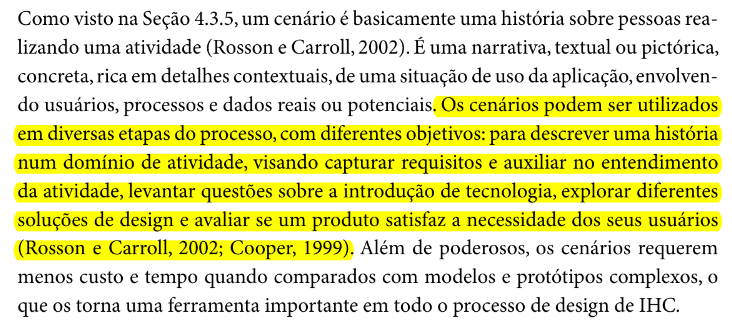
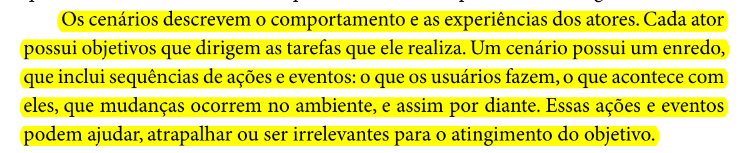
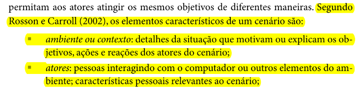
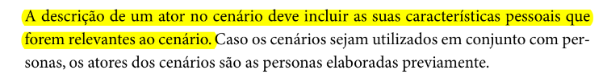
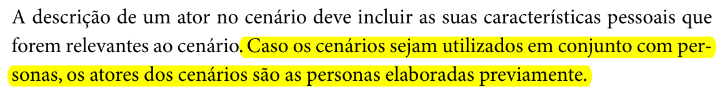
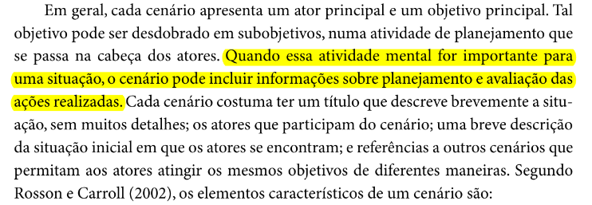

# Verificação Cenários

## Introdução

Este documento é uma verificação do artefato [Cenário](https://requisitos-de-software.github.io/2023.2-Carteira_Digital_de_Transito/modelagem/cenarios/) na versão 1.1 de data 06/11/2023, autorado por [Mayara Alves](https://github.com/Mayara-tech), que é integrante do [grupo 02](https://github.com/Requisitos-de-Software/2023.2-Carteira_Digital_de_Transito), cujo projeto tem como foco o [Aplicativo Carteira Digital de Trânsito](https://play.google.com/store/apps/details?id=br.gov.serpro.cnhe&hl=pt_BR&gl=US), o propósito desta verificação é identificar possíveis problemas no artefato.

## Metodologia

A verificação do artefato seguirá o [planejamento](https://github.com/Requisitos-de-Software/2023.2-Carteira_Digital_de_Transito/blob/main/docs/verificacao/grupo2/planejamentoDaVerificacao.md) estabelecido pelo nosso grupo. Conforme detalhado no planejamento, destaca-se a relevância do subtópico da metodologia neste documento, para apresentar a tabela contendo os checklists utilizados para realizar essa verificação deste artefato em específico. Podemos observar o referido checklist referente a verificação do Cronograma na Tabela 1, as perguntas foram tiradas da verificação da [Cenário](https://requisitos-de-software.github.io/2023.2-Carteira_Digital_de_Transito/modelagem/cenarios/) feita anterirormente pelo grupo.

**Tabela 1** - Checklist Geral

| ID | Critério de Avaliação                           | Avaliação ( Sim/ Não / Não Aplicável )             | Observações                       | Referências                                                    |
|----| ------------------------------------------------|----------------------------------------------------|-----------------------------------|----------------------------------------------------------------|
| 1  | O histórico de versão é padronizado?                                           |            |            |  REQUISITOS DE SOFTWARE. Carteira Digital de Trânsito. Distrito Federal, 2023. Disponível em: <https://github.com/Requisitos-de-Software/2023.2-Carteira_Digital_de_Transito/>. Acesso em: 02/12/2023.          |            
| 2  | Possui o(s) autor(es) e o(s) revisor(es) do artefato?                          |            |            |  REQUISITOS DE SOFTWARE. Carteira Digital de Trânsito. Distrito Federal, 2023. Disponível em: <https://github.com/Requisitos-de-Software/2023.2-Carteira_Digital_de_Transito/>. Acesso em: 02/12/2023.          | 
| 3  | O artefato possui referências bibliográficas e/ou bibliografia?                |            |            |  REQUISITOS DE SOFTWARE. Carteira Digital de Trânsito. Distrito Federal, 2023. Disponível em: <https://github.com/Requisitos-de-Software/2023.2-Carteira_Digital_de_Transito/>. Acesso em: 02/12/2023.          | 
| 4  | Todos os textos estão na norma padrão?                                         |            |            |   REQUISITOS DE SOFTWARE. Carteira Digital de Trânsito. Distrito Federal, 2023. Disponível em: <https://github.com/Requisitos-de-Software/2023.2-Carteira_Digital_de_Transito/>. Acesso em: 02/12/2023.         | 
| 5  | Há introdução do artefato?                                                     |            |            |    REQUISITOS DE SOFTWARE. Carteira Digital de Trânsito. Distrito Federal, 2023. Disponível em: <https://github.com/Requisitos-de-Software/2023.2-Carteira_Digital_de_Transito/>. Acesso em: 02/12/2023.        | 
| 6  | Há metodologia de como foi conduzido o artefato?                               |    |            |  REQUISITOS DE SOFTWARE. Carteira Digital de Trânsito. Distrito Federal, 2023. Disponível em: <https://github.com/Requisitos-de-Software/2023.2-Carteira_Digital_de_Transito/>. Acesso em: 02/12/2023.          | 

Fonte: [Vinícius Mendes](https://github.com/yabamiah)

**Tabela 2** - Checklist Específico

| ID | Critério de avaliação | Avaliação (Sim/Não/Não aplicável) | Observações | Referências | Imagem da Referência |
|---|----------------------|------------------------------------|---------------|--------------|-------------|
|01| O cenário possui um título que descreve brevemente a história descrita? |  | | Página: 183-184, Capítulo 6. Organização do Espaço de Problema. Livro: SIMONE DINIZ JUNQUEIRO BARBOSA, BRUNO SANTANA DA SILVA, Interação Humano-Computador, 1a. Edição, Editora Campus, 2010 | |
|02| É possível observar no cenário uma história contando sobre pessoas realizando alguma atividade sobre o aplicativo do projeto? |  | | Página: 183-184, Capítulo 6. Organização do Espaço de Problema. Livro: SIMONE DINIZ JUNQUEIRO BARBOSA, BRUNO SANTANA DA SILVA, Interação Humano-Computador, 1a. Edição, Editora Campus, 2010 |  |
|03| O cenário possui um enredo que contém sequências de ações e eventos? (O que os usuários fazem, o que acontece com eles)|  | | Página: 183-184, Capítulo 6. Organização do Espaço de Problema. Livro: SIMONE DINIZ JUNQUEIRO BARBOSA, BRUNO SANTANA DA SILVA, Interação Humano-Computador, 1a. Edição, Editora Campus, 2010 |  |
|04| O cenário possui o ambiente ou contexto? (Elemento que detalha a situação que motiva ou explica os objetivos, tarefas e reações dos atores do cenário) |  | |Página: 183, Capítulo 6. Organização do Espaço de Problema. Livro: SIMONE DINIZ JUNQUEIRO BARBOSA, BRUNO SANTANA DA SILVA, Interação Humano-Computador, 1a. Edição, Editora Campus, 2010 |  |
|05| O cenário possui um atores? (Pessoas que interagem com o sistema ou outros elementos do ambiente)| | | Página: 183-184, Capítulo 6. Organização do Espaço de Problema. Livro: SIMONE DINIZ JUNQUEIRO BARBOSA, BRUNO SANTANA DA SILVA, Interação Humano-Computador, 1a. Edição, Editora Campus, 2010 |  |
|06| O atores tiveram suas informações descritas? (Como nome, profissão e idade)|  | | Página: 184, Capítulo 6. Organização do Espaço de Problema. Livro: SIMONE DINIZ JUNQUEIRO BARBOSA, BRUNO SANTANA DA SILVA, Interação Humano-Computador, 1a. Edição, Editora Campus, 2010 | |
|07| Os atores presentes no cenários, foram baseados a partir das personas criadas? (São pessoas relevantes ao cenário)|  | | Página: 184, Capítulo 6. Organização do Espaço de Problema. Livro: SIMONE DINIZ JUNQUEIRO BARBOSA, BRUNO SANTANA DA SILVA, Interação Humano-Computador, 1a. Edição, Editora Campus, 2010|  |
|08| É possível observar no cenário, um objetivo principal dos atores?(Desejo dos atores que os motivam a realizar ações)|  | | Página: 184, Capítulo 6. Organização do Espaço de Problema. Livro: SIMONE DINIZ JUNQUEIRO BARBOSA, BRUNO SANTANA DA SILVA, Interação Humano-Computador, 1a. Edição, Editora Campus, 2010| |
|09| O cenário possui um planejamento? (Sequências de ações dos atores que levam um objetivo a uma ação)|  | | Página: 184, Capítulo 6. Organização do Espaço de Problema. Livro: SIMONE DINIZ JUNQUEIRO BARBOSA, BRUNO SANTANA DA SILVA, Interação Humano-Computador, 1a. Edição, Editora Campus, 2010| |
|10| É possível observar as ações dos atores no cenário? (Comportamentos ou atividades realizadas)|  | | Página: 184, Capítulo 6. Organização do Espaço de Problema. Livro: SIMONE DINIZ JUNQUEIRO BARBOSA, BRUNO SANTANA DA SILVA, Interação Humano-Computador, 1a. Edição, Editora Campus, 2010|  |
|11| É possível observar eventos externos que ajudam ou atrapalham o usuário a realizar suas atividades? (Eventos externos são eventos gerados por computador, sistema, produto ou qualquer elemento do ambiente) |  | |  Página: 183, Capítulo 6. Organização do Espaço de Problema. Livro: SIMONE DINIZ JUNQUEIRO BARBOSA, BRUNO SANTANA DA SILVA, Interação Humano-Computador, 1a. Edição, Editora Campus, 2010|  |
|12| O cenário possui uma conclusão? (Uma interpretação das ações descrita no cenário)|  | | Página: 184, Capítulo 6. Organização do Espaço de Problema. Livro: SIMONE DINIZ JUNQUEIRO BARBOSA, BRUNO SANTANA DA SILVA, Interação Humano-Computador, 1a. Edição, Editora Campus, 2010|  |

Fonte: [Vinícius Mendes](https://github.com/yabamiah)

## Desenvolvimento

Na tabela 2 podemos observar o checklist preenchido após verificação do artefato. Este checklist, minuciosamente preenchido, reflete os resultados, observações e considerações resultantes da análise realizada no artefato. A inspeção foi feita por meio uma gravação individual, que está presentes na tabela 3.

**Tabela 3** - Checklist Geral

| ID | Critério de Avaliação                           | Avaliação ( Sim/ Não / Não Aplicável )             | Observações                       |
|----| ------------------------------------------------|----------------------------------------------------|-----------------------------------|
| 1  | O histórico de versão é padronizado?                                           |     Sim       |            |            
| 2  | Possui o(s) autor(es) e o(s) revisor(es) do artefato?                          |     Sim       |            |  
| 3  | O artefato possui referências bibliográficas e/ou bibliografia?                |     Sim       |            |   
| 4  | Todos os textos estão na norma padrão?                                         |     Sim       |            |   
| 5  | Há introdução do artefato?                                                     |     Sim       |            | 
| 6  | Há metodologia de como foi conduzido o artefato?                               |     Sim       |            |

Fonte: [Vinícius Mendes](https://github.com/yabamiah)

**Tabela 4** - Checklist preenchido

| ID | Critério de avaliação | Avaliação (Sim/Não/Não aplicável) | Observações |
|---|----------------------|------------------------------------|---------------|
|01| O cenário possui um título que descreve brevemente a história descrita? | Sim  |
|02| É possível observar no cenário uma história contando sobre pessoas realizando alguma atividade sobre o aplicativo do projeto? |  Não |
|03| O cenário possui um enredo que contém sequências de ações e eventos? (O que os usuários fazem, o que acontece com eles)|  Sim |
|04| O cenário possui o ambiente ou contexto? (Elemento que detalha a situação que motiva ou explica os objetivos, tarefas e reações dos atores do cenário) |  Sim  |
|05| O cenário possui atores? (Pessoas que interagem com o sistema ou outros elementos do ambiente)| Sim    |
|06| O atores tiveram suas informações descritas? (Como nome, profissão e idade)|  Não   |
|07| Os atores presentes no cenários, foram baseados a partir das personas criadas? (São pessoas relevantes ao cenário)|   Não    |
|08| É possível observar no cenário, um objetivo principal dos atores?(Desejo dos atores que os motivam a realizar ações)|    Sim  |
|09| O cenário possui um planejamento? (Sequências de ações dos atores que levam um objetivo a uma ação)|   Sim   |
|10| É possível observar as ações dos atores no cenário? (Comportamentos ou atividades realizadas)|      Sim   |
|11| É possível observar eventos externos que ajudam ou atrapalham o usuário a realizar suas atividades? (Eventos externos são eventos gerados por computador, sistema, produto ou qualquer elemento do ambiente) |  Sim    | 
|12| O cenário possui uma conclusão? (Uma interpretação das ações descrita no cenário)|  Não  |

Fonte: [Vinícius Mendes](https://github.com/yabamiah)

**Tabela 3** - Cronograma de verificação

| Participantes | Data | Horário | Link da gravação | Minutagem aonde começa |
|--------------|-------|---------|-------------------|---------|
| Vinícius Mendes| 04/12/2023 | 17:20 |   [Link da gravação](https://youtu.be/co-TCP8RCAg)     |        00:00      |

## Sugestões de Melhorias

De acorda com a inspeção feita, foi possível encontrar algumas possíveis melhorias para o artefato em questão, as melhorias serão descritas logo abaixo junto ao ID da verificação:
- **ID02**: O cenário deve ter uma história que contar sobre os atores realizando alguma atividade sobre o aplicativo do projeto.
- **ID06**: Os atores devem ter suas informações descritas, como nome, profissão e idade.
- **ID07**: Deve ser utilizado as personas criadas para serem utilizadas como base para os atores do cenário, e descrever se isso foi feito na meotodologia.
- **ID12**: Os cenário devem possui uma conclusão ou uma interpretação da história descrita no cenário.

## Porcentual de aproveitamento do Checklist geral

**Figura 1** - Gráfico de setores do porcentual de aproveitamento do checklist geral

.png)

Fonte: [Vinícius Mendes](https://github.com/yabamiah)
### Porcentual de aproveitamento do Checklist específico

**Figura 2** - Gráfico de setores do porcentual de aproveitamento do checklist específico

.png)

Fonte: [Vinícius Mendes](https://github.com/yabamiah)

## Referência Bibliográfica
> Carteira Digital de Trânsito. Requisitos de Software. Distrito Federal, 2023. Disponível em: https://requisitos-de-software.github.io/2023.2-Carteira_Digital_de_Transito/. Acesso em: 02/12/2023

## Bibliografia
> SIMONE DINIZ JUNQUEIRO BARBOSA, BRUNO SANTANA DA SILVA, Interação Humano-Computador, 1a. Edição, Editora Campus, 2010

## 📑 Histórico de Versões

| Versão | Data | Descrição | Autor | Revisor |
|-------|-------|------------|-------|--------|
|`1.0`| 03/12/2023| Criação do documento | [Vinícius Mendes](https://github.com/yabamiah)| [Mayara Alves](https://github.com/Mayara-tech) |
