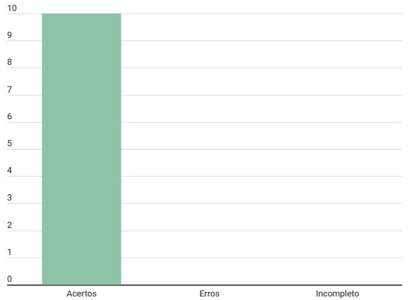

# Especificação Suplementar

## Introdução

Este documento é uma verificação do artefato [Especificação Suplementar](../../../modelagem/especificacao-suplementar.md) na versão 1.0 de data 22/10/23, autorado por [Breno Queiroz](https://github.com/brenob6), que é integrante do [grupo 02](https://github.com/Requisitos-de-Software/2023.2-Carteira_Digital_de_Transito), cujo projeto tem como foco o [Aplicativo Carteira Digital de Trânsito](https://play.google.com/store/apps/details?id=br.gov.serpro.cnhe&hl=pt_BR&gl=US), o propósito desta verificação é identificar possíveis problemas no artefato.

## Metodologia

A verificação do artefato seguirá o [planejamento](../../grupo2/planejamentoDaVerificacao.md) estabelecido pelo nosso grupo. Conforme detalhado no planejamento, destaca-se a relevância do subtópico da metodologia neste documento, para apresentar a tabela contendo os checklists utilizados para realizar essa verificação deste artefato em específico. Podemos observar o referido checklist referente a verificação do Cronograma na Tabela 1, as perguntas foram tiradas da verificação da [especificação suplementar](https://requisitos-de-software.github.io/2023.2-Economia-DF/verificacao/Grupo-02/Entrega-02/entrevista/) feita anterirormente pelo grupo.

**Tabela 1** - Checklist

| ID | Descrição                                                                           | Avaliação  | Observação |
|----|-------------------------------------------------------------------------------------|------------|------------|
| 1  | O histórico de versão é padronizado?                                                |      -     |     -      |
| 2  | Possui o(s) autor(es) e o(s) revisor(es) do artefato?                               |      -     |     -      |
| 3  | O artefato possui referências bibliográficas e/ou bibliografia?                     |      -     |     -      |
| 4  | Todas as tabelas e imagens são chamadas no texto, possuem legendas e fontes?        |      -     |     -      |
| 5  | Todos os textos estão na norma padrão?                                              |      -     |     -      |
| 6  | Há introdução do artefato?                                                          |      -     |     -      |
|7   | O artefato segue o modelo FURPS+?                                                   |      -     |     -      |
|8   | Todas as classificações do modelo FURPS+ com exceção da classificação funcional foram utilizados na classificação? |      -     |     -      |
|9   | Os requisitos são quantitativos?                                                    |      -     |     -      |
|10  | Dentre os requisitos de usabilidade é abordado questões de acessibilidade?          |      -     |     -      |

Fonte: [Milena Baruc](https://github.com/MilenaBaruc)

## Desenvolvimento

Na tabela 2 podemos observar o checklist preenchido após verificação do artefato. Este checklist, minuciosamente preenchido, reflete os resultados, observações e considerações resultantes da análise realizada no artefato. A inspeção foi feita por meio uma gravação individual, que está presentes na tabela 3.

**Tabela 2** - Checklist preenchido

| ID | Descrição                                                                           | Avaliação  | Observação |
|----|-------------------------------------------------------------------------------------|------------|------------|
| 1  | O histórico de versão é padronizado?                                                | Sim |     -      |
| 2  | Possui o(s) autor(es) e o(s) revisor(es) do artefato?                               | Sim |     -      |
| 3  | O artefato possui referências bibliográficas e/ou bibliografia?                     | Sim |     -      |
| 4  | Todas as tabelas e imagens são chamadas no texto, possuem legendas e fontes?        | Sim |     -      |
| 5  | Todos os textos estão na norma padrão?                                              | Sim |     -      |
| 6  | Há introdução do artefato?                                                          | Sim |     -      |
|7   | O artefato segue o modelo FURPS+?                                                   | Sim |     -      |
|8   | Todas as classificações do modelo FURPS+ com exceção da classificação funcional foram utilizados na classificação? | Sim |     -      |
|9   | Os requisitos são quantitativos?                                                    | Sim |     -      |
|10  | Dentre os requisitos de usabilidade é abordado questões de acessibilidade?          | Sim |     -      |

Fonte: [Milena Baruc](https://github.com/MilenaBaruc)

**Tabela 3** - Cronograma de verificação

| Participantes | Data | Horário | Link da gravação | Minutagem aonde começa |
| -------------------------------------------------------------------------------------------- | ---------- | ----- | ------------------- | ------------- |
| [Milena Baruc](https://github.com/MilenaBaruc)                                               | 02/12/2023 | 17:00/17:30 | [Verificação individual](https://youtu.be/gGi9UGBSIMw) | 00:12:26 |

Fonte: [Milena Baruc](https://github.com/MilenaBaruc)

## Dados gráficos

Segue no gráfico 1, o gráfico onde podemos ver com maior facilidade os erros, acertos e incompletos do artefato.

**Gráfico 1** - Dados visuais

Fonte: [Milena Baruc](https://github.com/MilenaBaruc)

## Sugestões de Melhorias

O artefato verificado está ótimo, porém o nome do artefato no barra lateral está errada.

## Referência Bibliografica

> 1. Carteira Digital de Trânsito. Requisitos de Software. Distrito Federal, 2023. Disponível em: <https://requisitos-de-software.github.io/2023.2-Carteira_Digital_de_Transito/>. Acesso em: 02/12/2023.

## Bibliografia

> BARBOSA, S. D. J.; Silva, B. S. da; Silveira, M. S.; Gasparini, I.; Darin, T.; Barbosa, G. D. J. (2021);Interação Humano-Computador e Experiência do usuário.

## 📑 Histórico de Versões

| Versão | Data       | Descrição                                       | Autor                                          | Revisor                                      |
| ------ | ---------- | ----------------------------------------------- | -----------------------------------------------| ---------------------------------------------|
| `1.0`  | 02/12/2023 | Criação do Documento | [Milena Baruc](https://github.com/MilenaBaruc)  | [Luis Miranda](https://github.com/LuisMiranda10)|
