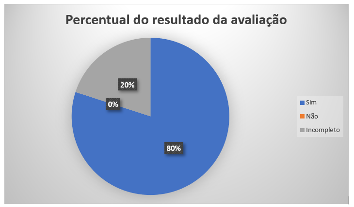

# Verificação Léxicos
 
## Introdução

Este documento é uma verificação do artefato [Léxicos](https://requisitos-de-software.github.io/2023.2-Carteira_Digital_de_Transito/modelagem/l%C3%A9xicos/) na versão 1.2 de data 13/11/2023, autorado por [Vinicius Mendes](https://github.com/yabamiah) e [Luis Miranda](https://github.com/LuisMiranda10), que são integrantes do [grupo 02](https://requisitos-de-software.github.io/2023.2-Carteira_Digital_de_Transito/), cujo projeto tem como foco o aplicativo [Carteira Digital de Trânsito](https://play.google.com/store/apps/details?id=br.gov.serpro.cnhe&hl=pt_BR&gl=US), o propósito desta verificação é identificar possíveis problemas no artefato de elicitação.

## Metodologia 

A verificação do artefato seguirá o [planejamento](https://requisitos-de-software.github.io/2023.2-Carteira_Digital_de_Transito/verificacao/grupo2/planejamendoDaVerificacao.md) estabelecido pelo nosso grupo. Conforme detalhado no planejamento, destaca-se a relevância do subtópico da metodologia neste documento, para apresentar a tabela contendo os checklists utilizados para realizar essa verificação deste artefato em especifico. Podemos observar o referido checklist referente a verificação do Léxicos na Tabela 1. 

**Tabela 1** - Checklist - Léxicos

| ID | Descrição                                                                                                                      | Avaliação  | Observação                                                             |
|----|--------------------------------------------------------------------------------------------------------------------------------|------------|------------------------------------------------------------------------|
| 1  | O artefato possui Introdução?                                                                                                  | -          | -       |
| 2  | O artefato possui a metodologia utilizada?                                                                    		      | -          | -    |
| 3  | O artefato possui bibliografia/referências bibliográficas?                                                                     | -          | -  |
| 4  | O artefato possui um histórico de versões com o id e descrição das versões, data, autores e revisores?                         | -          | -    |
| 5  | Todas as tabelas e imagens são chamadas no texto, possuem legendas e fontes?                                                   | -          | -         |
| 6  | Todos os textos estão na norma padrão?                                       						      | -          | -            |
| 7  | O artefato possui a especificação dos léxicos?                                           | -          | -             |
| 8  | Cada símbolo possui classificação, sinônimo, noção e impactos?                                           | -          | -         | 
| 9  | Os léxicos utilizam a estrutura de dicionário (verbo, objeto, estado ou outra classificação)?                                       | -          | -         | 
| 10  | Cada léxico apresenta sua classificação correta?                                       | -          | -         | 
| 11  | As definições de noção e impacto se encaixam com o que é descrito e estão de acordo com a classificação?                                      | -          | -         | 
| 12  | Os léxicos possuem ligações (hyperlinks) entre si, sendo referenciados e conectados? O princípio circular foi devidamente propagado?             | -          | -         | 
| 13  | A descrição dos léxicos é coerente e esclarecedora?             | -          | -         | 
| 14  | É apresentado pelo menos um léxico de cada categoria, sendo elas, verbo, estado e objeto?            | -          | -         | 
| 15  | Os léxicos cobrem as principais funcionalidades e interações do sistema?          | -          | -         | 

Fonte: [Mayara Alves](https://github.com/Mayara-tech) 

 

## Desenvolvimento 

Na tabela 2 podemos observar o checklist preenchido após verificação do artefato Léxicos. Este checklist, minuciosamente preenchido, reflete os resultados, observações e considerações resultantes da análise realizada no artefato.

**Tabela 2** - Checklist Preenchido - Léxicos

| ID | Descrição                                                                                                                      | Avaliação  | Observação                                                             |
|----|--------------------------------------------------------------------------------------------------------------------------------|------------|------------------------------------------------------------------------|
| 1  | O artefato possui Introdução?                                                                                                  | Sim          | -       |
| 2  | O artefato possui a metodologia utilizada?                                                                    		      | Sim         | -    |
| 3  | O artefato possui bibliografia/referências bibliográficas?                                                                     | Sim        | -  |
| 4  | O artefato possui um histórico de versões com o id e descrição das versões, data, autores e revisores?                         | Sim         | -    |
| 5  | Todas as tabelas e imagens são chamadas no texto, possuem legendas e fontes?                                                   | Incompleto         | As tabelas dos lexicos não são chamadas no texto.         |
| 6  | Todos os textos estão na norma padrão?                                       						      | Sim          | -            |
| 7  | O artefato possui a especificação dos léxicos?                                           | Sim       | -             |
| 8  | Cada símbolo possui classificação, sinônimo, noção e impactos?                                           | Incompleto         |  Os sinônimos foram nomeados de "Dicionário" o que causou uma certa confusão na compreensão dos termos usados.       | 
| 9  | Os léxicos utilizam a estrutura de dicionário (verbo, objeto, estado ou outra classificação)?                                       | Sim        | -         | 
| 10 | Cada léxico apresenta sua classificação correta?                                       | Sim         | -         | 
| 11 | As definições de noção e impacto se encaixam com o que é descrito e estão de acordo com a classificação?                                      | Sim         | -         | 
| 12 | Os léxicos possuem ligações (hyperlinks) entre si, sendo referenciados e conectados? O princípio circular foi devidamente propagado?             | Incompleto    | O princípio circular e alguns léxicos estão em negrito, porém ficou faltando os hyperlinks.         | 
| 13 | A descrição dos léxicos é coerente e esclarecedora?             | Sim        | -         | 
| 14 | É apresentado pelo menos um léxico de cada categoria, sendo elas, verbo, estado e objeto?            | Sim         | -         | 
| 15 | Os léxicos cobrem as principais funcionalidades e interações do sistema?          | Sim        | -         | 

Fonte: [Mayara Alves](https://github.com/Mayara-tech) 

## Sugestões de Melhorias

De maneira geral o artefato apresenta uma boa qualidade, uma boa formatação e uma boa padronização, além de ideias que foram documentadas de forma clara e concisa. Entretanto foram encontrados identificados alguns possíveis problemas em relação as especificações do check-list, sendo elas demonstradas na tabela 3. 

**Tabela 3** - Sugestões de melhoria - Léxicos

| ID | Descrição do problema | Sugestão de melhoria |
| --- | ---------------------| ---------------------- |
| 05 | As tabelas dos lexicos não são chamadas no texto.     |  É sugerido que seja feito o chamado das tabelas referentes aos lexicos no texto. |
| 07 | Os sinônimos foram nomeados de "Dicionário" o que causou uma certa confusão na compreensão dos termos usados.     | É sugerido que seja feita a substituição do termo dicionário para sinônimos, para evitar ambiguidade de sentidos.  |
| 12 | O princípio circular e alguns léxicos estão em negrito, porém ficou faltando os hyperlinks.     |  É sugerido que todos os léxicos citados possuam hiperlinks para seguir o principio circular.|

Fonte: [Mayara Alves](https://github.com/Mayara-tech) 

## Acompanhamento

A figura 1 apresenta um gráfico com o percentual de respostas sim, não, incompleto ou não se aplica, obtidas através da checklist de verificação.

**Figura 1** - Percentual das respostas obtidas na verificação 

Fonte: [Mayara Alves](https://github.com/Mayara-tech) 

### Percentual de aproveitamento 

Para saber a porcentagem de aproveitamento do artefato, será utilizado a Equação na figura 2:

**Figura 2** - Equação da procentagem de aproveitamento do artefato

Fonte: [Mayara Alves](https://github.com/Mayara-tech) 

Através dos checklists realizados podemos observar que:

- 12/15  exigências são atendidas;
- 3/15 exigências estão incompletas;
- 0/15 exigências estão erradas ou não foram realizadas.
- 0/15 não se aplica.

onde 15 é a quantidade de itens avaliados na verificação.

Portanto, com base no cálculo apresentado, pode-se dizer que o aproveitamento deste artefato está em 90%.

## Retrabalho

Como proposto por Fagan, para o retrabalho os autores do artefato [Vinicius Mendes](https://github.com/yabamiah) e [Luis Miranda](https://github.com/LuisMiranda10) irão fazer as correções dos problemas apresentados seguindo a tabela de sugestão de correção apresentada anteriormente. O responsável por essa verificação fará uma revisão das correções feitas, checando se as correções são suficientes e se foi introduzido novos erros ou não. A tabela 3 a seguir apresenta o cronograma de correções.

**Tabela 3** - Cronograma de Correções.

| Data de Correção | Descrição                                                                             |                Responsável(eis)                |                 Revisor(es)                 |      Status      |
| :--------------: | :------------------------------------------------------------------------------------ | :--------------------------------------------: | :-----------------------------------------: | :--------------: |
|    30/11/2023    | Fazer o chamado das tabelas dos léxicos no texto            |   [Vinicius Mendes](https://github.com/yabamiah) e [Luis Miranda](https://github.com/LuisMiranda10)  | [Mayara Alves](https://github.com/Mayara-tech) |  |
|    30/11/2023    |  Substituir do termo dicionário para sinônimos |  [Vinicius Mendes](https://github.com/yabamiah) e [Luis Miranda](https://github.com/LuisMiranda10)| [Mayara Alves](https://github.com/Mayara-tech) |  |
|    30/11/2023    |  Colocar hiperlinks em todos os léxicos apresentados |  [Vinicius Mendes](https://github.com/yabamiah) e [Luis Miranda](https://github.com/LuisMiranda10)| [Mayara Alves](https://github.com/Mayara-tech) |  |

Fonte: [Mayara Alves](https://github.com/Mayara-tech) 

## Bibliografia

> BARBOSA, S. D. J.; Silva, B. S. da; Silveira, M. S.; Gasparini, I.; Darin, T.; Barbosa, G. D. J. (2021);Interação Humano-Computador e Experiência do usuário.
> 
> BILHETERIA DIGITAL. Interacao-Humano_computador. Distrito Federal, 2023. Disponível em: <https://interacao-humano-computador.github.io/2023.1-BilheteriaDigital/>. Acesso em: 26/11/2023. 
>
> VICTOR, Lucas. [Planejamento de Verificação da Entrega 2](https://github.com/Requisitos-de-Software/2023.2-Economia-DF/blob/main/docs/verificacao/Grupo-02/Entrega-02/planejamento-verificacao-e2-grupo2.md), GAMA, FGA, 2023. Acesso em: 26 de novembro de 2023.

## 📑 Histórico de Versões

| Versão | Data       | Descrição                                       | Autor                                          | Revisor                                      |
| ------ | ---------- | ----------------------------------------------- | -----------------------------------------------| ---------------------------------------------|
| `1.0`  | 27/11/2023 | Adicionando verificação do artefato Léxicos   | [Mayara Alves](https://github.com/Mayara-tech) | [Luis Miranda](https://github.com/LuisMiranda) |
