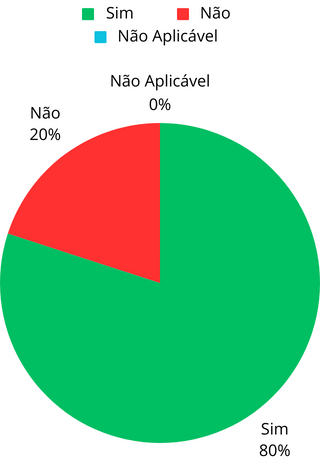
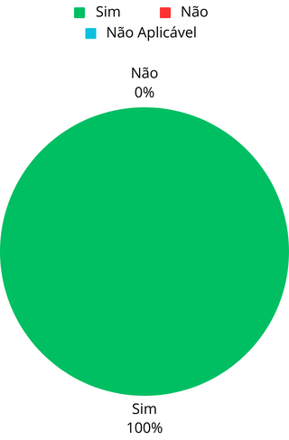

# Verificação do artefato HeatMap

## Introdução
Este documento é uma verificação do artefato [HeatMap](https://github.com/Requisitos-de-Software/2023.2-Carteira_Digital_de_Transito/blob/main/docs/planejamento/Heatmap.md) na versão 1.2 de data 27/09/2023, autorada por [Limirio Correia](https://github.com/LimirioGuimaraes), que é integrante do [Grupo 2](https://github.com/Requisitos-de-Software/2023.2-Carteira_Digital_de_Transito). O propósito desta verificação é identificar possíveis problemas no artefato.

## Metodologia

A verificação do artefato seguirá o [planejamento]() desenvolvido pelo nosso grupo. Conforme detalhado no planejamento, destaca-se a relevância do subtópico da metologia neste documento, onde será apresentada a tabela contendo os checklists utilizados para realizar essa verificação. O referido checklist pode ser consultado na Tabela 1.

  
**Tabela 1** - CheckList  Geral não preenchida

| ID | Critério de Avaliação                           | Avaliação ( Sim/ Não / Não Aplicável )             | Observações                       | Referências                                                    |
|----| ------------------------------------------------|----------------------------------------------------|-----------------------------------|----------------------------------------------------------------|
| 1  | O artefato possui Introdução?                                                |                                                   |                                   | |
| 2  | O artefato possui uma Bibliografia/Referência Bibliográfica?                                                 |                                                   |                                   | |
| 3  | O artefato possui um Histórico de Versões com o id e descrição das versões, data, autores e revisores?                                                |                                                  |     | |
| 4  | Os revisores são pessoas diferentes dos autores?                                                |                                                    |                                   | |
| 5  | Todas as tabelas e imagens são chamadas no texto, possuem legendas e fontes?                                                |                                                 |                              ||

Fonte: <a href="https://github.com/LuisMiranda10">Luis Miranda</a>

  
**Tabela 2** - CheckList Específico não preenchido

| ID | Critério de Avaliação                           | Avaliação ( Sim/ Não / Não Aplicável )             | Observações                       | Referências                                                    |
|----| ------------------------------------------------|----------------------------------------------------|-----------------------------------|----------------------------------------------------------------|
| 1  | Possui o heatmap com os horários disponíveis de cada integrante ?                                                |                                                 |                                   | |
| 2  | Possui o horário escolhido pelo grupo para se reunir?                                                |                                               |                                   | |
| 3  | O objetivo do texto está explicitado de maneira clara e coesa?                                               |                                                 |                                   | |
| 4  | É explicitado de forma compreensível como foi preenchida a tabela?                                           |                                               |                                   | |

Fonte: <a href="https://github.com/LuisMiranda10">Luis Miranda</a>

## Desenvolvimento

Na tabela 3 e 4 podemos observar o checklist preenchido após verificação do artefato HeatMap. Este checklist, minuciosamente preenchido, reflete os resultados, observações e considerações resultantes da análise realizada no artefato.

**Tabela 3** - CheckList Geral preenchido

| ID | Critério de Avaliação                           | Avaliação ( Sim/  /  Aplicável )             | Observações                       | Referências                                                    |
|----| ------------------------------------------------|----------------------------------------------------|-----------------------------------|----------------------------------------------------------------|
| 1  | O artefato possui Introdução?                                                |                       Sim                             |                                   | Página: 1. Heatmap matrix: a multidimensional data visualization technique . Livro: Miguel Mechi and Celmar Guimaraes, HeatMap Matrix, Unicamp-SP.                                                               |
| 2  | O artefato possui uma Bibliografia/Referência Bibliográfica?                                                 |                Sim                                    |                                   | Página: 1-3. Heatmap matrix: a multidimensional data visualization technique . Livro: Miguel Mechi and Celmar Guimaraes, HeatMap Matrix, Unicamp-SP.                                                                |
| 3  | O artefato possui um Histórico de Versões com o id e descrição das versões, data, autores e revisores?                                                |           Sim                                         |                                   | Página: 1-3. Heatmap matrix: a multidimensional data visualization technique . Livro: Miguel Mechi and Celmar Guimaraes, HeatMap Matrix, Unicamp-SP.                                                                |
| 4  | Os revisores são pessoas diferentes dos autores?                                                |                    Não                                |                                   | Página: 1-3. Heatmap matrix: a multidimensional data visualization technique . Livro: Miguel Mechi and Celmar Guimaraes, HeatMap Matrix, Unicamp-SP.                                                                |
| 5  | Todas as tabelas e imagens são chamadas no texto, possuem legendas e fontes?                                                |                      Sim                              |                                   | Página: 1-3. Heatmap matrix: a multidimensional data visualization technique . Livro: Miguel Mechi and Celmar Guimaraes, HeatMap Matrix, Unicamp-SP.                                                                |

Fonte: <a href="https://github.com/LuisMiranda10">Luis Miranda</a>

  
**Tabela 2** - CheckList Específico preenchido

| ID | Critério de Avaliação                           | Avaliação ( Sim/ Não / Não Aplicável )             | Observações                       | Referências                                                    |
|----| ------------------------------------------------|----------------------------------------------------|-----------------------------------|----------------------------------------------------------------|
| 1  | Possui o heatmap com os horários disponíveis de cada integrante ?                                                |                   Sim                                 |                                   | Página: 2-3. Heatmap matrix: a multidimensional data visualization technique . Livro: Miguel Mechi and Celmar Guimaraes, HeatMap Matrix, Unicamp-SP.                                                                |
| 2  | Possui o horário escolhido pelo grupo para se reunir?                                                |            Sim                                        |                                   | Página: 2-3. Heatmap matrix: a multidimensional data visualization technique . Livro: Miguel Mechi and Celmar Guimaraes, HeatMap Matrix, Unicamp-SP.                                                                |
| 3  | O objetivo do texto está explicitado de maneira clara e coesa?                                                |                   Sim                                 |                                   | Página: 2-3. Heatmap matrix: a multidimensional data visualization technique . Livro: Miguel Mechi and Celmar Guimaraes, HeatMap Matrix, Unicamp-SP.                                                                |
| 4  | É explicitado de forma compreensível como foi preenchida a tabela?                                                 |            Sim                                        |                                   | Página: 2-3. Heatmap matrix: a multidimensional data visualization technique . Livro: Miguel Mechi and Celmar Guimaraes, HeatMap Matrix, Unicamp-SP.                                                                |

Fonte: <a href="https://github.com/LuisMiranda10">Luis Miranda</a>

## Inspeção individual

**Tabela 5** - Cronograma de inspeção

| Participantes | Data | Horário | 
|--------------|-------|---------|
| Luis Miranda | 02/12/2023 | 19:25/19:32|

## Sugestões de Melhorias

Foi encontrado uma sugestão de melhoria neste artefato, como é mostrado na tabela 6. O [grupo](https://github.com/Requisitos-de-Software/2023.2-Carteira_Digital_de_Transito) já tinha feito uma correção pós-apresentação desta entrega.

**Tabela 6** - Sugestões de melhoria Checklist Geral - Cronograma

| ID | Descrição do problema | Sugestão de melhoria |
| --- | ---------------------| ---------------------- |
| 01  |  O autor do documento está como revisor do documento juntamente com os outros integrantes do grupo                   |     Retirar o autor do documento como revisor                   |

Fonte: <a href="https://github.com/LuisMiranda10">Luis Miranda</a>

## Resultados

Abaixo estão os resultados obtidos na verificação do artefato [HeatMap](https://github.com/Requisitos-de-Software/2023.2-Carteira_Digital_de_Transito/blob/main/docs/planejamento/Heatmap.md) na forma de um gráfico de pizza, onde são apresentadas a quantidade de "sim", "não" e "não aplicável" obtidos na verificação.

  

<b>Figura 1:</b> Resultados do artefato HeatMap Checklist Geral

Fonte: <a href="https://github.com/LuisMiranda10">Luis Miranda</a>

<b>Figura 2:</b> Resultados do artefato HeatMap Checklist Especifico

Fonte: <a href="https://github.com/LuisMiranda10">Luis Miranda</a>

## Referência Bibliográfica
> Carteira Digital de Trânsito. Requisitos de Software. Distrito Federal, 2023. Disponível em: https://requisitos-de-software.github.io/2023.2-Carteira_Digital_de_Transito/. Acesso em: 02/12/2023

## Bibliografia
> SIMONE DINIZ JUNQUEIRO BARBOSA, BRUNO SANTANA DA SILVA, Interação Humano-Computador, 1a. Edição, Editora Campus, 2010

## 📑 Histórico de Versões

| Versão | Data       | Descrição                                       | Autor                                          | Revisor                                      |
| ------ | ---------- | ----------------------------------------------- | -----------------------------------------------| ---------------------------------------------|
| `1.0`  | 02/12/2023 | Criação do Documento | [Luis Miranda](https://github.com/LuisMiranda10)  | [Vinicius Mendes](https://github.com/yabamiah)                      |
