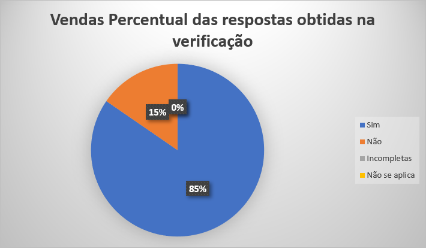

# Verificação Políticas
 
## Introdução

Este documento é uma verificação do artefato [Políticas](https://requisitos-de-software.github.io/2023.2-Carteira_Digital_de_Transito/planejamento/pol%C3%ADticas/) na versão 1.0 de data 18/09/2023, autorado por [Breno Queiroz](https://github.com/brenob6), que é integrante do [grupo 02](https://requisitos-de-software.github.io/2023.2-Carteira_Digital_de_Transito/), cujo projeto tem como foco o aplicativo [Carteira Digital de Trânsito](https://play.google.com/store/apps/details?id=br.gov.serpro.cnhe&hl=pt_BR&gl=US), o propósito desta verificação é identificar possíveis problemas no artefato do planejamento políticas.

## Metodologia 

A verificação do artefato seguirá o [planejamento](https://requisitos-de-software.github.io/2023.2-Carteira_Digital_de_Transito/verificacao/grupo2/planejamendoDaVerificacao.md) estabelecido pelo nosso grupo. Conforme detalhado no planejamento, destaca-se a relevância do subtópico da metodologia neste documento, para apresentar a tabela contendo os checklists utilizados para realizar essa verificação deste artefato em especifico, as questões do checklist foram retiradas do [GitHub Docs](https://docs.github.com/pt/get-started/quickstart/github-flow). Podemos observar o referido checklist referente a verificação das Políticas na Tabela 1. 

**Tabela 1** - Checklist - Políticas

| ID | Descrição                                                                                                                      | Avaliação  | Observação                                                             |
|----|--------------------------------------------------------------------------------------------------------------------------------|------------|------------------------------------------------------------------------|
| 1  | O artefato possui Introdução?                                                                                                  | -          | -       |
| 2  | O artefato possui a metodologia utilizada?                                                                    		      | -          | -    |
| 3  | O artefato possui bibliografia/referências bibliográficas?                                                                     | -          | -  |
| 4  | O artefato possui um histórico de versões com o id e descrição das versões, data, autores e revisores?                         | -          | -    |
| 5  | Todas as tabelas e imagens são chamadas no texto, possuem legendas e fontes?                                                   | -          | -         |
| 6  | Todos os textos estão na norma padrão?                                       						      | -          | -            |
| 7  | As políticas são expressas de maneira clara e compreensível para todos os membros da equipe?                                                 | -          | -       |
| 8  | As políticas estão alinhadas com os objetivos do projeto e da equipe de desenvolvimento?                                      		      | -          | -    |
| 9  | As políticas estão acessíveis a todos os membros da equipe e são facilmente localizáveis?                                                                     | -          | -  |
| 10  | Cada política define claramente as responsabilidades dos membros da equipe em relação à sua implementação?           | -          | -    |
| 11 | As políticas incentivam a colaboração entre os membros da equipe?                                       | -          | -         |
| 12 | As políticas foram avaliadas quanto ao seu impacto na organização, qualidade do projeto e eficiência do desenvolvimento?           | -          | -            |
| 13  | Existem uma instrução em relação ao uso das políticas                      		      | -          | -    |

Fonte: [Mayara Alves](https://github.com/Mayara-tech) 

 

## Desenvolvimento 

Na tabela 2 podemos observar o checklist preenchido após verificação do artefato políticas, a gravação da verificação do artefato esta disponivel neste [link](https://youtu.be/oXwDZap_4eo). Este checklist, minuciosamente preenchido, reflete os resultados, observações e considerações resultantes da análise realizada no artefato.

**Tabela 2** - Checklist Preenchido - Políticas

| ID | Descrição                                                                                                                      | Avaliação  | Observação                                                             |
|----|--------------------------------------------------------------------------------------------------------------------------------|------------|------------------------------------------------------------------------|
| 1  | O artefato possui Introdução?                                                                                                  | Sim        | -       |
| 2  | O artefato possui a metodologia utilizada?                                                                    		      | Não          | O artefato não especifica como foi feita a escolha e construção das políticas   |
| 3  | O artefato possui bibliografia/referências bibliográficas?                                                                     | Sim         | -  |
| 4  | O artefato possui um histórico de versões com o id e descrição das versões, data, autores e revisores?                         | Sim        | -    |
| 5  | Todas as tabelas e imagens são chamadas no texto, possuem legendas e fontes?                                                   | Sim         | -         |
| 6  | Todos os textos estão na norma padrão?                                       						      | Sim         | -            |
| 7  | As políticas são expressas de maneira clara e compreensível para todos os membros da equipe?                                                 | Sim         | -       |
| 8  | As políticas estão alinhadas com os objetivos do projeto e da equipe de desenvolvimento?                                      		      | Sim         | -    |
| 9  | As políticas estão acessíveis a todos os membros da equipe e são facilmente localizáveis?                                                                     | Sim         | -  |
| 10  | Cada política define claramente as responsabilidades dos membros da equipe em relação à sua implementação?           | Não          | Não foi especificado o papel de cada membro da equipe dentro das politicas    |
| 11 | As políticas incentivam a colaboração entre os membros da equipe?                                       | Sim        | -         |
| 12 | As políticas foram avaliadas quanto ao seu impacto na organização, qualidade do projeto e eficiência do desenvolvimento?           | Sim         | -            |
| 13 | Existem uma instrução em relação ao uso das políticas                      		      | Sim         | -    |

Fonte: [Mayara Alves](https://github.com/Mayara-tech) 

## Sugestões de Melhorias

De maneira geral o artefato apresenta uma boa qualidade, uma boa formatação e uma boa padronização, além de ideias que foram documentadas de forma clara e concisa. Entretanto foram encontrados identificados alguns possíveis problemas em relação as especificações do check-list, sendo elas demonstradas na tabela 3. 

**Tabela 3** - Sugestões de melhoria - Políticas

| ID | Descrição do problema | Sugestão de melhoria |
| --- | ---------------------| ---------------------- |
|  02   |  O artefato não especifica como foi feita a escolha e construção das políticas                    |   É sugerido que seja feito a construção de uma metodologia explicando como foi construido e elaborado a politicas utilizadas pela equipe                    | 
|  10   | Não foi especificado o papel de cada membro da equipe dentro das politicas               |   É sugerido que seja feito a distribuição do papel de cada membro da equipe dentro de cada política            | 

Fonte: [Mayara Alves](https://github.com/Mayara-tech) 

## Acompanhamento

A figura 1 apresenta um gráfico com o percentual de respostas sim, não, incompleto ou não se aplica, obtidas através da checklist de verificação.

**Figura 1** - Percentual das respostas obtidas na verificação 

Fonte: [Mayara Alves](https://github.com/Mayara-tech) 

### Percentual de aproveitamento 

Para saber a porcentagem de aproveitamento do artefato, será utilizado a Equação na figura 2:

**Figura 2** - Equação de percentual de aproveitamento

Fonte: [Mayara Alves](https://github.com/Mayara-tech) 

Através dos checklists realizados podemos observar que:

- 11/13  exigências são atendidas;
- 0/13 exigências estão incompletas;
- 2/13 exigências estão erradas ou não foram realizadas.
- 0/13 não se aplica.

onde 13 é a quantidade de itens avaliados na verificação.

Portanto, com base no cálculo apresentado, pode-se dizer que o aproveitamento deste artefato está em 69,23%.

## Retrabalho

Como proposto por Fagan, para o retrabalho o autor do artefato [Breno Queiroz](https://github.com/Brenob6) irá fazer as correções dos problemas apresentados seguindo a tabela de sugestão de correção apresentada anteriormente. O responsável por essa verificação fará uma revisão das correções feitas, checando se as correções são suficientes e se foi introduzido novos erros ou não. A tabela 4 a seguir apresenta o cronograma de correções.

**Tabela 4** - Cronograma de Correções.

| Data de Correção | Descrição                                                                             |                Responsável(eis)                |                 Revisor(es)                 |      Status      |
| :--------------: | :------------------------------------------------------------------------------------ | :--------------------------------------------: | :-----------------------------------------: | :--------------: |
|    05/12/2023    | Construção da  metodologia               |  [Breno Queiroz](https://github.com/Brenob6)  | [Mayara Alves](https://github.com/Mayara-tech) |  |
|    05/12/2023    | distribuição do papel de cada membro da equipe dentro de cada política  | [Breno Queiroz](https://github.com/Brenob6) | [Mayara Alves](https://github.com/Mayara-tech) |  |

Fonte: [Mayara Alves](https://github.com/Mayara-tech) 

## Referência bibliografica 

GITHUB, Inc. Understanding the GitHub Flow. Disponível em: <https://guides.github.com/introduction/flow/> Acesso em: 04/12/2023

## Bibliografia

> BARBOSA, S. D. J.; Silva, B. S. da; Silveira, M. S.; Gasparini, I.; Darin, T.; Barbosa, G. D. J. (2021);Interação Humano-Computador e Experiência do usuário.

## 📑 Histórico de Versões

| Versão | Data       | Descrição                                       | Autor                                          | Revisor                                      |
| ------ | ---------- | ----------------------------------------------- | -----------------------------------------------| ---------------------------------------------|
| `1.0`  | 26/11/2023 | Adicionando verificação do artefato Políticas    | [Mayara Alves](https://github.com/Mayara-tech) |[Luis Miranda](https://github.com/LuisMiranda10) |
