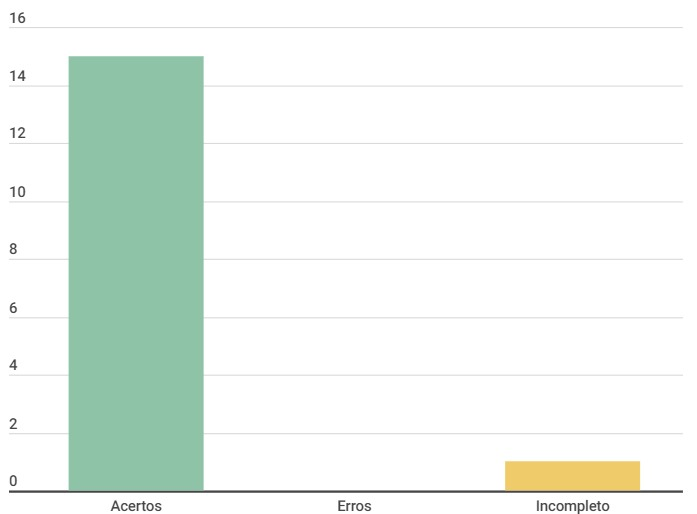

# Cronograma

## Introdução

Este documento é uma verificação do artefato [Cronograma](../../../planejamento/cronograma.md) na versão 1.5 de data 21/11/2023, autorado por [Altino Arthur](https://github.com/arthurrochamoreira), que é integrante do [grupo 02](https://github.com/Requisitos-de-Software/2023.2-Carteira_Digital_de_Transito), cujo projeto tem como foco o [Aplicativo Carteira Digital de Trânsito](https://play.google.com/store/apps/details?id=br.gov.serpro.cnhe&hl=pt_BR&gl=US), o propósito desta verificação é identificar possíveis problemas no artefato.

## Metodologia

A verificação do artefato seguirá o [planejamento](../../grupo2/planejamentoDaVerificacao.md) estabelecido pelo nosso grupo. Conforme detalhado no planejamento, destaca-se a relevância do subtópico da metodologia neste documento, para apresentar a tabela contendo os checklists utilizados para realizar essa verificação deste artefato em específico. Podemos observar o referido checklist referente a verificação do Cronograma na Tabela 1, as perguntas foram tiradas da verificação do [cronograma](../../grupo3/planejamento/cronograma.md) feita anterirormente pelo grupo.

**Tabela 1** - Checklist

| ID | Descrição                                                                           | Avaliação  | Observação |
|----|-------------------------------------------------------------------------------------|------------|------------|
| 1  | O histórico de versão é padronizado?                                                |      -     |     -      |
| 2  | Possui o(s) autor(es) e o(s) revisor(es) do artefato?                               |      -     |     -      |
| 3  | O artefato possui referências bibliográficas e/ou bibliografia?                     |      -     |     -      |
| 4  | Todas as tabelas e imagens são chamadas no texto, possuem legendas e fontes?        |      -     |     -      |
| 5  | Todos os textos estão na norma padrão?                                              |      -     |     -      |
| 6  | Há introdução do artefato?                                                          |      -     |     -      |
|  7  | Os nomes das tarefas planejadas são condizentes?                       |  -	  |       -    |  
|  8  | O cronograma apresenta todos os artefatos solicitados para cada entrega?   |  -	  |  -  |
|  9  | Há uma distribuição igualitária de tarefas entre os membros?                                              |  -  |   -  |
|  10  | Os revisores são sempre diferentes dos autores no mesmo artefato?                   |  -	  |  -  |
|  11  | Existem atividades repetidas sem necessidade ou redundantes?                         |  -  | - |
|  12  | O cronograma apresenta um período de revisão após receber um feedback dos artefatos?	                         |  -  | -  |
|  13  | Há uma sequência lógica nas atividades?                       |  - |  - |
|  14  | As durações das tarefas são realistas?                       |  -	  |  - |
|  15  | Cada tarefa possui pelo menos um autor e um revisor?                       |  -  |  -  |
|  16  | O cronograma estima uma data para gravação das entregas?                       |  -	  |  -  |

Fonte: [Milena Baruc](https://github.com/MilenaBaruc)

## Dados gráficos

Segue no gráfico 1, o gráfico onde podemos ver com maior facilidade os erros, acertos e incompletos do artefato.

**Gráfico 1** - Dados visuais

Fonte: [Milena Baruc](https://github.com/MilenaBaruc)

## Desenvolvimento

Na tabela 2 podemos observar o checklist preenchido após verificação do artefato. Este checklist, minuciosamente preenchido, reflete os resultados, observações e considerações resultantes da análise realizada no artefato. A inspeção foi feita por meio de uma gravação individual, que estão presentes na tabela 3.

**Tabela 2** - Checklist preenchido

| ID | Descrição                                                                           | Avaliação  | Observação |
|----|-------------------------------------------------------------------------------------|------------|------------|
| 1  | O histórico de versão é padronizado?                                                | Sim |     -      |
| 2  | Possui o(s) autor(es) e o(s) revisor(es) do artefato?                               | Sim |     -      |
| 3  | O artefato possui referências bibliográficas e/ou bibliografia?                     | Sim |     -      |
| 4  | Todas as tabelas e imagens são chamadas no texto, possuem legendas e fontes?        | Incompleto | Tabela 6 não possui fonte, da tabela 7 a 12 não estão centralizadas |
| 5  | Todos os textos estão na norma padrão?                                              | Sim |     -      |
| 6  | Há introdução do artefato?                                                          | Sim |     -      |
|  7  | Os nomes das tarefas planejadas são condizentes?                       | Sim |       -    |  
|  8  | O cronograma apresenta todos os artefatos solicitados para cada entrega?   | Sim |  -  |
|  9  | Há uma distribuição igualitária de tarefas entre os membros?                                              | Sim |   -  |
|  10  | Os revisores são sempre diferentes dos autores no mesmo artefato?                   | Sim |  -  |
|  11  | Existem atividades repetidas sem necessidade ou redundantes?                         | Sim | - |
|  12  | O cronograma apresenta um período de revisão após receber um feedback dos artefatos?	                         | Sim | -  |
|  13  | Há uma sequência lógica nas atividades?                       | Sim |  - |
|  14  | As durações das tarefas são realistas?                       | Sim |  - |
|  15  | Cada tarefa possui pelo menos um autor e um revisor?                       | Sim |  -  |
|  16  | O cronograma estima uma data para gravação das entregas?                       | Sim  |  -  |

Fonte: [Milena Baruc](https://github.com/MilenaBaruc)

**Tabela 3** - Cronograma de verificação

| Participantes | Data | Horário | Link da gravação | Minutagem aonde começa |
| -------------------------------------------------------------------------------------------- | ---------- | ----- | ------------------- | ------------- |
| [Milena Baruc](https://github.com/MilenaBaruc)                                               | 02/12/2023 | 17:00/17:30 | [Verificação individual](https://youtu.be/gGi9UGBSIMw) | 00:00:19 |

Fonte: [Milena Baruc](https://github.com/MilenaBaruc) 

## Sugestões de Melhorias

Em geral, o artefato está bem condizente com o que foi solicitado, porém necessita de algumas alterações. Sendo assim, segue as sugestões de melhoria:

• Arrumar a tabela 6 que não possui fonte;
• Arrumar as tabelas de 7 a 12 que não estão centralizadas, para que fique em conformidade com o padrão dos outros artefatos.

## Referência Bibliografica

> 1. Carteira Digital de Trânsito. Requisitos de Software. Distrito Federal, 2023. Disponível em: <https://requisitos-de-software.github.io/2023.2-Carteira_Digital_de_Transito/>. Acesso em: 02/12/2023.

## Bibliografia

> BARBOSA, S. D. J.; Silva, B. S. da; Silveira, M. S.; Gasparini, I.; Darin, T.; Barbosa, G. D. J. (2021);Interação Humano-Computador e Experiência do usuário.

## 📑 Histórico de Versões

| Versão | Data       | Descrição                                       | Autor                                          | Revisor                                      |
| ------ | ---------- | ----------------------------------------------- | -----------------------------------------------| ---------------------------------------------|
| `1.0`  | 02/12/2023 | Criação do Documento | [Milena Baruc](https://github.com/MilenaBaruc)  |  [Luis Eduardo](https://github.com/LuisMiranda10)|
